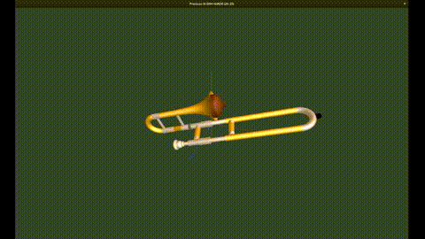
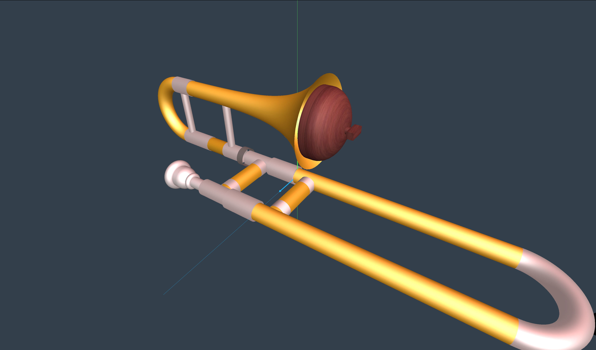
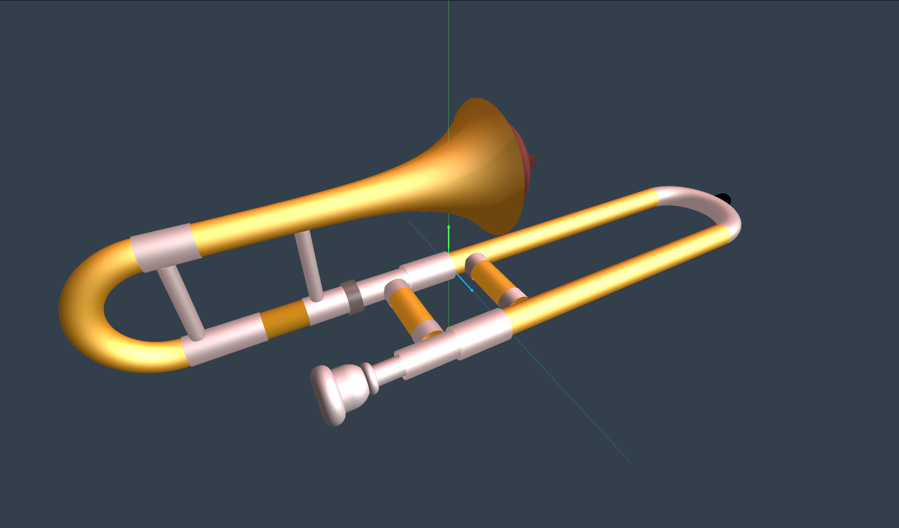

# Trombón



## Introducción

Este proyecto tiene como objetivo principal la visualización y animación de un trombón utilizando técnicas de informática gráfica. 



Se busca facilitar la comprensión de los fundamentos gráficos y ofrecer una apreciación visual del instrumento, mediante representaciones detalladas y animadas del trombón.



## Prerequisitos

En Linux es necesario tener instalado el compilador de C++ de GNU o del proyecto LLVM, esto permite invocar la orden g++ y la orden make. Si no se tienen disponibles, estas herramientas se pueden
instalar con la orden:

```
sudo apt install build-essential
```

Se debe usar `apt` para instalar `cmake`, que se usa para poder compilar desde la línea de órdenes, se hace con:

```
sudo apt install cmake
```

Finalmente se deben instalar los paquetes para las librerías GLEW, GLFW (version 3), GLM y JPEG, se puede hacer con:

```
sudo apt install libglew-dev libglfw3-dev libglm-dev libjpeg-dev
```

## Compilación

Para la generación de los archivos de compilación y la compilación en sí se usa cmake, para ello es necesario ir a la carpeta `builds/linux`. En esa carpeta debemos asegurarnos de que la sub-carpeta cmake está vacía (si no lo estaba ya, hay que borrar todos los archivos ahí). Para generar los archivos de compilación, hay que hacer entrar a la carpeta cmake y ahí escribir:

```
cmake ..
```

Esto hay que hacerlo una vez, o cada vez que se añadan nuevos fuentes o se quiera cambiar la configuración de compilación. Esto genera diversos archivos y carpetas dentro de la carpeta cmake.

Después, para compilar los fuentes, hay que ejecutar (en esa misma carpeta):
```
make
```

Si la compilación va bien se genera el ejecutable, que tiene el nombre `debug_exe` y está en la carpeta `bin`. La orden make también se puede usar con un argumento para otros fines:

- `make clean` para eliminar el programa compilado y los archivos asociados.
- `make release_exe` para generar el ejecutable `release_exe` (también en bin), el cual no tiene los símbolos de depuración y además está optimizado (es más pequeño y puede que sea más rápido al ejecutarse)

Para forzar un recompilado de todos los fuentes, basta con vaciar la carpeta cmake y volver a hacer `cmake ..` en ella. Es necesario hacerlo si se añaden o quitan unidades de compilación o cabeceras de las carpetas con los fuentes.