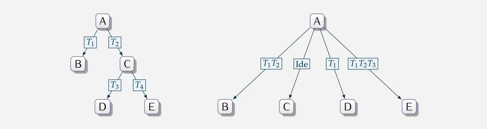
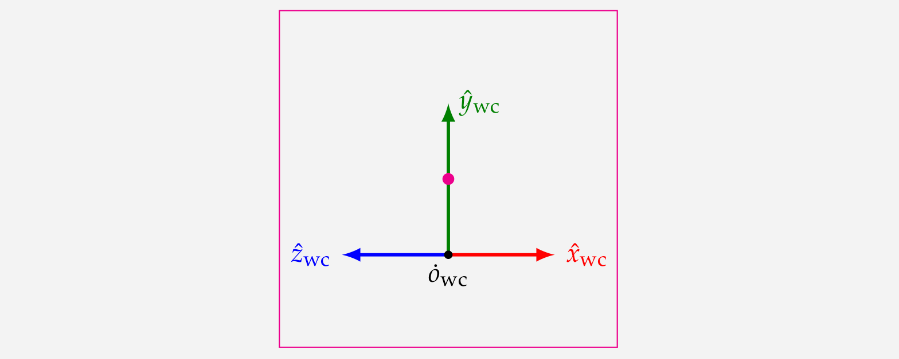
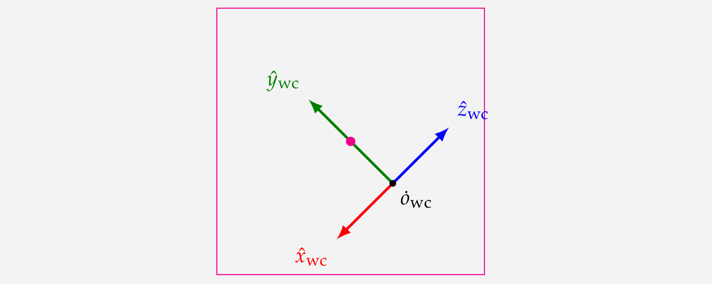
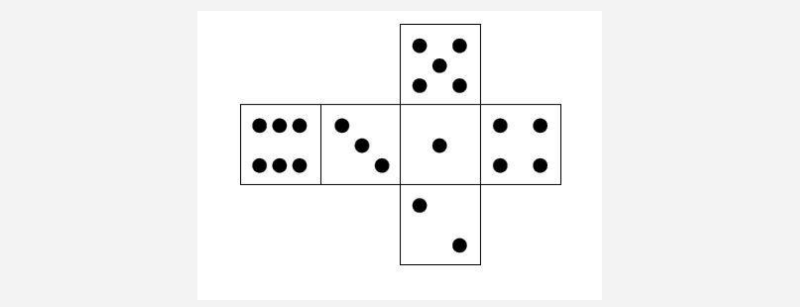

> Autor: Miguel Ángel Moreno Castro
>
> Source: Carlos Ureña Almagro

# Tema 1
## Ejercicio 1

Escribe una función que genera una tabla de coordenadas de posición de vértices con las coordenadas de los vértices de un polígono regular de $n$ lados o aristas (es una constante del programa), con centro en el origen y radio unidad. 

Los vértices se almacenan como flotantes de doble precisión (`double`), con $2$ coordenadas por vértice (usa una tabla de tipo `vector<dvec2>` para esto). Adicionalente, en esa función escribe el código que crea el correspondiente descriptor de VAO a partir de esta tabla (el vao queda guardado como una variable global del programa). 

El valor de $n$ ($> 2$) es un parámetro entero sin signo. El VAO sería la base para visualizar el polígono (únicamente las aristas), considerando la tabla de vértices como una secuencia de vértices no indexada. Escribe dos variantes del código, de forma que la tabla se debe diseñar para representar el polígono usando distintos tipos de primitivas:
- `GL_LINE_LOOP`
- `GL_LINES`
En este problema y el siguiente se pide únicamente generar las tablas y el VAO, en ningún caso se pide visualizar nada.

```c++
void DrawPolygon(unsigned int num_verts)
{
	assert(2 < num_verts);
	assert(glGetError() == GL_NO_ERROR);
	if (polygon == nullptr)
	{
		
		std::vector<glm::dvec2> vertices;
		
		for (size_t i = 0; i < num_verts; ++i)
		{
			float angle = 2.0f * M_PI * i / num_verts;
			vertices.push_back(glm::vec2(0.5f * cos(angle), 0.5f * sin(angle)));
		}
		polygon = new VertexArrayObject(1, 
			new AttribBufferObject(cauce->ind_atrib_posiciones, GL_DOUBLE, 2, num_verts, vertices));
	}
	assert(glGetError() == GL_NO_ERROR);
	glPolygonMode(GL_FRONT_AND_BACK, GL_LINE);
	polygon->draw(GL_LINE_LOOP);
	assert(glGetError() == GL_NO_ERROR);
}
```

```c++
void DrawPolygon(unsigned int num_verts)
{
	assert(2 < num_verts);
	assert(glGetError() == GL_NO_ERROR);
	if (polygon == nullptr)
	{
		std::vector<glm::dvec2> vertices;
		float angle = 2.0f * M_PI * i / num_verts;
		for (size_t i = 0; i < num_verts; ++i)
		{
			vertices.push_back(glm::vec2(0.5f * cos(i*angle), 0.5f * sin(i*angle)));
			vertices.push_back(glm::vec2(0.5f * cos((i+1)*angle), 0.5f * sin((i+1)*angle)));
		}
		polygon = new VertexArrayObject(1, 
			new AttribBufferObject(cauce->ind_atrib_posiciones, GL_DOUBLE, 2, num_verts, vertices));
	}
	assert(glGetError() == GL_NO_ERROR);
	glPolygonMode(GL_FRONT_AND_BACK, GL_LINE);
	polygon->draw(GL_LINES);
	assert(glGetError() == GL_NO_ERROR);
}
```

## Ejercicio 2

Escribe otra función para generar una tabla de vértices y una tabla de índices (y el correspondiente descriptor de VAO en una variable global), que permitiría visualizar el mismo polígono regular del problema anterior pero ahora como un conjunto de $n$ triángulos iguales rellenos que comparten un vértice en el centro del polígono (el origen). Usa ahora datos de simple precisión float para los vértices, con tres valores por vértice, siendo la $Z$ igual a 0 en todos ellos.

La tabla está destinada a ser visualizada con el tipo de primitiva `GL_TRIANGLES`. Escribe dos variantes del código: 
- Usa una secuencia no indexada con $3n$ vértices
- Usa una secuencia indexada (sin vértices repetidos), con $n + 1$ vértices y $3n$ índices.

```c++
void DrawPolygon(unsigned int num_verts)
{
	assert(2 < num_verts);
	assert(glGetError() == GL_NO_ERROR);
	if (polygon == nullptr)
	{
		std::vector<glm::vec2> vertices;
		float angle = 2.0f * M_PI / num_verts;
		for (size_t i = 0; i < num_verts; ++i)
		{
			vertices.push_back(glm::vec2(0.0f, 0.0f));
			vertices.push_back(glm::vec2(0.5f * cos(angle * i), 0.5f * sin(angle * i)));
			vertices.push_back(glm::vec2(0.5f * cos(angle * (i+1)), 0.5f * sin(angle * (i+1))));
		} 
		polygon = new VertexArrayObject(1, 
					new AttribBufferObject(cauce->ind_atrib_posiciones, vertices));
	}
	assert(glGetError() == GL_NO_ERROR);
	glPolygonMode(GL_FRONT_AND_BACK, GL_LINE);
	polygon->draw(GL_TRIANGLES);
	assert(glGetError() == GL_NO_ERROR);
}
```

```c++
void DrawPolygon(unsigned int num_verts)
{
	assert(2 < num_verts);
	assert(glGetError() == GL_NO_ERROR);
	if (polygon == nullptr)
	{
		std::vector<glm::vec2> vertices;
		std::vector<glm::vec3> colors;
		std::vector<glm::uvec3> indices;
		for (size_t i = 0; i < num_verts; ++i)
		{
			float angle = 2.0f * M_PI * i / num_verts;
			vertices.push_back(glm::vec2(0.5f * cos(angle), 0.5f * sin(angle)));
		}
			vertices.push_back(glm::vec2(0.0f, 0.0f)); 
		for (size_t i = 0; i < num_verts; ++i)
		{
			indices.push_back(glm::uvec3(i, (i + 1) % num_verts, num_verts));
		}
		polygon = new VertexArrayObject(cauce->num_atribs, 
					new AttribBufferObject(cauce->ind_atrib_posiciones, vertices));
		polygon->add(new IndexBufferObject(indices));
	}
	assert(glGetError() == GL_NO_ERROR);
	glPolygonMode(GL_FRONT_AND_BACK, GL_LINE);
	polygon->draw(GL_TRIANGLES);
	assert(glGetError() == GL_NO_ERROR);
}
```

## Ejercicio 3

Modifica el código de los ejercicios anteriores para incluir una nueva función para visualizar las aristas y el relleno del polígono regular de $n$ lados, usando los dos descriptores de VAO que se mencionan en
- El enunciado del problema 1.1 (`GL_LINE_LOOP`) para las aristas,
- El enunciado del problema 1.2 (secuencia indexada) para el relleno.

El polígono se verá relleno de un color plano y las aristas con otro color (también plano), distintos ambos del color de fondo. Debes usar un VAO para las aristas y otro para el relleno. No uses una tabla de colores de vértices para este problema, en su
lugar usa la función `glVertexAttrib` para cambiar el color antes de dibujar.

Incluye todo el código en una función de visualización (nueva), esa función debe incluir tanto la creación de tablas y VAOs (en la primera llamada), como la visualización (en todas las llamadas).

```c++
// Esto está regular CORREGIR
void DrawPolygon(unsigned int num_verts)
{
	cauce->fijarUsarColorPlano(true);
	cauce->fijarColor({1.0, 0.0, 0.0});
	DrawPolygon1(num_verts);
	cauce->fijarColor({0.0, 0.0, 1.0});
	DrawPolygon2(num_verts);
}
```

## Ejercicio 4

Repite el problema anterior, pero ahora intenta usar el mismo VAO para las aristas y los triángulos rellenos. Para eso
puedes usar una única tabla de $n + 1$ posiciones de vértices, esa tabla sirve de base para el relleno, usando índices. Para las aristas, puedes usar `GL_LINE_LOOP`, pero teniendo en cuenta únicamente los $n$ vértices del polígono (sin usar el vértice en el origen).

```c++
// NO FUNCIONA DEL TODO BIEN, PROBAR CON EL TRIÁNGULO
void DrawPolygon(unsigned int num_verts)
{
	assert(2 < num_verts);
	assert(glGetError() == GL_NO_ERROR);
	if (polygon == nullptr)
	{
		std::vector<glm::vec2> vertices;
		std::vector<glm::vec3> colors;
		std::vector<glm::uvec3> indices;
		for (size_t i = 0; i < num_verts; ++i)
		{
			float angle = 2.0f * M_PI * i / num_verts;
			vertices.push_back(glm::vec2(0.5f * cos(angle), 0.5f * sin(angle)));
		}
			vertices.push_back(glm::vec2(0.0f, 0.0f)); 
		for (size_t i = 0; i < num_verts; ++i)
		{
			indices.push_back(glm::uvec3(i, (i + 1) % num_verts, num_verts));
		}
		polygon = new VertexArrayObject(cauce->num_atribs, 
					new AttribBufferObject(cauce->ind_atrib_posiciones, vertices));
		polygon->add(new IndexBufferObject(indices));
	}
	assert(glGetError() == GL_NO_ERROR);
	polygon->createVAO();
	assert(glGetError() == GL_NO_ERROR);
	glPolygonMode(GL_FRONT_AND_BACK, GL_FILL);
	cauce->fijarUsarColorPlano(true);
	cauce->fijarColor({1.0, 0.0, 0.0});
	glDrawElements(GL_TRIANGLES, 3*indices.size(), GL_UNSIGNED_INT, 0);
	assert(glGetError() == GL_NO_ERROR);
	glPolygonMode(GL_FRONT_AND_BACK, GL_LINE);
	cauce->fijarUsarColorPlano(true);
	cauce->fijarColor({0.0, 0.0, 0.0});
	glDrawArrays(GL_LINE_LOOP, 0, num_verts);
	assert(glGetError() == GL_NO_ERROR);
}
```


## Ejercicio 5

## Ejercicio 6

## Ejercicio 7

Modifica el código del ejemplo `opengl3-minimo` para añadir a la clase `Cauce` un método que permita especificar la región visible. El método debe de fijar el valor del parámetro uniform con la matriz de proyección, según lo visto en las transparencias anteriores.

```c++
void fijarRegionVisible(const float x0, const float x1, const float y0, const float y1, const float z0, const float z1);
```


## Ejercicio 8

Modifica el código del ejemplo `opengl3-minimo` para que no se introduzcan deformaciones cuando la ventana se redimensiona y el alto queda distinto del ancho. El código original del repositorio presenta los objetos deformados (escalados con distinta escala en vertical y horizontal) cuando la ventana no es cuadrada, ya que visualiza en el viewport (no cuadrado) una cara (cuadrada) del cubo de lado $2$. 

Para evitar este problema, en cada cuadro se deben de leer las variables que contienen el tamaño actual de la ventana y en función de esas variables modificar la zona visible, que ya no será siempre un cubo de lado $2$ unidades, sino que será un ortoedro que contendrá dicho cubo de lado $2$, pero tendrá unas dimensiones superiores a $2$ (en $X$ o en $Y$, no en ambas), adaptadas a las proporciones de la ventana (el ancho en $X$ dividido por el alto en $Y$ es un valor que debe coincidir en el ortoedro visible y en el viewport).


## Ejercicio 9

Demuestra que el producto escalar de dos vectores se puede calcular usando sus coordenadas en cualquier marco cartesiano como la suma del producto componente a componente, a partir de las propiedades que definen dicho producto escalar.

## Ejercicio 10

Demuestra que el producto vectorial de dos vectores se puede calcular usando sus coordenadas en cualquier marco cartesiano según se indica en la transparencia anterior, a partir de las propiedades que definen dicho producto vectorial.

## Ejercicio 11

Demuestra que el producto vectorial de dos vectores es perpendicular a cada uno de esos dos vectores.

# Tema 2

## Ejercicio 1

Supongamos que queremos codificar una esfera de radio $1/2$ y centro en el origen de dos formas:
- Por enumeración espacial, dividiendo el cubo que engloba a la esfera en celdas, de forma que haya $k$ celdas por lado del cubo, todas ellas son cubos de $1/k$ de ancho. Cada celda ocupa un bit de memoria (si su centro está en la esfera, se guarda un $1$, en otro caso un $0$).
- Usando un modelo de fronteras (una malla indexada de triángulos), en el cual se usa una rejilla de triángulos y aristas que siguen los meridianos y paralelos, habiendo en cada meridiano y en cada paralelo un total de $k$ vértices (se guarda únicamente la tabla de vértices y la de triángulos).

Asumiendo que un `float` y un `int` ocupan $4$ bytes cada uno, contesta a estas cuestiones:
- Expresa el tamaño de ambas representaciones en bytes como una función de $k$.
- Suponiendo que $k = 16$ calcula cuantos KB de memoria ocupa cada estructura.
- Haz lo mismo asumiendo ahora que $k = 1024$ (expresa los resultados en MB)
Compara los tamaños de ambas representaciones en ambos casos ($k = 16$ y $k = 1024$).

### Enumeración Espacial

Considerando el cubo de lado unidad que engloba a la esfera de radio $1/2$, si cada lado del cubo está compuesto por $k$ celdas obtenemos un total de $k^3$ celdas contenidas en el cubo. Si cada una de dichas celdas ocupan un bit en memoria el tamaño en bytes sería de $\frac{k^3}{8} = \left( \frac{k}{2} \right)^3$ bytes. Luego:
- $k = 16$: Ocuparía un total de $512$ bytes, lo que equivale a $0.5$ KB
- $k = 1024$: Ocuparía un total de $134217728$ bytes, lo que equivalen a $128$ MB

### Modelo de Fronteras

Considerando que cada meridiano/paralelo tiene $k$ vértices, será necesario almacenar un total de $k^2$ vértices. Además ya que cada vértice está compuesto de $3$ componentes de tipo `float` tendríamos que almacenar $12 \cdot k^2$ bytes. Por otro lado, cada $4$ vértices construimos $2$ triángulos por lo que tendremos $2 \cdot k^2$ triángulos y, puesto que cada triángulo está compuesto de $3$ componentes de tipo `int` tendríamos que almacenar $24  \cdot k^2$ bytes. Luego:
- $k = 16$: Ocuparía un total de $9216$ bytes, lo que equivale a $9$ KB
- $k = 1024$: Ocuparía un total de $37748736$ bytes, lo que equivalen a $36$ MB

## Ejercicio 2

Considera una malla indexada (tabla de vértices y caras, esta última con índices de vértices) con topología de rejilla como la de la figura, en la cual hay $n$ columnas de pares de triángulos y $m$ filas (es decir, hay $n + 1$ filas de vértices y $m + 1$ columnas de vértices, con $n, m > 0$).

En relación a este tipo de mallas, responde a estas dos cuestiones:
- Supongamos que un `float` ocupa $4$ bytes (igual a un `int`) ¿que tamaño en memoria ocupa la malla completa, en bytes?(Tener en cuenta únicamente el tamaño de la tabla de vértices y triángulos, suponiendo que se almacenan usando los tipos `float` e `int`, respectivamente). Expresa el tamaño como una función de `m` y `n`.
- Escribe el tamaño en KB suponiendo que $m = n = 128$.
- Supongamos que $m$ y $n$ son ambos grandes (es decir, asumimos que $1/n$ y $1/m$ son prácticamente $0$). deduce que relación hay entre el número de caras $n_C$ y el número de vértices $n_V$ en este tipo de mallas.

## Ejercicio 3

## Ejercicio 4

Supongamos una malla cerrada, simplemente conexa (topológicamente equivalente a una esfera), cuyas caras son
triángulos y cuyas aristas son todas adyacentes a exactamente dos caras (la malla es un poliedro simplemente conexo de caras triangulares). Considera el número de vértices $n_V$, el número de aristas $n_A$ y el número de caras $n_C$ en este tipo de mallas.

Demuestra que cualquiera de esos números determina a los otros dos, en concreto, demuestra que se cumplen estas dos igualdades:
$$\begin{align}n_A & = 3 (n_V − 2) \\ n_C & = 2 (n_V − 2)\end{align}$$

Nótese que, al igual que en el problema anterior, sigue siendo cierto que el número de caras es aproximadamente el doble que el de vértices.

### Solución

Dado que toda arista es adyacente a exactamente $2$ caras y cada cara está formada por $3$ aristas, tenemos que
$$2 \cdot n_A = 3 \cdot n_C \; \Longrightarrow \; n_C = \frac{2}{3} \cdot n_A$$
Por tanto, haciendo uso de la **característica de Euler** tenemos que
$$\chi(\mathbb{S}^2) = n_V - n_A + n_C = 2 \; \Longrightarrow \; \begin{cases} n_A = n_V + n_C - 2 = n_V + \frac{2}{3} \cdot n_A - 2 \; & \Longrightarrow \; n_A = 3(n_V - 2) \\
n_C = 2 + n_A - n_V = 2 + \frac{3}{2} n_C - n_V \; & \Longrightarrow \; n_C = 2(n_V - 2)\end{cases}$$
## Ejercicio 5

En una malla indexada, queremos añadir a la estructura de datos una tabla de aristas. Será un vector `edges`, que en cada entrada tendrá una tupla de tipo `uvec2`  con los índices en la tabla de vértices de los dos vértices en los extremos de la arista. El orden en el que aparecen los vértices en una arista es indiferente, pero cada arista debe aparecer una sola vez.

Escribe el código de una función C++ para crear y calcular la tabla de aristas a partir de la tabla de triángulos. Intenta encontrar una solución con la mínima complejidad en tiempo y memoria posible.

Suponer que el número de vértices adyacentes a uno cualquiera de ellos es como mucho un valor constante $k > 0$, valor que no depende del número total de vértices, que llamamos $n$.

Considerar dos casos:
1. Los triángulos se dan con orientación no coherente, es decir, si un triángulo está formado por los vértices $i$, $j$, $k$, estos tres índices pueden aparecer en cualquier orden en la correspondiente entrada de la tabla de triángulos (puede aparece como $i$, $j$, $k$ o como $i$, $k$, $j$, o como $k$, $j$, $i$, etc.)
2. Los triángulos se dan con orientación coherente, es decir, si dos triángulos comparten una arista entre los vértices $i$ y $j$, entonces en uno de los triángulos la arista aparece como $(i, j)$ y en el otro aparece como $(j, i)$ (decimos que en el triángulo $a$, $b$, $c$ aparecen las tres aristas $(a, b)$, $(b, c)$ y $(c, a)$). Además, asumimos que la malla es cerrada, es decir, que cada arista es compartida por exactamente dos triángulos.

### Orientación no coherente

Observamos que sin tener en cuenta la eficiencia (tiempo y memoria) una posible solución puede ser tan sencilla como

```c++
vector<uvec2> extractEdges(const vector<uvec3> & triangles, const int num_vertices)
{
	vector<uvec2> edges;
	for (const auto & triangle : triangles)
	{
		edges.push_back({triangle[0], triangle[1]});
		edges.push_back({triangle[1], triangle[2]});
		edges.push_back({triangle[2], triangle[3]});
	}
}
```

Sin embargo, podemos notar que esta solución inserta dos veces toda arista adyacente en nuestra tabla. Una posible solución para ello sería construir la matriz de adyacencia de los vertices, es decir, para cada vértice $i$ llevaremos un registro de los vértices que son adyacentes a él. Así obtendríamos nuestra tabla de aristas considerando todas las parejas de vértices adyacentes

```c++
vector<uvec2> extractEdges(const vector<uvec3> & triangles, const int num_vertices)
{
	vector<uvec2> edges;
	vector<vector<int>> adjacent_vertices(num_vertices, vector<int>());
	for (size_t i = 0; i < triangles.size(); ++i)
	{
		for (size_t j = 0; j < 3; ++j)
		{
			int a = triangle[i][j];
			int b = triangle[i][(j+1) % 3];
			if (a > b)
			{
				swap(a, b);
			}
			bool found = false;
			for (size_t k = 0; k < adjacent_vertices[a].size() && !found; ++k)
			{
				if (adjacent_vertices[a][k] == b)
				{
					found = true;
				}
			}
			if (!found)
			{
				adjacent_vertices[a].push_back(b);
			}
		}
	}
	for (size_t i = 0; i < num_vertices; ++i)
	{
		for (size_t j = 0; j < adjacent_vertices[i].size(); ++j)
		{
			edges.push_back({i, adjacent_vertices[i][j]});
		}
	}
	return edges;
}
```

### Orientación coherente

Este caso es mucho más sencillo, ya que al ser una malla cerrada podemos considerar únicamente las entradas en las que $i < j$, puesto que al haber siempre dos triángulos con la misma arista así conseguiremos añadirla una úncica vez.

```c++
vector<uvec2> extractEdges(const vector<uvec3> & triangles, const int num_vertices)
{
	vector<uvec2> edges;
	vector<vector<int>> adjacent_vertices(num_vertices, vector<int>());
	for (size_t i = 0; i < triangles.size(); ++i)
	{
		for (size_t j = 0; j < 3; ++j)
		{
			int a = triangle[i][j];
			int b = triangle[i][(j+1) % 3];
			if (a > b)
			{
				edges.push_back({a, b});
			}
		}
	}
	return edges;
}
```

## Ejercicio 6

Escribe el pseudo-código de la función para calcular el área total de una malla indexada de triángulos, a partir de la tabla de vértices y de triángulos. Será una función que acepta un puntero a una `MallaInd` y devuelve un número real (asumir que se dispone del tipo `vec3` y de los operadores usuales de tuplas o vectores, es decir suma ($+$), resta $−$, producto escalar $\cdot$, producto vectorial $\times$, etc . ).
### Solución

```c++
double getArea(const MallaInd * mesh)
{
	double area = 0.0f;
	vector<vec3> vertices = mesh->vertices;
	for (const auto & triangle : mesh->triangles)
	{
		vec3 a = vertices[triangle[1]] - vertices[triangle[0]];
		vec3 b = vertices[triangle[2]] - vertices[triangle[0]];
		area += length(cross(a, b))/2.0f;
	}
	return area;
}
```

## Ejercicio 7

Demuestra que $\vec{u}$ y $P(\vec{u})$ son siempre perpendiculares según la definición anterior.
### Solución

Sea $R = [\hat{x}, \hat{y}, \dot{o}]$ un sistema de referencia cartesiano entonces consideramos $\vec{u} = (a, b)_{R}$ y $P(\vec{u}) = (-b, a)_{R}$ las coordenadas de ambos vectores en dicho sistema de referencia. Entonces es claro observar que
$$\vec{u} \cdot P(\vec{u}) = a \cdot (-b) + b \cdot a = 0$$
Por tanto dichos vectores son perpendiculares entre sí.

## Ejercicio 8

Describe como se podría definir una rotación hacia la derecha (en el sentido de las agujas del reloj) en lugar de a izquierdas.
### Solución

Sea $R = [\hat{x}, \hat{y}, \dot{o}]$ un sistema de referencia cartesiano entonces consideramos $\vec{u} = (a, b)_{R}$ . Así, una rotación hacia la derecha de $\vec{u}$ tendría como coordenadas
$$P(\vec{u}) = (b, -a)_{R}$$
## Ejercicio 9

Demuestra que la transformación afín $P$ (cuando se aplica a vectores, no a puntos) no depende del marco cartesiano $C$ con respecto al cual expresamos las coordenadas $(a, b)$ (en el caso de aplicarla a puntos, la rotación de $90º$ es entorno al punto origen $\dot{o}$ de $C$).
### Solución

Sea $R = [\hat{x}, \hat{y}, \dot{o}]$ un sistema de referencia cartesiano entonces considerando $\vec{u} = (a, b)_{R}$, podemos expresar la transformación afín $P$ que va del sistema de referencia $R$ en el sistema de referencia $R$ mediante la siguiente matriz
$$P(\vec{u}) = \begin{pmatrix} 0 & -1 \\ 1 & 0 \end{pmatrix} \begin{pmatrix} a \\ b \end{pmatrix} = \begin{pmatrix} -b \\ a \end{pmatrix}$$
Así, la transformación $P$ no depende del sistema de referencia cartesiano que escojamos.

## Ejercicio 10

Demuestra que el producto escalar de vectores en 2D es invariante por rotación, es decir, que para cualquier ángulo $\theta$ y vectores $\vec{a}$ y $\vec{b}$ se cumple:
$$R_{\theta}(\vec{a}) \cdot R_{\theta}(\vec{b}) = \vec{a} \cdot \vec{b}$$
### Solución

Sea $R = [\hat{x}, \hat{y}, \dot{o}]$ un sistema de referencia cartesiano, $P = \mathcal{M}(R_{\theta} \; ; \; R \rightarrow R)$ la matriz asociada a la rotación de ángulo $\theta$ y $(a_1, a_2)_{R}, \; (b_1, b_2)_{R}$, las coordenadas de los vectores $\vec{a}$ y $\vec{b}$, respectivamente, en el sistema de referencia $R$. Así

$$R_{\theta}(\vec{a}) \cdot R_{\theta}(\vec{b}) = (P \begin{pmatrix} a_1 \\ a_2 \end{pmatrix})^t \cdot P\begin{pmatrix} b_1 \\ b_2 \end{pmatrix} = \begin{pmatrix} a_1 & a_2 \end{pmatrix} P^t P \begin{pmatrix} b_1 \\ b_2 \end{pmatrix} = \begin{pmatrix} a_1 & a_2 \end{pmatrix} \begin{pmatrix} b_1 \\ b_2 \end{pmatrix} = \vec{a} \cdot \vec{b}$$
donde hemos hecho uso de que la rotación de ángulo $\theta$ es una isometría, entonces $P$ es una matriz ortogonal ($P^t = P^{-1}$).

## Ejercicio 11

Demuestra que en 2D las rotaciones no modifican la longitud de un vector, es decir, que para cualquier ángulo $\theta$ y vector $\vec{v}$, se cumple:
$$\|R_{\theta}(\vec{v})\| = \|\vec{v}\|$$
### Solución

Para demostrar que las rotaciones de ángulo $\theta$ son una isometría veamos la matriz asociada a la aplicación es ortogonal, es decir, $P^t = P^{-1}$. Es sencillo observar que

$$P P^t = \begin{pmatrix} \cos \theta & - \sin \theta \\ \sin \theta & \cos \theta \end{pmatrix} \begin{pmatrix} \cos \theta & \sin \theta \\ - \sin \theta & \cos \theta \end{pmatrix} = \begin{pmatrix} cos^2 \theta + \sin^2 \theta & 0 \\ 0 & \cos^2 \theta + \sin^2 \theta \end{pmatrix} = I $$

## Ejercicio 12

Demuestra que el producto escalar de vectores en 3D es invariante por rotaciones elementales.
### Solución

Análogo al ejercicio 10

## Ejercicio 13

Demuestra que las rotaciones elementales en 3D no modifican la longitud de un vector.
### Solución

Análogo al ejercicio 11

## Ejercicio 14

Demuestra que el producto vectorial de dos vectores rota igual que lo hacen esos dos vectores, es decir, que para cualquiera dos vectores $\vec{a}$ y $\vec{b}$ y un ángulo $\theta$, se cumple:
$$R_{\theta}(\vec{a} \times \vec{b}) = R_{\theta}(\vec{a}) \times R_{\theta}(\vec{b})$$
### Solución


## Ejercicio 15

Escribe una función llamada gancho para dibujar con OpenGL en modo diferido la polilínea de la figura (cada segmento recto tiene longitud unidad, y el extremo inferior está en el origen).

La función debe ser neutra respecto de la matriz modelview, el color o el grosor de la línea, es decir, usará la matriz modelview, el color y grosor del estado de OpenGL en el momento de la llamada (y no los cambia).
### Solución

```c++
void DrawHook()
{
	assert(glGetError() == GL_NO_ERROR);
	if (hook == nullptr)
	{
		const std::vector<glm::vec2> vertices =
		{
		{0.0, 0.0}, {0.25, 0.0}, {0.25, 0.25}, {0.0, 0.25}, {0.0, 0.5}
		};
		hook = new VertexArrayObject(1, new AttribBufferObject(cauce->ind_atrib_posiciones, vertices));
	}
	assert(glGetError() == GL_NO_ERROR);
	glPolygonMode(GL_FRONT_AND_BACK, GL_LINE);
	glVertexAttrib3f(cauce->ind_atrib_colores, 0.0, 0.0, 1.0);
	hook->draw(GL_LINE_STRIP);
	assert(glGetError() == GL_NO_ERROR);
}
```

## Ejercicio 16

Usando (exclusivamente) la función `gancho` del problema anterior, construye otra función (`gancho_x4`) para dibujar con OpenGL, usando el cauce fijo, el polígono que aparece en la figura:
### Solución

```c++
void DrawHook4()
{
	assert(glGetError() == GL_NO_ERROR);
	cauce->resetMM();
	DrawHook();
	cauce->compMM(glm::translate(glm::vec3{0.0f, 0.5f, 0.0f}));
	cauce->compMM(glm::rotate(glm::radians(90.0f), glm::vec3{0.0f, 0.0f, 1.0f}));
	DrawHook();
	cauce->resetMM();
	cauce->compMM(glm::translate(glm::vec3{-0.5f, 0.5f, 0.0f}));
	cauce->compMM(glm::rotate(glm::radians(180.0f), glm::vec3{0.0f, 0.0f, 1.0f}));
	DrawHook();
	cauce->resetMM();
	cauce->compMM(glm::translate(glm::vec3{-0.5f, 0.0f, 0.0f}));
	cauce->compMM(glm::rotate(glm::radians(270.0f), glm::vec3{0.0f, 0.0f, 1.0f}));
	DrawHook();
	assert(glGetError() == GL_NO_ERROR);
}
```

## Ejercicio 17

Escribe el pseudocódigo OpenGL otra función (`gancho_2p`) para dibujar esa misma figura, pero escalada y rotada de forma que sus extremos coincidan con dos puntos arbitrarios disintos $\dot{p}_0$ y $\dot{p}_1$ , puntos cuyas coordenadas de mundo son $p_0 = (x_0, y_0 , 1)$ y $p_1 = (x_1, y_1, 1)$ . Estas coordenadas se pasan como parámetros a dicha función (como `vec3`)

Escribe una solución:
- Acumulando matrices de rotación, traslación y escalado en la matriz modelview de OpenGL. 
- En la cual la matriz modelview se calcula directamente sin necesidad de usar funciones trigonometricas (como lo son el arcotangente, el seno, coseno, arcoseno o arcocoseno).

### Solución

## Ejercicio 18


### Solución

## Ejercicio 19

Dados los dos siguientes grafos de escena sencillos:



Construye los grafos tipo PHIGS equivalentes más sencillos posible (en el sentido de menos nodos posibles).

### Solución


## Ejercicio 20

Escribe una función llamada `FiguraSimple` que dibuje con OpenGL en modo diferido la figura que aparece aquí (un cuadrado de lado unidad, relleno de color, con la esquina inferior izquierda en el origen, con un triángulo inscrito, relleno del color de fondo).
### Solución

```c++
void DrawSimpleFigure()
{
	assert(glGetError() == GL_NO_ERROR);
	VertexArrayObject *square = nullptr;
	VertexArrayObject *triangle = nullptr;
	const std::vector<glm::vec2> vertices_square =
	{
		{0.0, 0.0}, {0.5, 0.0}, {0.5, 0.5}, {0.0, 0.5}
	};
	const std::vector<glm::uvec3> indices_square =
	{
		{0, 1, 2}, {0, 2, 3}
	};
	const std::vector<glm::vec2> vertices_triangle =
	{
		{0.1, 0.1}, {0.25, 0.1}, {0.175, 0.25}
	};
	const std::vector<glm::uvec3> indices_triangle =
	{
		{0, 1, 2}
	};
	square = new VertexArrayObject(1, new AttribBufferObject(cauce->ind_atrib_posiciones, vertices_square));
	square->add(new IndexBufferObject(indices_square));
	triangle = new VertexArrayObject(1, new AttribBufferObject(cauce->ind_atrib_posiciones, vertices_triangle));
	triangle->add(new IndexBufferObject(indices_triangle));
	
	assert(glGetError() == GL_NO_ERROR);
	
	glPolygonMode(GL_FRONT_AND_BACK, GL_FILL);
	cauce->usePlainColor(true);
	cauce->setColor({0.0, 0.0, 1.0});
	square->draw(GL_TRIANGLES);
	
	cauce->setColor({1.0, 1.0, 1.0});
	triangle->draw(GL_TRIANGLES);
	
	assert(glGetError() == GL_NO_ERROR);
}
```

## Ejercicio 21

Usando exclusivamente llamadas a la función del ejercicio anterior construye otra función llamada `FiguraCompleja` que dibuja la figura de aquí. Para lograrlo puedes usar manipulación de la pila de la matriz modelview (`pushMM` y `popMM`), junto con `glm::translate` y `glm::rotate`:

### Solución

```c++

```

## Ejercicio 22

## Ejercicio 23

## Ejercicio 24

## Ejercicio 25

# Tema 3

## Ejercicio 1

Supongamos una escena que contiene una representación visible del marco de coordenadas del mundo como tres flechas (roja, verde y azul), como ocurre en las prácticas. Queremos visualizar esa escena en pantalla, de forma que:
1. El eje $Y$ aparezca vertical, hacia arriba, el eje $X$ horizontal, hacia la derecha, el eje $Z$ horizontal, hacia la izquierda (los ejes $X$ y $Z$ se visualizan con la misma longitud aparente).
2. El punto de coordenadas $(0, 0.5, 0)$ (aparece como un disco de color morado en la figura) debe aparecer en el centro del viewport
3. El observador (foco de la proyeccion) estará a 3 unidades de distancia del punto $(0, 0.5, 0)$



Escribe unos valores que podríamos usar para $a$, $u$ y $n$ de forma que se cumplan estos requisitos. En la figura se observa una vista esquemática de como quedaría la figura en un viewport cuadrado, no necesariamente a escala.
### Solución

En primer lugar, ya que nos dicen que el punto $(0, 0.5, 0)$ se encuentra en el centro del viewport deducimos que ese será el punto de atención, así
$$\dot{a} = (0, 0.5, 0)$$
Por otro lado, para calcular el vector normal al plano de visión calcularemos previamente el foco de la proyección que sabemos que se encuentra a $3$ unidades de distancia del punto $(0, 0.5, 0)$, así podemos tomar
$$\dot{o}_{ec} = \left(\sqrt{3}, \frac{1}{2} + \sqrt{3}, \sqrt{3} \right)$$
Por tanto, 
$$\vec{n} = \dot{a} - \dot{o}_{ec} = \left( -\sqrt{3}, -\sqrt{3}, -\sqrt{3} \right)$$
Finalmente, para el _view-up vector_ podemos tomar
$$\vec{u} = (0, 1, 0)$$
ya que sabemos que el eje $Y$ aparece vertical.

## Ejercicio 2

Repite el problema anterior, pero ahora para esta vista:


### Solución


## Ejercicio 3

Escribe el código para calcular los vectores de coordenadas $x_{ec}$, $y_{ec}$, $z_{ec}$ y $o_{ec}$ que definen el marco de vista a partir de los vectores de coordenadas $a$, $u$ y $n$ (todos estos vectores de coordenadas son de tipo `vec3`).
### Solución

```c++
glm::mat4 lookAT(const glm::vec3 & a, const glm::vec3 & u, const glm::vec3 & n)
{
	glm::vec3 oec = a - n;
	glm::vec3 zec = n/glm::normalize(n);
	glm::vec3 xec = glm::cross(u, n)/glm::normalize(glm::cross(u, n));
	glm::vec3 yec = glm::cross(zec, xec);
	return glm::mat4{xec, yec, zec, -oec};
}
```

## Ejercicio 4

Partiendo de los vectores de coordenadas $x_{ec}$, $y_{ec}$, $z_{ec}$ y $o_{ec}$ que se calculan en el problema anterior, escribe el código que calcula explicitamente las $16$ entradas de la matriz de vista (crea una `glm::mat4` llamada $V$ y luego asigna valor a $V(i, j)$ para cada fila $i$ y columna $j$, ambas entre $0$ y $3$).
### Solución

```c++
glm::mat4::mat4(const glm::vec3 &xec, const glm::vec3 &yec, const glm::vec3 &zec, const glm::vec3 &oec)
{
	glm::mat4 out = mat4(1.0);
	for (unsigned i = 0; i < 3; ++i)
	{
		out[i][0] = xec[i];
	}
	for (unsigned i = 0; i < 3; ++i)
	{
		out[i][1] = yec[i];
	}
	for (unsigned i = 0; i < 3; ++i)
	{
		out[i][2] = zec[i];
	out[0][3] = -glm::dot(xec, oec);
	out[1][3] = -glm::dot(yec, oec);
	out[2][3] = -glm::dot(zec, oec);
	return out;
}
```

## Ejercicio 5

Queremos visualizar una escena con mallas indexadas de la cual sabemos que tiene todos los vértices dentro de un cubo de lado $s$ unidades cuyo centro es el punto de coordenadas del mundo
$$c = (c_x, c_y, c_z)$$
Para construir la matriz de vista, se situa el observador en el punto
$$o_{ec} = (c_x , c_y , c_z + s + 2)$$
El punto de atención $a$ se hace igual a $c$ (el centro del cubo se ve en el centro de la imagen), y el vector $u$ es $(0, 1, 0)$. Se visualizará en un viewport cuadrado.

Queremos construir la matriz de proyeccion perspectiva $Q$ de forma que se cumplan estos requerimientos:
1. No se recorta ningún triángulo.
2. El tamaño aparente de los objetos (proyectados en pantalla) es el mayor posible.
3. El valor del parámetro $n$ es el mayor posible.
4. El valor del parámetro $f$ es el menor posible.
5. Los objetos no aparecen deformados.
Con estos requerimientos, indica como calcular los valores $l$, $r$, $t$, $b$, $n$ y $f$ (para obtener la matriz $Q$ de proyección), en función de $s$ y $(c_x, c_y, c_z)$.
### Solución


## Ejercicio 6

## Ejercicio 7

## Ejercicio 8

## Ejercicio 9

Suponemos que visualizamos una esfera de radio unidad centrada en el origen. Se ilumina con una fuente de luz puntual situada en el punto $p = (0, 2, 0)$. El observador está situado en $o = (2, 0, 0)$. En estas condiciones:
- Describe razonadamente en que punto de la superficie de la esfera el brillo será máximo si el material es puramente difuso ($k_d = 1$ en todos los puntos, y $k_a = k_s = 0$) ¿es ese punto visible para el observador?
- Repite el razonamiento anterior asumiendo ahora que el material es puramente pseudo-especular ($MS = (1, 1, 1)$, resto a cero) ¿es ese punto visible para el observador?
### Solución

Sabemos que en un material puramente difuso, la densidad de fotones que inciden en el entorno de $p$ es proporcional al valor de $\cos(\alpha)$ donde $\alpha$ es el ángulo que forman los vectores $n_p$ y $l_i$. Por tanto, el brillo será máximo cuando $\cos(\alpha) = 1$ lo que equivale a que $n_p \cdot l_i = 0$, esto es $n_p = l_i$, que ocurre exactamente en el punto $p' = (0, 1, 0)$, el cual no es visible para el observador.

Por otro lado, si consideramos un material puramente pseudo-especular


## Ejercicio 10

Supongamos que se desea crear una malla indexada para un cubo, de forma que deseamos aplicar un textura que incluya las caras de un dado. Para ello disponemos de una imagen de textura que tiene una relación de aspecto $4:3$. La imagen aparece aquí:



Responde a estas cuestiones:
- Describe razonadamente cuantos vértices (como mínimo) tendrá el modelo.
- Escribe la tabla de coordenadas de vértices, la tabla de coordenadas de textura, y la tabla de triángulos. Ten en cuenta que el cubo tiene lado unidad y su centro está en $(1/2, 1/2, 1/2)$. Dibuja un esquema de la textura en la cual cada vértice del modelo aparezca etiquetado con su número de vértice más sus coordenadas de textura.
### Solución

Dado que cada vértice del cubo será adyacente a tres caras necesitamos como mínimo $3 \cdot 8 = 24$ vértices. Procedemos a escribir la tabla de coordenadas de vértices para dicho cubo de lado unidad centrado en $(1/2, 1/2, 1/2)$.

```c++
std::vector<glm::vec3> vertices = 
{
	// Cara frontal
	{0, 0, 1}, {1, 0, 1}, {1, 1, 1}, {0, 1, 1},
	// Cara lateral derecha
	{1, 0, 1}, {1, 0, 0}, {1, 1, 0}, {1, 1, 1},
	// Cara trasera
	{0, 0, 0}, {1, 0, 0}, {1, 1, 0}, {0, 1, 0},
	// Cara lateral izquierda
	{0, 0, 1}, {0, 0, 0}, {0, 1, 0}, {0, 1, 1},
	// Tapa superior
	{0, 1, 1}, {1, 1, 1}, {1, 1, 0}, {0, 1, 0}
	// Tapa inferior
	{0, 0, 1}, {1, 0, 1}, {1, 0, 0}, {0, 0, 0}
}
```

Seguimos con la tabla de triangulos

```c++
std::vector<glm::uvec3> triangles =
{
	// Cara frontal
	{0, 1, 2}, {2, 3, 0},
	// Cara lateral derecha
	{4, 5, 6}, {6, 7, 4},
	// Cara trasera
	{8, 9, 10}, {10, 11, 8},
	// Cara lateral izquierda
	{12, 13, 14}, {14, 15, 12},
	// Tapa superior
	{16, 17, 18}, {18, 19, 16},
	// Tapa inferior
	{20, 21, 22}, {22, 23, 20}
}
```

Por último definimos la tabla de coordenadas de textura

```c++
std::vector<glm::vec2> texture_coordinates =
{
	// Cara frontal
	{0, 2/3}, {1/4, 2/3}, {1/4, 1/3},
	// Cara lateral derecha
	{1/4, 2/3}, {2/4, 2/3}, {2/4, 1/3}, {1/4, 1/3},
	// Cara trasera
	{2/4, 2/3}, {3/4, 2/3}, {3/4, 1/3}, {2/4, 1/3},
	// Cara lateral izquierda
	{3/4, 2/3}, {1, 2/3}, {1, 1/3}, {3/4, 1/3},
	// Tapa superior
	{2/3, 1/3}, {3/4, 1/3}, {3/4, 0}, {2/4, 0},
	// Tapa inferior
	{2/4, 1}, {3/4, 1}, {3/4, 2/3}, {2/4, 2/3}
}
```

## Ejercicio 11

Considera de nuevo el cubo y la textura del problema anterior. Ahora supón que queremos visualizar con OpenGL el cubo usando sombreado de Gouroud o de Phong, para lo cual debemos de asignar normales a los vértices. Responde a estas cuestiones:
- Describe razonadamente si sería posible usar la misma tabla de vértices y la misma tabla de coordenadas de textura que has escrito en en el problema anterior, o es necesario usar otra tabla distinta.
- Si has respondido que no es posible usar las mismas tablas, escribe la nueva tabla de vértices, la nueva tabla de coordenadas de textura. Asimismo, escribe como sería la tabla de normales.
### Solución

Si sería posible usar la mista tabla de vértices y de coordenadas de textura ya que al haber triplicado los vértices podemos asignar las normales de forma correcta y no se verían deformadas:

```c++
std::vector<glm::vec3> nor_vert = 
{
	// Cara frontal
	{0, 0, 1}, {0, 0, 1}, {0, 0, 1}, {0, 0, 1},
	// Cara lateral derecha
	{1, 0, 0}, {1, 0, 0}, {1, 0, 0}, {1, 0, 0},
	// Cara trasera
	{0, 0, -1}, {0, 0, -1}, {0, 0, -1}, {0, 0, -1},
	// Cara lateral izquierda
	{-1, 0, 0}, {-1, 0, 0}, {-1, 0, 0}, {-1, 0, 0},
	// Tapa superior
	{0, 1, 0}, {0, 1, 0}, {0, 1, 0}, {0, 1, 0},
	// Tapa inferior
	{0, -1, 0}, {0, -1, 0}, {0, -1, 0}, {0, -1, 0}
}
```

## Ejercicio 12

Considera un cubo de lado unidad, y con centro en $(1/2, 1/2, 1/2)$ que se quiere visualizar con una textura a partir de una única imagen (cuadrada) que se replicará en las $6$ caras de dicho cubo. Asume que no se va a usar iluminación (no es necesario calcular la tabla de normales). Escribe ahora la tabla de coordenadas de vértices y la tabla de coordenadas de textura.

### Solución

Creo que podemos hacer uso de la misma que en el ejercicio 10

# Tema 4

## Ejercicio 1

Supongamos que queremos visualizar una secuencia de frames, en los cuales la cámara va cambiando. Para ellos queremos escribir el código de una función que fija la matriz de vista en el cauce. 

La función acepta como parámetro un valor real $t$, que es el tiempo en segundos transcurrido desde el inicio de la animación. Suponemos que la animación dura $s$ segundos en total.

En ese tiempo el observador de cámara se desplaza con un movimiento uniforme desde un punto de coordenadas de mundo $O_0$ (para $t = 0$) hasta un punto destino $O_1$ (para $t = 1$). Además el punto de atención de la cámara también se desplaza desde $a_0$ hasta $a_1$ . Durante toda la animación, el vector $VUP$ es $(0, 1, 0)$. Escribe el pseudo-código de la citada función.
### Solución

```c++

```

## Ejercicio 2

Una posibilidad para hacer selección en mallas de triángulos es usar cálculo de intersecciones entre un rayo (una semirrecta que pasa por el centro de un pixel) y cada uno de los triángulos de la malla.

Diseña un algoritmo en pseudo-código para el cálculo de intersecciones entre un rayo y un triángulo:
- El rayo tiene como origen o extremo el punto cuyas coordenadas del mundo es la tupla $o$, y como vector de dirección la tupla $d$ (la suponemos normalizada).
- Las coordenadas del mundo de los vértices del triángulo son $v_0$, $v_1$ y $v_2$.
- El algoritmo debe de indicar si hay intersección o no, y, en caso de que la haya, calcular las coordenadas del mundo del punto de intersección.

Ten en cuenta que habrá intersección si y solo si se cumplen cada una de estas dos condiciones:
1. El rayo interseca con el plano que contiene al triángulo, es decir, existe $t > 0$ tal que el punto $p_t = o + td$ está en dicho plano. Equivale a decir que el vector $p_t − v_0$ es perpendicular a la normal al plano.
2. El punto $p_t$ citado arriba está dentro del triángulo. Es decir, hay dos valores reales no negativos $a$ y $b$ (con $0 \leq a + b \leq 1$) tales que el vector $p_t − v_0$ es igual a $a(v_1 − v_0) + b(v_2 − v_0$).

 > Alos tres valores $a$, $b$ y $c = 1 − b − a$ se les llama coordenadas baricéntricas de $p_t$ en el triángulo, se usan en Ray-Tracing.

### Solución

```c++

```

## Ejercicio 3

Para implementar la selección usando intersecciones es necesario calcular el rayo que tiene como origen el observador y pasa por centro del pixel donde se ha hecho click. Escribe el pseudo-código del algoritmo que calcula el rayo a partir de las coordenadas del pixel donde se ha hecho click:
- Tenemos una vista perspectiva, y conocemos los 6 valores $l$, $r$, $t$, $b$, $n$, $f$ usados para construir la matriz de proyección.
- También conocemos el marco de coordenadas de vista, es decir, las tuplas $x_{ec}$ , $y_{ec}$ y $o_{ec}$ con los versores y la tupla $\dot{o}_{ec}$ con el punto origen (todos en coordenadas del mundo).
- El viewport tiene $w$ columnas y $f$ filas de pixels. Se ha hecho click en el pixel de coordenadas enteras $x_p$ e $y_p$.

El algoritmo debe producir como salida las tuplas $o$ y $d$ (normalizado) que definen el rayo.

### Solución

```c++

```

# Tema 5

## Ejercicio 1

Supongamos que un rayo (una semirecta en 3D) tiene como origen $o$ extremo el punto cuyas coordenadas del mundo es la tupla $(o_x, o_y, o_z)$, y como vector de dirección la tupla $(d_x, d_y, d_z)$ (la suponemos normalizada).

Además sabemos que un disco de radio $r$ tiene como centro el punto de coordenadas de mundo $c = (c_x, c_y, c_z)$ y está en el plano perpendicular al vector $n = (n_x, n_y, n_z)$

Con estos datos de entrada, diseña un algoritmo para calcular si hay intersección entre el rayo y el disco.

Ten en cuenta que habrá intersección si y solo si se cumplen cada una de estas dos condiciones:
1. El rayo interseca con el plano que contiene al triángulo, es decir, existe $t > 0$ tal que el punto $p_t = o + td$ está en dicho plano. Equivale a decir que el vector $p_t − v_0$ es perpendicular a la normal al plano $n$.
2. El punto $p_t$ citado arriba está dentro del disco, es decir, su distancia a $c$ es inferior al radio.

## Ejercicio 2

Diseña un algoritmo para calcular la primera intersección entre un rayo (con oriden en $o$ y vector $d$, normalizado) y una esfera de radio unidad y centro en el origen, si hay alguna.

Ten en cuenta que un punto cualquiera $p$ está en esfera si y solo sí el módulo de $p$ es la unidad, es decir, si y solo si $F(p) = 0$, donde $F$ es el campo escalar definido así:
$$F(p) = p \cdot p − 1$$

Describe como podría usarse ese mismo algoritmo para calcular la intersección con una esfera con centro y radio arbitrarios (este problema puede reducirse al anterior si el rayo se traslada a un espacio de coordenadas donde la esfera tiene centro en el origen y radio unidad).

## Ejercicio 3

Describe como podemos definir el campo escalar cuyos ceros son los puntos en un cilindro con altura unidad y radio unidad (sin considerar los discos que forman la base ni la tapa).

Usando esa definición diseña el algoritmo para calcular la intersección rayo-cilindro.

Describe asimismo el campo escalar y el algoritmo correspondientes a un cono de altura unidad y radio de la base unidad (sin considerar el disco de la base).