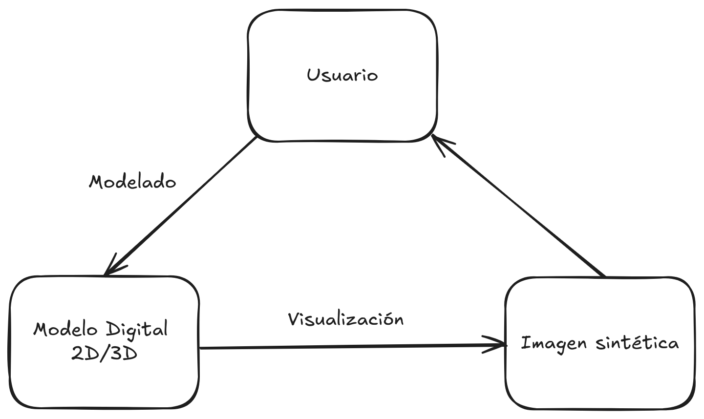
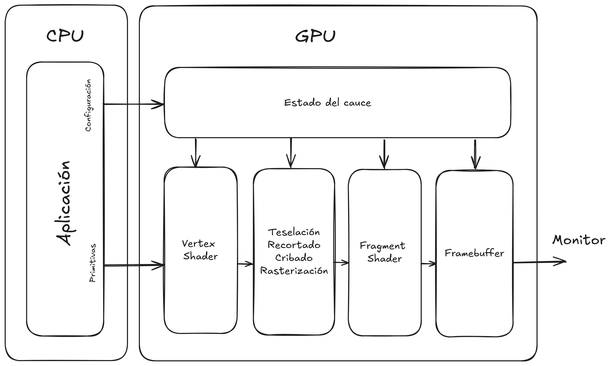
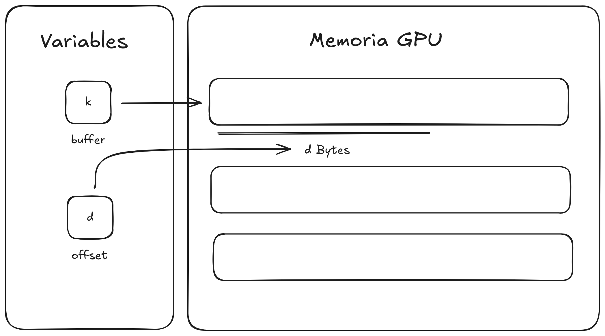
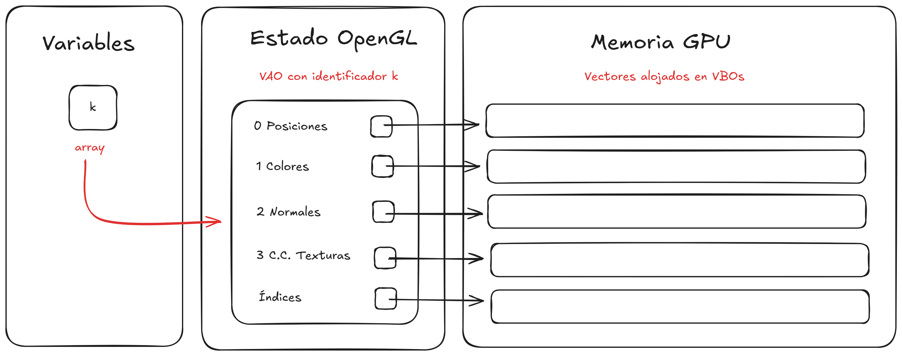
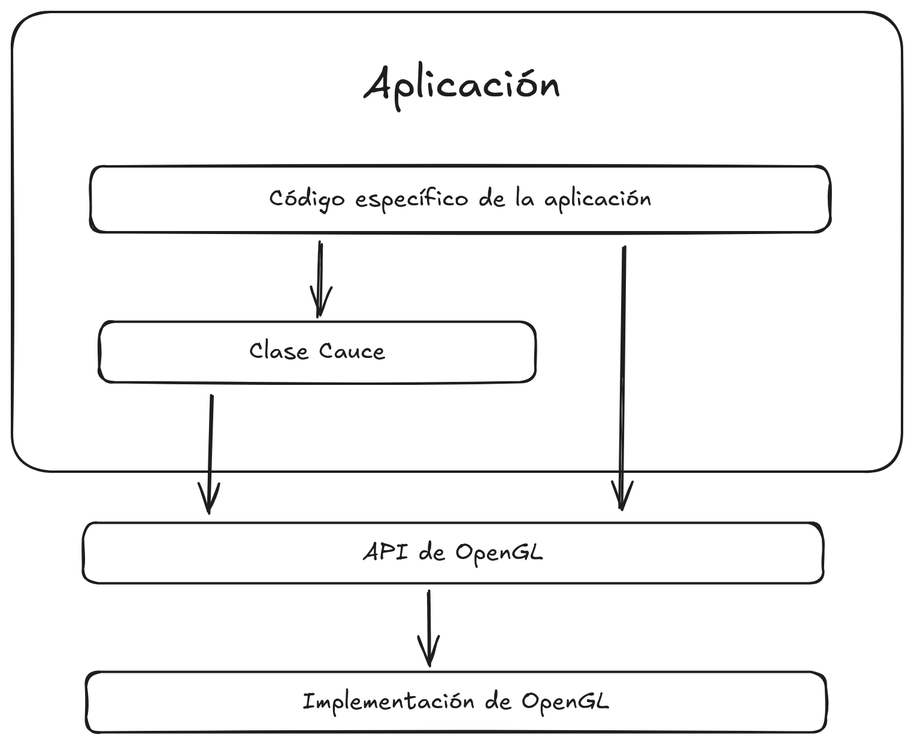
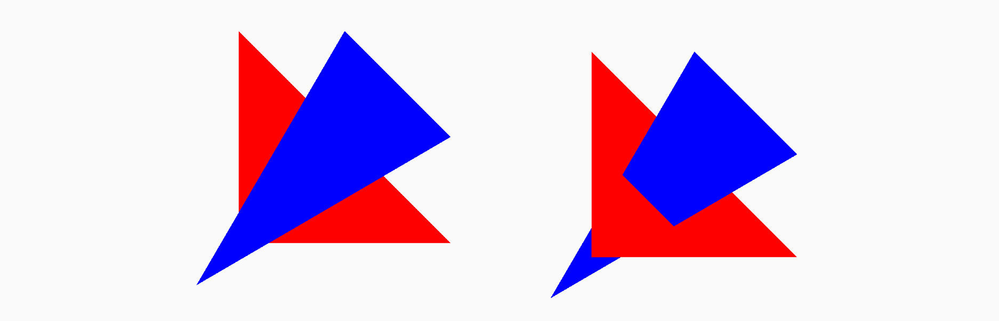
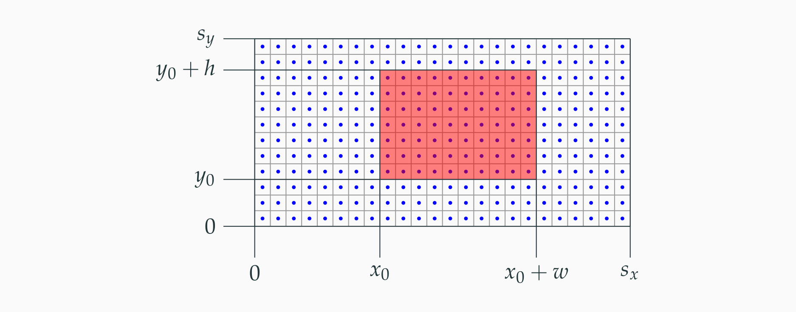

# 1. Introducción

> Autor: Miguel Ángel Moreno Castro
>
> Source: Carlos Ureña Almagro

El término **Informática Gráfica** designa, en un sentido amplio a el campo de la informática dedicado al estudio de los algoritmos, técnicas o metodologías destinados a la creación y manipulación de contenido visual digital.

Esencialmente nos centraremos en estudiar las técnicas para el diseño e implementación de programas interactivos para visualización 3D y animación de modelos de caras planas y jerárquicos.

Los elementos esenciales de una aplicación gráfica son:
- **Modelos digitales** de objetos reales, ficticios o de datos.
- **Imágenes o vídeos digitales** que se usan para visualizar dichos objetos.

> En las aplicaciones interactivas, los usuarios modifican los modelos y reciben retroalimentación inmediata:



# 2. Proceso de Visualización

## 2.1 Programas gráficos

Un **programa gráfico** es un programa que almacena una estructura de datos que constituye un **modelo** computacional de determinada información, además produce una salida constituida por una o varias imágenes.

Las imágenes típicas son **imágenes raster**, constituidas por un array de pixeles discretos, cada uno con un color RGB. Existen otro tipo de salidas gráficas, la más frecuentes son las **imágenes vectoriales** (`.svg`).

Hay dos tipos de programas gráficos:

- Un programa **interactivo** es un programa que visualiza en una ventana gráfica una imagen que constituye una representación visual del modelo. Procesa acciones del usuario, llamadas **eventos**, que se traducen en modificaciones del modelo.

> Cada vez que el modelo es modificado, se vuelve a visualizar de forma interactiva, es decir, desde que el usuario produce el evento hasta que puede observar la imagen actualizada pasan tiempos del orden de decenas de milisegundos como mucho.

- Un programa **no interactivo** es un programa que produce una o varias imágenes a partir del modelo, siendo la duración de la producción de estas desde unos segundos hasta varias horas. El usuario solo especifica el modelo y los parámetros de visualización, no interviniendo de ninguna otra forma durante el tiempo en el que se producen las imágenes.

## 2.2 El Proceso de Visualización

El proceso de visualización produce una imagen a partir de un **modelo de escena** y unos **parámetros**.

El **modelo de escena** es una estructura de datos en memoria que representa lo que se quiere ver, está formado por varias partes:
- **Modelo geométrico**: Conjunto de primitivas, típicamente polígonos planos, que definen la forma de los objetos a visualizar.
- **Modelo de aspecto**: Conjunto de parámetros que definen el aspecto de los objetos, entre ellos destacan el tipo de material, color, textura, fuentes de luz, etc.

Los **parámetros de visualización** son un conjunto amplio de valores que determinan como se visualiza la escena en la imagen. Algunos elementos esenciales son:
- **Cámara virtual**: Posición, orientación y ángulo de visión del observador ficticio que vería la escena como aparece en la imagen.
- **Viewport**: Resolución de la imagen, y si procede, posición de la misma en la ventana.

## 2.3 Rasterización y Ray-Tracing

### Visualización basada en rasterización

> Iniciar el color de todos los píxeles para cada primitiva $P$ del modelo a visualizar
> Encontrar el conjunto $S$ de píxeles cubiertos por $P$
> Para cada píxel $q$ de $S$:
	Calcular el color de $P$ en $q$
	Actualizar el color de $q$

La complejidad en tiempo es claramente del orden del número de primitivas ($n$) por el número de pixels ($p$), es decir, $O(n \cdot p)$.

### Visualización basada en Ray-Tracing

> Iniciar el color de todos los píxeles 
> Para cada píxel $q$ de la imagen a producir
> 	Calcular $T$, el conjunto de primitivas que cubren $q$
> 	Para cada primitiva $P$ del conjunto $T$
> 		Calcular el color de $P$ en $q$
> 		Actualizar el color de $q$

Se puede optimizar para lograr complejidad en número de pixels por el logaritmo del número de primitivas, es decir, $O(p \log n)$. Esto requiere el uso de **indexación espacial**, para el cálculo de $T$ en cada pixel.

El método de Ray-Tracing y sus variantes suele ser más lento, pero consigue resultados más realistas cuando se pretende reproducir ciertos efectos visuales. En los últimos años, han aparecido arquitecturas de GPUs con aceleración por hardware para Ray-Tracing, lo que está llevando a implementar algunos videojuegos usando esta técnica.

## 2.4 El Caucre Gráfico en Rasterización

El **cauce gráfico** es el conjunto de etapas de cálculo que permiten la síntesis de imágenes por rasterización.

Las entradas al cauce gráfico se denominan **primitivas**, formas visibles que no se pueden descomponer en otras más simples, siendo típicamente triángulos o segmentos de líneas/puntos. Un **vertice** es un punto del espacio, extremo de una arista de un triángulo, o de un segmente de recta, o donde se dibuja un punto. 

> Una o varias primitivas se especifican mediante una lista de coordenadas de vértices, más alguna información adicional.

El cauce escribe en el **framebuffer**, que es una zona de memoria donde se guardan uno o varios arrays con los colores RGB de los pixels de la imagen, además de alguna información adicional. Está conectado al monitor.

El cauce gráfico tiene las siguientes etapas:

- **Procesado de vértices**: Parte de una secuencia de vértices y produce una secuencia de primitivas. Tiene estas sub-etapas:
	- **Transformación**: Los vértices de cada primitiva son transformados en diversos pasos hasta encontrar su proyección en el plano de la imagen. Es realizado por el subprograma llamado **Vertex Shader**.
	- **Teselación y nivel de detalle**: Transformaciones adicionales avanzadas, realizadas por varios programas, entre ellos el **Geometry Shader**.
- **Post-procesado de vértices y montaje de primitivas**: Incluye varios cálculos como el recortado (_clipping_) y el cribado de caras (_face culling_).
- **Rasterización**: Cada primitiva es rasterizada, y se encuentran los pixels que cubre en la imagen de salida.
- **Sombreado**: En cada pixel cubierto se calcula el color que se le debe asignar. Se realiza por un programa llamado **Fragment Shader** o **Pixel Shader**.


## 3. OpenGL y GLFW

**OpenGL** es la especificación de un conjunto de funciones útil para visualización 2D/3D basada en rasterización. **GLSL** (_GL Shading Languaje_) es el lenguaje de programación de shaders que se usa con OpenGL.

> Para gestionar ventanas y eventos de entrada se deben usar librerías auxiliares, que pueden o no ser dependientes del entorno hardware/software, para la cuál utilizaremos **GLFW**.

## 3.1 Programación y eventos en GLFW

En las aplicaciones interactivas, un **evento** es la ocurrencia de un suceso relevante para la aplicación, hay varios tipos, entre los que destacamos:
- **Teclado**: Pulsación o levantado de una tecla, de tipo carácter o de otras teclas.
- **Ratón**: Pulsación o levantado de botones del ratón, movimiento del ratón, movimiento de la rueda del ratón para _scroll_.
- **Cambio de tamaño**: Cambio de tamaño de alguna ventana de la aplicación.

Las **funciones gestoras de eventos** (_event managers_, o _callbacks_) son funciones del programa que se invocan cuando ocurre un evento de un determinado tipo.

El programa establece que tipos de eventos se quieren gestionar y qué funciones lo harán. Tras invocar a una de estas funciones, se dice que el correspondiente evento ya ha sido **procesado** o **gestionado**.

```c++
void VisualizarFrame(){}
void FGE_CambioTamano(GLFWwindow* ventana, int nuevoAncho, int nuevoAlto){}
void FGE_PulsarLevantarTecla(GLFWwindow* ventana, int tecla, ...){}
void FGE_PulsarLevantarRaton(GLFWwindow* ventana, int boton, ...){}
void Inicializa_GLFW(int argc, char* argv[]){}
void Inicializa_OpenGL(){}
void BucleEventos_GLFW(){}
int main(int argc, char* argv[])
{
	Inicializa_GLFW(argc, argv); // Crea una ventana
	Inicializa_OpenGL(); // Inicializa estado del cauce
	BucleEventos_GLFW(); // Ejecuta el bucle
	glfwTerminate(); // Cerrar la ventana
}
```

Una aplicación OpenGL/GLFW ejecuta un **bucle principal** o **bucle de gestión de eventos** (en GLFW, el programador debe implementarlo explícitamente):
- GLFW mantiene una **cola de eventos**, con información de cada evento que ya ha ocurrido pero que no ha sido gestionado aún por la aplicación.
- En cada iteración se espera hasta que haya al menos un evento en la cola, entonces:
	- Se extrae el siguiente evento de la cola; si hay designada una función gestora para ese tipo de evento se ejecuta dicha función.
	- Si la ejecución de la función ha cambiado el modelo de escena o algún parámetro, se visualiza un cuadro nuevo.
- El bucle termina típicamente cuando alguna función gestora se ordena cerrarla.

```c++
void Inicializa_GLFW(int argc, char* argv[])
{
	// Intenta inicializar, termina si no puede
	if (!glfwInit())
	{
		cout << "Imposible inicializar GLFW\n\nSaliendo..." << end;
		exit(1);
	}
	// Especificar que función se llamará ante un error de GLFW
	glfwSetErrorCallback(ErrorGLFW);
	// Crear la ventana, activar el rendering context
	ventana_glfw = glfwCreateWindow(ventana_tam_x, ventana_tam_y, "Test", nullptr, nullptr);
	glfwMakeContextCurrent(ventana_glfw); // Necesario para OpenGL
	. . . 
}
```

Una vez creada la ventana, se deben especificar los nombres de las funciones de nuestro programa que deben ser llamadas cuando ocurre un evento:

```c++
void Inicializa_GLFW(int argc, char* argv[])
{
	. . . 
	// Definir cuales son las funciones gestoras de eventos
	glfwSetWindowSizeCallback(ventana_glfw, FGE_CambioTamano);
	glfwSetKeyCallback(ventana_glfw, FGE_PulsarLevantarTecla);
	glfwSetMouseButtonCallback(ventana_glfw, FGE_PulsarLevantarBotonRaton);
	glfwSetCursorPosCallback(ventala_glfw, FGE_MovimientoRaton);
	glfwSetScrollCallback(ventana_glfw, FGE_Scroll);
}
```

```c++
void BucleEventos_GLFW()
{
	redibujar_ventana = true; // Dibujar la ventana por primera vez
	terminar_programa = false; // Activar para terminar
	while (!terminar_programa)
	{
		if (redibujar_ventana)
		{
			VisualizarFrame(); // Dibujar escena
			redibujar_ventana = false; // Evitar que se dibuje continuamente
		}
		glfwWaitEvents(); // Esperar evento y llamar FGE
		terminar_programa = terminar_programam || glfwWindowShouldClose(ventala_glfw);
	}
}
```

> `redibujar_ventana` y `terminar_programa` son variables lógicas globales.

## 3.2 Tipos de Primitivas

En OpenGL, cada primitiva o conjunto de primitivas se especifica mediante una secuencia ordenada de coordenadas de **vertices**, esto es, un punto de un espacio afín 3D. Se representa en memoria mediante una tupla de coordenadas en algún marco de coordenadas de dicho espacio afín. Además, puede tener asociados otros valores, llamados **atributos**.

Existen tres tipos distintos de primitivas, así, una lista de $n$ coordenadas de vértices puede usarse para codificar:
- Si $n \geq 1$, $n$ **puntos** aislados (`GL_POINTS`)
- Si $n \geq 1$, uno o varios **segmentos** de recta, en concreto:
	- Si $n$ par, $\frac{n}{2}$ segmentos independientes (`GL_LINES`)
	- Si $n \geq 2$, $n-1$ segmentos formando una polilínea abierta (`GL_LINE_STRIP`)
	- Si $n \geq 3$, $n$ segmentos formando una polilínea cerrada (`GL_LINE_LOOP`)
- Si $n\geq 1 \land n \equiv 0 \mod 3$, $\frac{n}{3}$ **triángulos**, en concreto:
	- Si $n \geq 3$, $n-2$ triángulos compartinedo aristas, cada triángulo comparte dos vértices con el anterior (`GL_TRIANGLE_STRIP`)
	- Si $n \geq 3$, $n-1$ triángulos compartiendo un vértice (el primero de todos) y cada triángulo comparte dos vértices con el anterior (`GL_TRIANGLE_FAN`)

> Cada primitiva de tipo triángulo es clasificada por OpenGL como **delantera**, si su vértices se visualizan en pantalla en el sentido contrario de las agujas del reloj, o **trasera**, si sus vértices se visualizan en pantalla en el sentido de las agujas del reloj. Este comportamiento de OpenGL puede ser configurado para no visualizar las caras traseras o no visualizar las delanteras (_face culling_).

En el caso de las primitivas de tipo triángulos, OpenGL puede visualizarlos de varias formas, según el valor de un parámetro de configuración que se llama **modo de visualización de polígonos** y permite una de estas opciones:
- **Modo puntos**: Cada triángulo se visualiza como un punto en cada vértice (`GL_POINT`).
- **Modo líneas**: Cada triángulo se visualiza como una polilínea cerrada (`GL_LINE`).
- **Modo relleno**: Cada triángulo se visualiza relleno de color (`GL_FILL`).

> **Problema de vértices replicados**: Muchas veces necesitamos usar unas mismas coordenadas para varios vértices, lo que supone repetir vértices en la secuencia. Esto supone emplear más memoria y/o tiempo para visualizar del necesario.

Las APIs de rasterización permiten especificar una secuencia de vértices (con repeticiones) a partir de una secuencia de vértices únicos:
- Se parte de una secuencia $V_n$ de $n$ coordenadas arbitrarias de vértices $V_n = \{v_0, v_1, \dotsc, v_{n-1}\}$.
- Se usa una secuencia $I_m$ de $m$ índices $I_m = \{i_0, i_1, \dotsc, i_{m-1}\}$ donde cada valor $i_j$ es un entero entre $0$ y $n-1$ (ambos incluidos). Puede tener índices repetidos.
- La secuencia de vértices $V_n$ y la de índices determinan otra secuenci $S_m$ de $m$ vértices que tiene las mismas coordenadas de vértices $V_n$ pero en el orden especificado por los índices en $I_m$
$$S_m = \{v_{i_0}, v_{i_1}, \dotsc, v_{i_{m-1}}\}$$

## 3.3 Atributos de vértices

Las coordenadas de su posición se considera un **atributo** de los vértices, pero en rasterización se pueden opcionalmente usar otros atributos, por ejemplo:
- El **color** del vértice (una terna RGB con valores entre $0$ y $1$).
- Las **coordenadas del vector normal**, un vector unitario con tres coordenadas reales que determina la orientación de la superficie de un objeto en el punto donde está el vértice. Se usa para iluminación.
- Las **coordenadas de textura**, típicamente un par de valores reales que determinan que punto de la textura se fija al vértice.

> En OpenGL a cada vértice siempre se la asocia una tupla por cada atributo, es decir, todo vértice tiene siempre asociado una posición, un color, una normal y unas coordenadas de textura (u otros atributos). Según la configuración del cauce, algunos atributos serán usados o no, pudiendo definir un único valor de un atributo para todos los vértices de una primitiva, o bien especificar un valor para cada vértice.

> El valor de cada atributo está definido en cada pixel donde se proyecta la primitva. Estos valores se calculan durante la rasterización usando **interpolación**.


## 3.4 Almacenamiento de vértices y atributos

Cuando usamos arrays o tablas de coordenadas y atributos en memoria, tenemos dos opciones:
- **Array of Structures, AOS**: Se usa un array donde cada entrada contiene las coordenadas de un vértice y todos sus atributos.
- **Structure of Arrays, SOA**: Se usa una estructura con varios punteros a arrays. Uno de ellos contiene las coordenadas y los otros contienen cada uno una tabla de atributos.

```c++
struct
{
	float posicion[3],
		  color[3],
		  normal[3],
		  coord_text[2];
}
secuenciaAOS[num_vertices];
struct
{
	float posiciones[num_vertices*3], 
		  colores[num_vertices*3],
		  normales[num_vertices*3],
		  coord_text[num_vertices*2];
}
secuanciaSOA;
```

Usaremos la librería estándar de C++ junto con la librería **GLM** para gestionar el almacenamiento de las tablas de atributos e índices de una secuencia de vértices en la aplicación.

```c++
#include<glm>
std::vector<glm::vec3> posiciones; // Coordenadas de posición de los vértices
std::vector<glm::vec3> colores; // Colores de los vértices
std::vector<glm::vec3> normales; // Normales de los vértices
std::vector<glm::vec2> coord_text; // Coordenadas de textura de los vértices
std::vector<unsigned int> indices; // Indices
```

El almacenamiento de las tablas lo realizaremos en la GPU mediante los Vertex Buffer Objects

> Un **Vertex Buffer Object** es una secuencia de bytes contiguos en la memoria de la GPU. Dicho bloque contiene una o varias tablas con coordenadas, colores u otros atributosde vértices.

El uso de este bloque de memoria se hace exclusivamente a través de llamadas a OpenGL. Cada VBO tiene un valor entero único que denominamos **identificador** de VBO, de tipo `GLuint`. Un VBO puede tener atributos o puede tener índices, pero no ambos mezclados.

> El identificador (_buffer_) del VBO y el _offset_ deben almacenarse en la memoria de la aplicación, de forma que podamos acceder a los datos en el VBO:



Por otro lado, una tabla de atributos se puede describir usando un conjunto de valores o metadatos relativos a la propia tabla. A ese conjunto lo llamamos **parámetros descriptores**, son los siguientes:

- **Indice de atributo** (`GLuint index`): Índice asociado al atributo.

```c++
// Nosotros usaremos constantes con nombres descriptivos
constexpr GLuint
	ind_atrib_posiciones = 0, ind_atrib_colores = 1,
	ind_atrib_normales = 2, ind_atrib_coord_text = 3,
	numero_atributos_cauce = 4;
```

- **Tipo de valores** (`GLenum type`): Codifica el tipo de los valores, puede valer `GL_FLOAT` o `GL_DOUBLE`.
- **Número de valores por tupla** (`GLint size`): Número de valores reales por vértice.
- **Número de tuplas** (`GLsizei count`): Número de tuplas de datos, coincide con el número de vértices, ya que debe haber exactamente una tupla por vértice.
- **Puntero a datos** (`const void* data`): Puntero a la dirección de memoria del programa donde está el primer byte de la tabla.
- **Longitud de paso** (`GLsizei stride`): Distancia en bytes entre los atributos de un vértice y el siguiente, cuando se usan AOS y hay atributos adicionales en las posiciones.
- **Desplazamiento** (`const void* offset`): Número de bytes que hay en el VBO entre el inicio del VBO y el inicio de esta tabla.
- **Número de bytes por valor** (`unsigned val_size`): Número de bytes por dato, se puede calcular con la función `sizeof`, exclusivamente en base a `type`.
- **Tamaño en bytes** (`GLsizeiptr tot_size`): Tamaño de la tabla completa, se calcula como producto de `val_size`, `size` y `count`.
- **Nombre o identificador del VBO** (`GLuint buffer`): Identificador único del VBO, asignado por OpenGL cuando se crea el VBO.

### Clase para descriptores de VBOs de atributos

```c++
class DescrVBOAtribs
{
	private:
	GLuint buffer = 0; // Identificador del buffer en la GPU
	GLuint index = 0; // Índice de atributos
	GLenum type = 0; // Tipo de valores (GL_FLOAT o GL_DOUBLE)
	GLint size = 0; // Número de valores por tupla
	GLsizei count = 0; // Número de tuplas en la tabla
	GLsizeiptr tot_size = 0; // Tamaño completo

	const void* data = nullptr; // Datos originales en la CPU
	void* own_data = nullptr; // Datos propiedad de este objeto
	. . .
	public:
	// Constructores
	DescrVBOAtribs(const unsigned p_index, const GLenum p_type, const unsigned p_size, 
					const unsigned long p_count,const void* p_data);
	DescrVBOAtribs(const unsigned p_index, const std::vector<glm::vec3>& src_vec);
	DescrVBOAtribs(const unsigned p_index, const std::vector<glm::vec2>& src_vec);
}
```

En el caso de una tabla de índices, sus **parámetros descriptores** son:

- **Tipo de los índices** (`GLenum type`): Se usan tipos enteros sin signo, es decir, `GL_UNSIGNED_BYTE`, `GL_UNSIGNED_SHORT` o `GL_UNSIGNED_INT`.
- **Número de índices** (`GLsizei count`): Número total de índices en la tabla.
- **Puntero a datos** (`void* indices`): Puntero a la dirección de memoria del programa donde está el primer byte con los índices.
- **Número de bytes por índice** (`unsigned ind_size`): Se puede calcular con la función `sizeof`, exclusivamente en base a `tipo_indices`.
- **Tamaño en bytes** (`GLsizeiptr tot_size`): Tamaño de la tabla completa, se calcula como producto de `ind_size` y `count`.
- **Desplazamiento** (`const void* offset`): Número de bytes que hay en el VBO entre el inicio del VBO y el inicio de esta tabla.
- **Idenficador del VBO** (`GLuint buffer`): Identificador del VBO en la GPU que contiene la tabla.

### Clase para descriptores de VBOs de índices

```c++
class DescrVBOInds
{
	private:
	GLuint buffer = 0; // Identificador del VBO
	GLenum type = 0; // Tipo de índices
	GLsizei count = 0; // Número de índices en la tabla
	GLsizeiptr tot_size = 0; // Tamaño completo

	const void* indices = nullptr; // Datos originales en la CPU
	void* own_indices = nullptr; // Datos propiedad de este ofbjeto
	. . .
	public
	// Constructores
	DescrVBOInds(const GLenum p_type, const GLsizei p_count, const void* p_data);
	DescrVBOInds(const std::vector<unsigned> & src_vec);
	DescrVBOInds(const std::vector<glm::uvec3> & src_vec);
	. . .
}
```

> Antes de poder visualizar una secuencia de vértices es necesario especificar a OpenGL todos los datos relativos a dicha secuencia:

- Parámetros descriptores de la tabla de coordenadas de posición.
- Para cada atributo gestionado por los shaders:
	- Un valor lógico que indica si esta secuencia de vértices tiene asociada una tabla de este atributo.
		- Si la tiene, decimos que esa table de un atributo está habilitada (_enabled_).
		- Si no la tiene, está desabilitada (_disabled_), y todos los vértices toman el mismo valor para ese atributo.
	- Si está habilitada, parámetros descriptores de esa tabla.
- Si la secuencia es indexadam parámetros descriptores de la tabla de índices.

Para gestionar todos los datos relativos a una secuencia de vértices, las APIs de rasterización usan determinadas estructuras de datos. En OpenGL se llaman **Vertex Array Objects**:

> Un **Vertex Array Object (VAO)** es una estructura de datos, gestionada por OpenGL, que almacena toda la información sobre una secuencia de vértices, es decir, la localización y el formato de las coordenadas, otros atributos, e índices.

Una aplicación debe crear una de estas estructuras por cada secuencia de vértices que quiera visualizar. En el estado de OpenGL se puede guardar información sobre múltiples secuencias de vértices que forman la escena que queremos visualizar:

- Cada VAO se identifica por un entero (no negativo) único (`array`) de tipo `GLuint`.
- Para visualización en modo diferido con OpenGL moderno, se usan VAOs creado por la aplicación y alojados en la GPU (puede haber uno por cada secuencia de vértices).
- Siempre hay un VAO activo y en uso. Inicialmente es el VAO con identificador `0`, el cual no se puede usar para visualizar.



### Clase para descriptores de VAO

```c++
class DescrVAO
{
	private:
	GLuint array = 0;
	GLuint num_atribs = 0;
	GLsizei count = 0;
	GLsizei idxs_count = 0;
	// Puntero al descriptor del VBO de índices
	DescrVBOInds* dvbo_indices = nullptr;
	// Punteros a los descriptores de VBOs de atributos
	std::vector<DescrVBOAtribs*> dvbo_atributo;
	// Indica si cada atributo está habilitado
	std::vector<bool> atrib_habilitado;
	public:
	// Crea un descriptor de VAO a partir del descriptor de VBO de posiciones
	DescrVAO(const unsigned p_num_atribs, DescrVBOAtribs* vbo_posiciones);
	// Agregar un descriptor de VBO de atributos de índices
	void agregar(DescrVBOAtribs* vbo_atributo);
	void agregar(DescrVBOInds* vbo_indices);
	// Crear el VAO en la GPU (crea VBOs y transfiere datos)
	void crearVAO();
	// Habilita o desabilita uno de los atributos
	void habilitarAtrib(const unsigned index, const bool habilitar);
	// Visualiza el VAO usando un tipo de primitiva
	void draw(const GLenum mode);
};
```

Para operar con un VAO se pueden usar las siguientes funciones:

- `glGenVertexArrays`: Crea uno o varios VAO
- `glBindVertexArray`: Activa un VAO ya creado
- `glDeleteVertexArray`: Destruye uno o varios VAO
- `glVertexAttribPointer`: Registra en el VAO activo los parámetros descriptores de una tabla de atributos
- `glEnableVertexAttribArray`: Habilita el uso de una tabla de atributos concreta en el VAO activo.
- `glDisableVertexAttribArray`: Deshabilita el uso de una tabla de atributos concreta en el VAO activo.

> Si una tabla de atributos está deshabilitada al visualizar un VAO, todos los vértices usarán el valor actual de dicho atributo. Ese valor se puede modificar mediante la función `glVertexAttrib`.

OpenGL tiene siempre un VBO activo, inicialmente es el VBO con identificador `0` (no usable), y se debe cambiar para operar con otro VBOs. Para poder crear y poblar VBOs dentro del VAO activo, se puede usar:

- `glGenBuffers`: Crea uno o varios VBOs, se obtiene el identificador nuevo de cada uno.
- `glBindBuffer`: Activa un buffer ya creado, usando su identificador.
- `glBufferData`: Reserva memoria para el VBO activo y transfiere un bloque de bytes desde la memoria de la aplicación (RAM) hacia dicha memoria (los contenidos previos del VBO, si había alguno, se pierden).
- `glSubBufferData`: Permite actualizar un bloque de bytes dentro del VBO.

### Creación y activación de un VAO

```c++
// Crea un nuevo VAO
glGenVertexArrays(1, &array);
// Activa un VAO previamente creado
glBindVertexArray(array);
```

> Un mismo VBO con una tabla de atributos o índices puede usarse en más de un VAO

### Creación y activación de un VBO de atributos

```c++
// Crea y activa un VBO
glGenBuffer(1, &buffer);
glBindBuffer(GL_ARRAY_BUFFER, buffer);
// Transfiere datos desde la aplicación al VBO en GPU
glBufferData(GL_ARRAY_BUFFER, tot_size, data, GL_STATIC_DRAW);
// Registra el formato de los datos y la dirección de inicio en memoria
glVertexAttribPointer(index, size, type, GL_FALSE, stride, offset);
// Habilita la tabla, desactiva VBO
glEnableVertexAttribArray(index);
glBindBuffer(GL_ARRAY_BUFFER, 0);
```

> Al final se desactiva el VBO para no interferir con posteriores operaciones con otros VBOs en el mismo VAO pero con distinto índice.

### Creación y activación de un VBO de índices

```c++
// Crea y activa el VBO
glGenBuffers(1, &buffer);
glBindBuffer(GL_ELEMENT_ARRAY_BUFFER, buffer);
// Copia los índices desde la aplicación al VBO en la GPU
glBufferData(GL_ELEMENT_ARRAY_BUFFER, tot_size, indices, GL_STATIC_DRAW);
```

> Este VBO de índices queda activado en el VAO, ya que el VAO incluye como mucho un VBO de índices. No se especifica el formato de los índices pues esto se hace al visualizar una secuencia indexada.

### Creación de descriptores VAOs para tabla de tuplas

En un caso general, y para las tablas que codifican una secuencia de vértices, podríamos hacer:

```c++
DescrVAO* vao = new DescrVAO(num_atribs, new DescrVBOAtribs(ind_atrib_posiciones, posiciones));
if(indices.size() > 0)
	vao->agregar(new DescrVBOInds(indices));
if(colores.size() > 0)
	vao->agregar(new DescrVBOAtribs(ind_atrib_colores, colores));
if(normales.size() > 0)
	vao->agregar(new DescrVBOAtribs(ind_atrib_normales, normales));
if(coord_text.size() > 0)
	vao->agregar(new DescrVBOAtribs(ind_atrib_coord_text, coord_text));
```

> Este código debe ejecutarse después de haber inicializado OpenGL, habiendo creado previamente una ventana (se dice que ya existe un contexto de OpenGL) y antes de visualizar la secuencia por primera vez.


## 3.5 Visualización de secuencias de vértices en un VAO

Para visualizar una secuencia de vértices en el modo diferido se usan exclusivamente las funciones `glDrawArrays` (array no indexado) y `glDrawElements` (array indexado).

Antes de la primera visualización debemos almacenar las secuencias de coordenadas, atributos e índices (si proceda) en uno o verios VBOs dentro de un VAO específico. En cada visualización solo es necesario activar el VAO (con `glBindVertexArray`) y visualizar con una única llamada (con `glDrawArrays` o `glDrawElements`).

> Ambas funciones visualizan la secuencia de forma síncrona, es decir, durante la llamada la visualización se pone en marcha, pero no necesariamente ha acabado cuando termina de ejecutarse la función.

### `glDrawArrays`

La función `glDrawArrays` requiere que haya un VAO activado (distinto del por defecto), y visualiza una secuencia de vértices usando las tablas de atributos habilitadas en dicho VAO.

```c++
glDrawArrays(mode, first, count);
```

- `GLenum mode`: Tipo de primitiva
- `GLint first`: Índice del primer vértice a visualizar
- `GLsizei count`: Número de vértices a visualizar

### `glDrawElements`

La función `glDrawElements`sirve para visualizar secuencias indexadas, además de usar las tablas de atributos habilitadas, asume que hay activado un VBO de índices, y lo usa.

```c++
glDrawElements(mode, count, type, offset);
```

- `GLenum mode`: Tipo de primitiva
- `GLsizei count`: Número de índices a visualizar
- `GLenum type`: Tipo de índices
- `void* offset`: Distancia en bytes desde el inicio del VBO hasta el primer índice a visualizar

### Creación y visualización de VAOs con la clase `DescrVAO`

```c++
void DescrVAO::draw(const GLenum mode)
{
	// Nos aseguramos de que el VAO está creado y activado
	if (array == 0)
		crearVAO(); // Crear y activar el VAO
	else
		glBindVertexArray(array); // Activar el VAO
	// Visualizar con la llamada correspondiente de OpenGL
	if (buffer_indices != nullptr)
		glDrawElements(mode, idxs_count, idxs_type, offset);
	else
		glDrawArrays(mode, first, count);
	// Desactivar VAO
	glBindVertexArray(0);
}
```

### Habilitación/Deshabilitación de atributos

Excepto las posiciones, cada una de las otras tablas de atributos de un VAO se pueden habilitar o deshabilitar individualmente:

```c++
glEnableVertexAttribArray(GLuint index); // Habilita
glDisableVertexAttribArray(GLuint index); // Deshabilita
```

Donde `index` es el índice del atributo. Esto puede hacerse entre distintas visualizaciones de un mismo VAO, lo que permite seleccionar qué atributos se usan y cuales no en cada visualización.

## 3.8 Estado de OpenGL y Visualización de un Frame

En OpenGL podemos distinguir dos tipos de variables de estado:
- Definidas por OpenGL, donde su significado y posibles valores está fijado en la especificación de OpenGL.
- Definidas por el programador en los shaders, donde su nombre, tipo, significado y posibles valores están definidos por el programador.

A estás últimas las llaman **variables uniform**, las cuáles se modifican exclusivamente mediante las funciones `glUniform` y para identificarlas se usa un valor numérico asociado a cada una de ellas (_location_ de la variable uniform).


### Cambio de color por defecto actual

Si alguna secuencia de vértices no tiene tabla de colores (o está desactivada), entonces OpenGL le asocia a todos los colores el mismo color, el color actual por defecto (valor por defecto del atributo color).

Para cambiar el valor por defecto de un atributo se usa la función `glVertexAttrib`, indicando su índice:

```c++
void Cauce::fijarColor(const glm::vec3 & nuevo_color)
{
	color = nuevo_color;
	glVertexAttrib(ind_atrib_colores, color.r, color.g, color.b);
}
```


### Cambio del modo de visualización de polígonos

El modo de visualización de polígonos es una variable interna de OpenGL que se cambia usando la llamada

```c++
glPolygonMode(GL_FRONT_AND_BACK, nuevo_modo);
```

- `GLenum nuevo_modo`: Puede valer alguna de estas tres constantes:
	- `GL_POINT`: Se visualizan únicamente los vértices como puntos.
	- `GL_LINE`: Se visualizan únicamente las aristas como segmentos.
	- `GL_FILL`: Se visualizan el triángulo relleno del color actual.

 > El valor inicial es `GL_FILL`. En OpenGL 3.3- el primer parámetro debe tener ese valor siempre.
 
### Color de vértices y modos de sombreado

Si el cauce gráfico está preparado, OpenGL permite usar dos modos de sombreado:
- **Modo plano**: Se asigna a toda la primitiva un color plano, igual al color del último vértice que forma la primitiva.
- **Modo de interpolación**: Se hace una interpolación lineal de las componentes RGB del color, usando los colores de todos los vértices.

### Eliminación de partes ocultas (EPO) con Z-buffer

OpenGL usa las coordenadas $z$ (dirección perpendicular a la pantalla) de los vértices para calcular, por interpolación, la profundidad en $z$ de cada pixel de cada primitiva visualizada.

Existe un buffer, llamado **Z-buffer** donde se guarda la coordenada $z$ de lo que hay dibujado en cada pixel. Esto permite hacer el **test de profundidad** (_buffer test_), lo que facilita dibujar primitivas en 2D/3D con posibles ocultaciones entre ellas.

> Inicialmente en un pixel, una primitiva $A$ con una coordenada $z$ menor estará por delante de otra $B$ con una coordenada $z$ mayor, entonces $A$ oculta a $B$. Esto puede activarse o desactivarse con `glEnable`/`glDisable`, usando `GL_DEPTH_TEST` como argumento.



> A la izquierda está desabilitado el test de profundidad, y a la derecha está habilitado.

### Otros parámetros de visualización

OpenGL guarda, dentro de su estado interno, varios atributos que se usarán para la visualización de primitivas o para su operación en general. Entre muchos podemos destacar:

- **Color** que será usado cuando se limpie la ventana, con la función `glClearColor`.
- **Ancho** (en píxeles) de las lineas, con la función `glLineWidth`.
- **Ancho** (en píxeles) de los puntos, con la función `glPointSize`.

### Inicialización de OpenGL

```c++
void Inicializa_OpenGL()
{
	// Comprobar si el flag de error ya estaba activado
	assert(glGetError() == GL_NO_ERROR);
	// Establecer color de fondo
	glClearColor(1.0, 1.0, 1.0, 1.0);
	// Establecer color inicial para todas las primitivas, hasta que se cambie
	glVertexAttrib(ind_atrib_color, 0.7, 0.2, 0.4, 1.0);
	// Establecer ancho de líneas o segmentos
	GLfloat rango[2];
	glGetFloatv(GL_ALIASED_LINE_WIDTH_RANGE, rango);
	glLineWidth(GL_ALIASED_LINE_WIDTH_RANGE, std::min(2.1, rango[1]));
	// Habilitar eliminación de partes ocultas
	glEnable(GL_DEPTH_TEST);
	// Comprobar si ha habido algún error
	assert(glGetError() == GL_NO_ERROR);
}
```

### Definición del _viewport_

La función `glViewport` permite establecer que parte de la ventana será usada para visualizar. Dicha parte, llamada **viewport** es un bloque rectangular de píxeles.

```c++
glViewport(j, i, ancho, alto);
```

- `j` ($x_0$): Número de la columna de píxeles donde comienza
- `i` ($y_0$): Número de la fila de píxeles donde comienza
- `ancho` ($w$): Número total de columnas de píxeles que ocupa
- `alto` ($h$): Número total de filas de píxeles que ocupa

La ventana puede considerarse un bloque rectangular de píxeles, cada uno con un punto central, llamado **centro del píxel**, y un cuadrado, llamado **área del píxel**.



El evento de cambio de tamaño de la ventana se produce siempre una vez tras crear la ventana, y además siempre después de que se cambie su tamaño.

Por tanto, podemos situar en la correspondiente función gestora una llamada a `glViewport` para establecer el rectángulo de dibujo.

```c++
void FGE_CambioTamano(int nuevoAncho, int nuevoAlto)
{
	glViewport(0, 0, nuevoAncho, nuevoAlto);
}
```

### Región visible

NO SE SI ESTO ES IMPORTANTE

### La función de redibujado

La visualización de primitivas debe hacerse exclusivamente una vez por cada iteración del bucle principal, en la función `VisualizarFrame`.

```c++
void VisualizarFrame()
{
	// Comprobar si ha habido algún error
	CError();
	// Configurar estado de OpenGL (cámara, modo de polígonos, etc.)
	. . .
	// Limpiar la ventana: limpiar colores y limpiar Z-buffer
	glClear(GL_COLOR_BUFFER_BIT | GL_DEPTH_BUFFER_BIT);
	// Envío de secuencias de vértices, dibujando varios objetos
	. . .
	// Visualización de la imagen creada
	glfwSwapBuffers();
	// Comprobar si ha habido algún error
	CError();
}
```

### Detección de errores de OpenGL

Las funciones de OpenGL pueden activar una variable de estado con un código de error, que en condiciones normales vale `GL_NO_ERROR`. La función que lee ese código de error es `glGetError()`, la cual devuelve el valor de esa variable para posteriormente poner la variable a `GL_NO_ERROR`.

> Para depurar programas se puede comprobar el error antes y después de cada trozo de código donde se sospeche que hay un error. Aunque para aislar la llamada errónea se deberá insertar comprobaciones dentro del trozo de código.