> Autor: Miguel Ángel Moreno Castro
>
> Source: Carlos Ureña Almagro

# 1. Modelos Geométricos

### Modelos Geométricos Formales

Un **modelo geométrico** es un modelo matemático abstracto que sirve para representar un objeto geométrico que existe en un espacio afín $\mathbb{E}$ .

> Los modelos deben permitir la visualización computacional de los objetos que representan.

Los más usados hoy en día son los **modelos de fronteras**, los cuáles son estructuras de datos que representan la frontera del objeto de forma exacta o aproximada, normalmente mediante mallas de triángulos. Un modelo alternativo son los **modelos de volúmenes**. Últimamente se usan bastantes modelos basados en las **funciones de distancia con signo** (_signed distance functions_), en las que cada objeto se representa con un algoritmo que calcula la distancia (o una cota) desde cualquier punto al objeto.

### Modelos Geométricos Computacionales

Los modelos geométricos matemáticos abstractos más generales posibles son los **subconjuntos de puntos** de $\mathbb{E}$.

> Consideramos como ejemplo básico el disco cerrado de radio 1 centrado en $c \in \mathbb{E}$, es decir,  $\mathbb{S}_c = \{ p \in \mathbb{E} \colon \|p-c\| \leq 1 \}$.

El modelo basado en subconjunto de puntos del espacio permite representar matemáticamente cualquier objeto, pero no se puede representar de forma finita en la memoria de un ordenador. Ante esto hay representaciones aproximadas pero que usan una cantidad finita de memoria , llamadas **modelos geométricos computacionales**. Destacamos dos modelos principales:
- **Enumeración espacial**: Se particiona el espacio en celdas llamadas **voxels**, y cada una se clasifica como interior o exterior de objeto.
- **Modelos de fronteras**: Se representa la frontera en lugar de todo el interior, haciendo uso de conjuntos finitos de polígonos planos adyacentes entre ellos (caras).

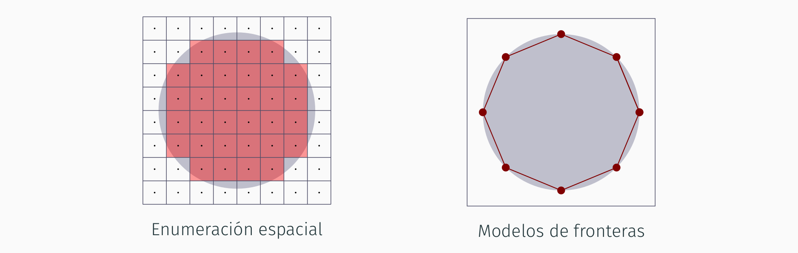
### Modelos Algorítmicos

Se basan en modelar un objeto $O$ mediante la implementación en el código de la aplicación de una función asociada al mismo (que se evalúa en cualquier punto $p$ del espacio), sin usar una estructura de datos. Hay varias opciones:

- **Función de pertenencia de $O$**: La función produce un valor lógico, `True` si $p$ está dentro de $O$ o `False` si está fuera. 

> La visualización usando estos modelos puede ser muy costosa en tiempo.

$$F_O(p) = \begin{cases}true & (p-c)\cdot(p-c) \leq r^2 \\ false & \text{ en otro caso }\end{cases}$$

```c++
bool pertenece_esfera(vec3 & p, vec3 & c, float r)
{
	return dot(p-c, p-c) <= r*2 ;
}
```

- **Función de distancia con signo de $O$** (_Signed Distance Function_): La función devuelve la distancia más corta desde $p$ a la frontera de $O$ (negativa si está dentro de $O$, positiva si está fuera). 

> Mucho más eficiente en tiempo.

$$SDF_O(p) = \|p-c\|-r$$

```c++
float sdf_esfera(vec3 & p, vec3 & c, float r)
{
	return (p-c).length() - r;
}
```

En la actualidad las _Signed Distance Functions_ se usan para representar escenas y objetos complejos, pues constituyen la única forma de representar y visualizar (con un alto grado de exactitud visual) algunos tipos de objetos matemáticos, como los **fractales**. 

> Se usan métodos numéricos iterativos, usualmente lentos.

# 2. Modelos de Fronteras

Una **malla de polígonos** (_polygon Mesh_) es un conjunto de puntos en un espacio afín que forman **caras** (_faces_) planas, usualmente adyacentes entre ellas, y que aproxima la frontera de un objeto en el espacio 3D.

> El término objeto designa un conjunto de puntos como los descritos antes (de extensión finita, continuo). Una cara es un conjunto de puntos en un plano de dicho espacio afín, delimitados por un polígono. 

Las mallas aproximan una superficie la cual encierra completamente una región del espacio (el objeto tiene volumen), o bien constituye en si misma el objeto, que tiene volumen nulo,

> Las primeras son mallas **cerradas** y las segundas **abiertas**


## 2.1 Elementos y Adyacencia

### Vértices

Un **vértice** (_vertex_) es un par formado por un **punto** del espacio afín, al que llamaremos **posición del vértice**, y un **valor entero único** (entre $0$ y $n-1$, donde $n$ es el número de vértices de la malla). al que llamaremos **índice del vértice**.

> Dos vértices distintos (con distinto índice) pueden tener la misma posición.

Usar estos índices permiten expresar la topología de una malla independientemente de su geometría. Además, facilita construir representaciones computacionales de las mallas con ciertas propiedades.

### Caras

Una **cara** (_face_) contiene un conjunto de puntos coplanares que están delimitados por un único polígono plano. Se determina por una secuencia ordenada de índices de vértices que forman dicho polígono.

En la secuencia de índices, cada vértice comparte una arista con el siguiente (y el último con el primero). En esta secuencia es indiferente cual índice es el primero. En principio, es indiferente en que sentido se recorren los
vértices (solo hay dos posibilidades).

> Dos caras distintas no pueden tener asociado el mismo conjunto de índices, ni siquiera con distinto orden o empezando en distintos vértices.

### Aristas

Una **arista** (_edge_) contiene el conjunto de puntos en un lado del polígono que delimita una cara, puntos que forman un segmento de recta. Se determina por un par único de índices de vértices.

- Los dos índices de vértice de una arista no pueden coincidir.
- El orden en el que aparecen los índices en el par es irrelevante ya que las aristas no está orientadas.
- Dos aristas distintas no pueden tener el mismo par de índices de vértice, ni siquiera en distinto orden.

### Representación de mallas

Esto implica que una malla viene determinada por la secuencia
$$\{ \dot{p}_0 , \dot{p}_1 , \dotsc , \dot{p}_{n-1} \}$$
de posiciones de sus $n$ vértices y la secuencia de caras, cada una de ellas representada como una
secuencia de $k$ índices de vértice
$$\{i_0, \dotsc, i_{k−1}\}$$
> $k$ puede ser distinto en cada cara

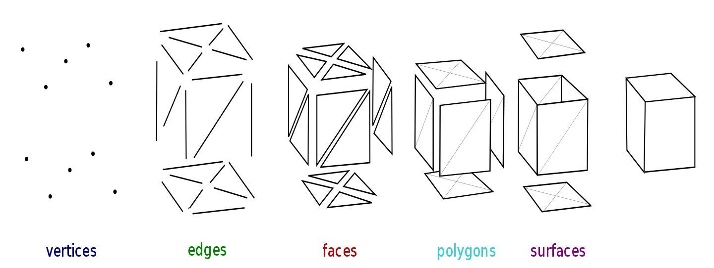


### Adyacencia entre elementos de una malla

En una malla existen relaciones binarias de adyacencia entre estos elementos:
- Un vértice en el extremo de una arista es adyacente a la arista (por tanto, toda arista es adyacente a exactamente dos vértices).
- Una arista y una cara son adyacentes si la arista forma parte del polígono que delimita la cara.
- Dos vértices son adyacentes si hay una arista adyacente a ambos.
- Dos caras son adyacentes si hay una arista adyacente a ambas.
- Un vértice y una cara son adyacentes si hay una arista adyacente a ambos.

Puesto que los vértices están numerados, las relaciones de adyacencia se pueden expresar en términos de los índices de los vértices.

### Geometría y topología de las mallas

Una malla tiene una geometría y una topología:

- **Geometría**: Conjunto de puntos que están en alguna cara (eso incluye los puntos que están en alguna arista y las posiciones de los vértices).
- **Topología**: Conjunto de relaciones de adyacencia entre vértices, aristas y caras (sin tener en cuenta la geometría, es decir, considerando únicamente los índices de los vértices).

Esta definición permite que dos mallas distintas:

- Tengan la misma topología pero distinta geometría, por ejemplo, partimos de una malla y cambiamos las posiciones de sus vértices, pero mantenemos las adyacencias.
- Tengan la misma geometría pero distinta topología, por ejemplo, partimos de una malla con caras de cuatro aristas y dividimos cada cara en dos caras triángulares coplanares.
### Características de las 2-variedades

Vamos a usar exclusivamente mallas que son una **superficie topológica** (_2-manifold_), esto implica que:
- Un vértice siempre es adyacente a dos aristas como mínimo (no hay vértices aislados).
- Una arista siempre es adyacente a una o a dos caras (no hay aristas aisladas, ni aristas adyacentes a 3 o más caras).
- Todas las caras adyacentes a un vértice se pueden ordenar en una secuencia en la cual cada cara es adyacente a la siguiente.

Estas propiedades aseguran, entre otras cosas, que se pueden asignar ciertos atributos a cada vértice de forma única (por ejemplo, normales y coordenadas de textura), ya que el entorno de un punto de la superficie siempre es equivalente a un plano.

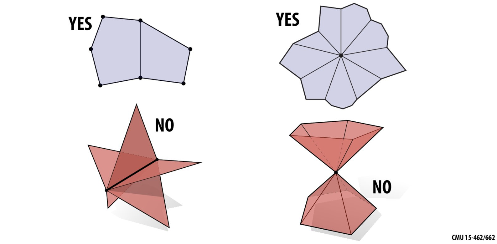

La topología de una malla que no es una 2-variedad puede modificarse para que lo sea, manteniendo la geometría:

- Se puede conseguir replicando vértices, es decir, añadiendo nuevos vértices con índices distintos en la misma posición de otros vértices ya existentes, por ejemplo, dos conos unidos por el ápice se separan al insertar dos ápices en la misma posición, un ápice por cono.
- Esto puede implicar a veces también replicar aristas, por ejemplo, dos cubos unidos con una arista en común se separan duplicando los dos vértices de dicha arista y la propia arista.

### Aristas y vértices de frontera

- Una arista es una **arista de frontera** (o de borde) (_boundary edge_ o _border edge_) si es adyacente a una única cara.
- Un vértice es un **vértice de frontera** si es adyacente a alguna arista de frontera.
- Una malla es cerrada si y solo si no tiene aristas de frontera (todas las aristas son adyacentes a exactamente dos caras).
- Las mallas abiertas tienen al menos una cara de frontera.

### Marco de referencia de la malla

La posición de cada vértice se representa en el ordenador por sus coordenadas respecto de un marco de referencia cartesiano $\mathcal{R}$ único. A dicho marco de referencia se le denomina **marco de referencia local de la malla**.

El $i$-ésimo vértice (en el punto $\dot{p}_i$) tiene coordenadas
$$c_i = (x_i , y_i , z_i , 1)$$
en el marco $\mathcal{R}$, es decir,
$$\dot{p}_i = \mathcal{R} \cdot \vec{c_i} = \mathcal{R} \cdot (x_i , y_i , z_i , 1)^T$$

> A la tupla $c_i$ se le denomina las coordenadas locales del vértice $i$-ésimo.
## 2.2 Atributos de vértices

### Atributos de las mallas

Como modelos de objetos reales, las mallas suelen incluir más información geométrica o del aspecto del objeto:

- **Normales** (_normals_): Vectores de longitud unidad
	- **Normales de caras**: Vector unitario perpendicular a cada cara, apuntando al exterior de la malla.
	- **Normales de vértices**: Vector unitario perpendicular al plano tangente a la superficie en la posición del vértice.
- **Colores**: Ternas (usualmente `RGB`) con tres valores entre $0$ y $1$.
	- **Colores de caras**: Útil cuando cada cara representa un trozo de superficie de color homogéneo.
	- **Colores de vértices**: Color de la superficie en cada vértice (la superficie varía de color de forma continua entre vértices).
- **Otros atributos**: Coordenadas de textura, vectores tangente y bitangente, etc...

### Normales de caras

Pueden ser útiles cuando el objeto que se modela con la malla está realmente compuesto de caras planas (por ejemplo, un cubo), o bien cuando se quiere hacer sombreado plano:

Para un polígono (con dos aristas $\vec{a}$, $\vec{b}$, vectores distintos, no nulos), su normal $\vec{n}$ se define como:
$$\vec{n} = \frac{\vec{m}}{\|\vec{m}\|} \hspace{0.5cm} \text{ donde } \hspace{0.5cm} \vec{m} = \vec{a} \times \vec{b}$$
En estos casos la normal se puede precalcular y almacenar en la malla para lograr eficiencia en tiempo de visualización.

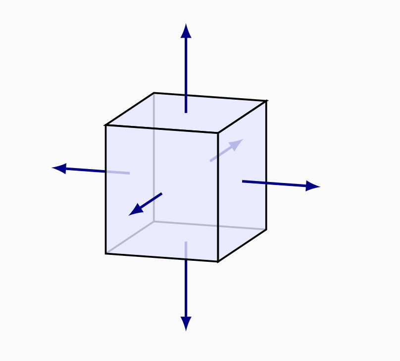

### Normales de vértices

Tienen sentido cuando la malla aproxima una superficie curvada:
- A veces la superficie original es conocida, y las normales se definen fácilmente (por ejemplo, una esfera).
- Si la superficie original es desconocida, las normales se pueden definir exclusivamente usando la malla

Para un vértice (con $k$ caras adyacentes) su normal $\vec{n}$ se define como:
$$\vec{n} = \frac{\vec{s}}{\|\vec{s}\|} \hspace{0.5cm} \text{ donde } \hspace{0.5cm} \vec{s} = \sum_{i = 0}^{k - 1} \vec{m_i}$$

donde $\vec{m}_0, \vec{m}_1, \dotsc, \vec{m}_{k-1}$ son las normales de las caras adyacentes al vértice.


### Discontinuidades de la normal

Algunos objetos reales presentan aristas o vértices donde la normal es discontinua (por ejemplo, un cubo), en ese caso promediar normales es mala idea, y es necesario replicar vértices y aristas (y después promediar):


> El cubo de la izquierda tiene $8$ vértices y el de la derecha $24$ vértices. 

> La iluminación es correcta a la derecha. El mismo problema puede aparecer con las coordenadas de textura, o los colores.

### Colores de vértices

En algunos casos, es conveniente asignar colores RGB a los vértices. La utilidad más frecuente de esto es hacer interpolación de color en las caras durante la visualización:

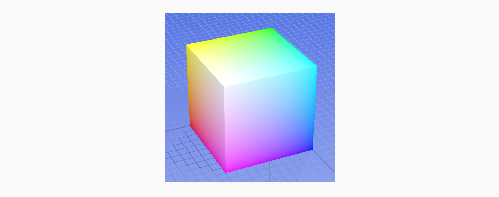

# 3. Representación en memoria de Modelos de Fronteras

En esta sección veremos distintas formas de representar las mallas en la memoria de un ordenador:
- **Triángulos aislados**, **tiras de triángulos**: No representan explícitamente la topología.
- **Mallas indexadas**: Representan explícitamente la topología.
- **Aristas aladas**: Extensión de las mallas indexadas para eficiencia en tiempo.

OpenGL está diseñado para visualizar directamente los triángulos aislados, las tiras de triángulos y las mallas indexadas.
## 3.1 Triangulos Asilados

La más simple es usar una lista o tabla de triángulos aislados. La malla se representa como un vector o lista con tres entradas (tres variables de tipo `vec3`) para cada triángulo:

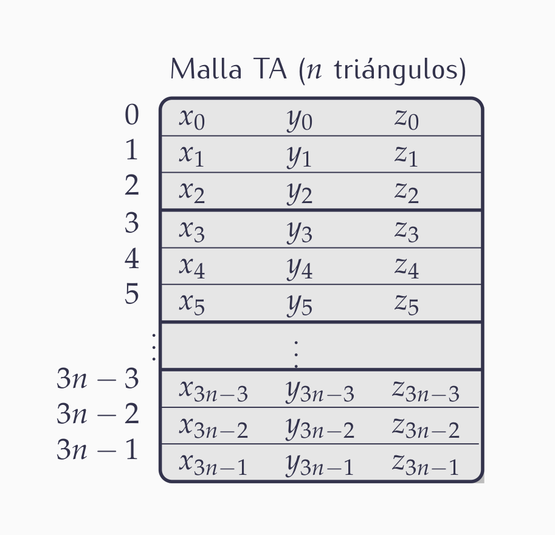

- Para cada triángulo se almacenan las coordenadas locales de cada uno de sus tres vértices ($9$ valores flotantes en total).
- La tabla se puede almacenar en memoria con todas las coordenadas contiguas.
- En total, incluye $9n$ valores flotantes.

Esta representación es poco eficiente en tiempo y memoria:
- Si un vértice es adyacente a $k$ triángulos, sus coordenadas aparecen repetidas $k$ veces en la tabla y se procesan $k$ veces al visualizar.
- En una malla típica que representa una rejilla de triángulos, los vértices internos (la mayoría) son adyacentes a 6 triángulos, es decir, cada tupla aparece casi 6 veces como media.

Además, no hay información explícita sobre la topología de la malla:
- La topología se puede calcular comparando coordenadas de vértices, pero tendría una complejidad en tiempo cuadrática con el número de vértices y es poco robusto.

En algunos casos muy particulares, podría ser útil (objetos realmente compuestos de muchos triángulos realmente aislados, objetos muy sencillos).

```c++
class MallaTA : public Objeto3D
{
protected:
	std::vector<glm::vec3> vertices; // Tabla de vértices (3n tuplas)
	DescrVAO * vao = nullptr; // Puntero al VAO (creado en la visualización)
. . .
public:
	virtual void visualizarGL() ;
	virtual void visualizarGeomGL() ;
. . .
} ;
```

> Se trata de una secuencia no indexada (no hay índices), se puede visualizar usando el método `draw` de `DescrVAO` con el tipo de primitiva `GL_TRIANGLES`.
## 3.2 Tiras de Triángulos

Las representanción en memoria usando tiras de triángulos pretende reducir la memoria y el tiempo que necesitan la
representación de triángulos aislados. Para conseguir esto, esta representación reduce el número de veces que aparecen replicadas unas coordenadas en memoria. Como consecuencia, se reduce el tiempo de procesamiento.

> Sin embargo, esta representación no evita totalmente las redundancias y tampoco incluye información explícita sobre la topología de la malla.

Podemos identificar una parte de una malla como una tira de triángulos: cada triángulo $T_{i+1}$ en la secuencia es adyacente al anterior $T_i$, con lo cual $T_{i+1}$ comparte con $T_i$ una arista y dos vértices, vértices cuyas coordenadas no tienen que ser repetidas en memoria:

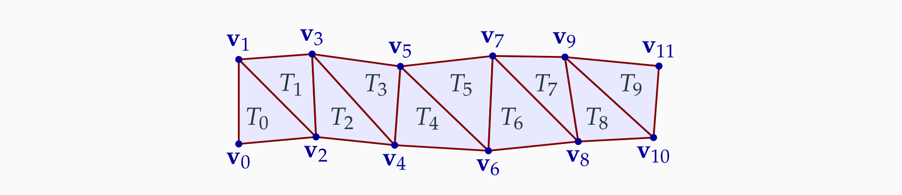

Cada tira de $n$ triángulos necesita $n + 2$ tuplas de coordenadas de vértices (tres para el primer triángulo y después una más por cada triángulo adicional)

Se almacena una tabla que en la $i$-ésima entrada almacena las coordenadas del $i$-ésimo vértice.

En la mayoría de los casos, las tiras obligan a repetir algunas coordenadas de vértices (aunque en mucho menor grado que los triángulos aislados). Ejemplo de una tira en zig-zag:

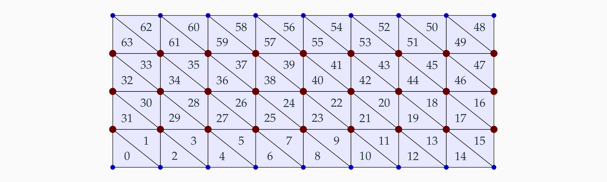

> Las coordenadas de los vértices en rojo se repiten dos veces, mientras que las de los vértices en azul aparecen una sola vez.

En algunos casos, es inevitable tener que recurrir a más de una tira para una única malla:

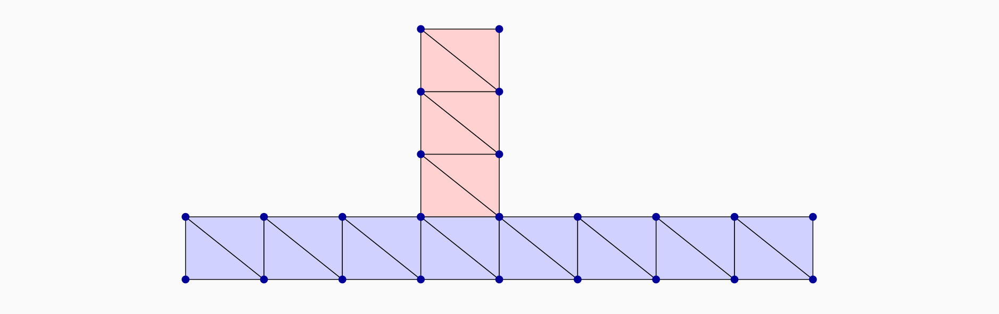

Por este motivo la implementación de una malla con tiras debe preveer más de una tira en la misma malla.
### Representación en memoria

Una malla es una estructura con varias tiras. La tira número $i$ (con $n_i$ triángulos) es un array con $n_i + 2$ celdas, en cada una están las coordenadas maestras de un vértice.

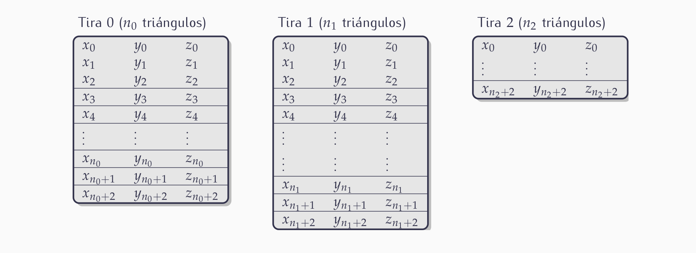

La mejora de las tiras frente a los triángulos aislados es que usan menos memoria, sin embargo, tiene estos inconvenientes:
- Al requerir probablemente más de una tira de triángulos, la representación es algo más compleja.
- Se necesitan algoritmos (complejos) para calcular las tiras a partir de una malla representada de alguna otra forma. Se intenta optimizar de forma que el número de coordenadas a almacenar sea el menor posible.
- El numero promedio de veces que se repite cada coordenada en memoria es prácticamente siempre superior a la 1, y cercano a 2.
- Esta representación tampoco incorpora información explícita sobre la conectividad.

```c++
struct TiraTri
{
	std::vector<glm::vec3> vertices;
	DescrVAO * vao = nullptr;
} ;

class MallaTT : public Objeto3D // Malla compuesta de tiras de triángulos
{
protected:
	std::vector<TiraTri> tiras; // Vector de tiras
. . .
public:
	virtual void visualizarGL( );
. . .
} ;
```

> Cada tira tiene su propio VAO y se visualiza con `draw` usando `GL_TRIANGLE_STRIP` como tipo de primitiva.
## 3.3 Mallas Indexadas

Para solucionar los problemas de uso de memoria y tiempo de procesamiento de las soluciones anteriores, se puede usar una estructura con dos tablas:
- **Tabla de vértices**: Tiene una entrada por cada vértice, incluyendo sus coordenadas.
- **Tabla de triángulos**: Tiene una entrada por triángulo, incluyendo los índices de sus tres vértices de la tabla anterior.

En esta solución no se repiten coordenadas de vértices, ahorrando así  memoria/cómputo, y se almacena información explícita de la topología (conectividad), es decir, se almacenan explícitamente los vértice adyacentes a un triángulo y se pueden calcular fácilmente el resto de adyacencias.
### Estructura de datos

La tabla de triángulos (para $n$ triángulos), almacena un total de $3n$ índices de vértices (enteros sin signo), y la de vértices $3m$ valores reales:

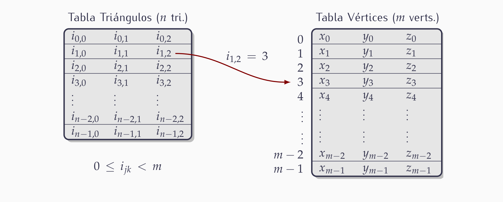

```c++
class MallaInd : public Objeto3D
{
protected:
	std::vector<glm::vec3> vertices ; // Tabla de vértices
	std::vector<glm::uvec3> triangulos; // Tabla de triángulos (índices)
	DescrVAO * vao = nullptr;
. . .
public:
	virtual void visualizarGL();
. . .
} ;
```

> Es una secuencia indexada que se visualiza con draw, usando `GL_TRIANGLES` como tipo de primitiva.
### Tiras de triángulos indexadas

Es posible representar una malla como una tabla de vértices y varias tiras de triángulos. Cada tira almacena índices de vértices en lugar de coordenadas de vértices.
- Las coordenadas no se repiten en memoria.
- Se repiten en memoria los índices de vértices, pero menos veces que con tabla de vértices y triángulos.
- El modelado usando tiras es más complejo.

Se pueden visualizar usando `glDrawElements` con `GL_TRIANGLE_STRIP` como tipo de primitivas:
- Las coordenadas de vértice se envían y se procesan una sola vez.
- Los índices de vértices se envían repetidos, pero solo un par de veces de media aprox.

### Archivos con mallas indexadas: el formato PLY

El formato PLY fue diseñado por Greg Turk y otros en la Universidad de Stanford a mediados de los 90. Codifica una malla indexada en un archivo ASCII o binario. Tiene tres partes:

- **Cabecera**: Describe los atributos presentes y su formato, se indica el número de vértices y caras, ocupa varias líneas.
- **Tabla de vértices**: Un vértice por línea, se indican sus coordenadas X, Y y Z (flotantes) en ASCII, separadas por espacios.
- **Tabla de caras**: Una cara por línea, se indica el número de vértices de la cara, y después los índices de los vértices de la cara (comenzando en cero para el primer vértice de la tabla de vértices).

> El formato es extensible de forma que un archivo puede incluir otros atributos, por ejemplo, colores de vértices.

```ply
ply
format ascii 1.0
comment Archivo de ejemplo del formato PLY (8 vertices y 6 caras)
element vertex 8
property float x
property float y
property float z
element face 6
property list uchar int vertex_index
end_header
0.0 0.0 0.0
0.0 0.0 2.0
0.0 1.3 1.0
0.0 1.4 0.0
1.1 0.0 0.0
1.0 0.0 2.0
1.0 0.8 1.5
0.5 1.0 0.0
4 0 1 2 3
4 7 6 5 4
4 0 4 5 1
4 1 5 6 2
4 2 6 7 3
4 3 7 4 0
```

### Archivos con mallas indexadas: el formato OBJ

El formato OBJ se usa bastante hoy en día, es parecido a PLY, pero con las normales y coordenadas de textura indexadas:
- Incluye una tabla de vértices y una tabla de triángulos, igual que PLY
- Además, incluye tablas normales y coordenadas de textura. A diferencia de PLY, su tamaño no tiene porque coincidir con el de la tabla de vértices.
- En cada cara, cada vértice se representa por un índice de sus coordenadas de posición, y opcionalmente, otros índices independientes para su normal y sus coordenadas de textura.

La ventaja frente a PLY es una mayor flexibilidad, lo que permite mayor eficiencia en memoria:
- Dos vértices en posiciones distintas pueden compartir normal (por ejemplo, una malla plana puede tener una única normal, en lugar de tantas como vértices)
- Un vértice único puede tener distintas coords. de textura o distintas normales en distintas caras, no es necesario replicarlo (por ejemplo, un cubo puede tener 8 vértices y solo 6 normales).

> La principal desventaja es que OpenGL no puede visualizar directamente este tipo de tablas, así que es necesario convertirlas a una malla indexada de triángulos, replicando normales y coordenadas de textura.
### Tabla de aristas

En una malla indexada podría ser conveniente (para ganar tiempo de procesamiento en ciertas aplicaciones) almacenar explicitamente las aristas (ahora esa info. está implícita en la tabla de triángulos). Se puede hacer usando un tabla de aristas:
- Contiene una entrada por cada arista.
- En cada entrada hay dos índices (naturales) de vértices (los dos vértices en los extremos de la arista).
- El orden de los vértices en cada entrada es irrelevante, pero las aristas no deben estar duplicadas.

La disponibilidad de esta tabla permite, por ejemplo, dibujar en modo alambre con begin/end sin repetir dos veces el dibujo de aristas adyacentes a dos triángulos.

## 3.4 Representación con estructura de aristas aladas

La estructura de malla indexada permite, por ejemplo, consultar con tiempo en $O(1)$ si un vértice es adyacente a un triángulo, pero:

- Para consultar si dos vértices son adyacentes, hay que buscar en la tabla de triángulos si los vértices aparecen contiguos en alguno, requiriendo un tiempo en $O(n_t)$.
- No se guarda información de las aristas. Las consultas relativas a aristas se resuelven también en $O(n_t)$.
- En general, las consultas sobre adyancencia son costosas en tiempo.

Para poder reducir los tiempos de cálculo de adyacencia a $O(1)$, se puede usar más memoria de la estrictamente necesaria para la malla indexada. Veremos la estructura de **aristas aladas** (para mallas que encierran un volumen, es decir, siempre hay dos caras adyacentes a una arista, no necesariamente triangulares).

### Estructura de aristas aladas: tabla de aristas

Una malla se puede codificar usando una tabla de vértices (`tver`) mas una tabla de aristas (`tari`). Esta última tiene una entrada por cada arista, con dos índices:
- `vi`:  Índice de vértice inicial
- `vf`: Índice de vértice final

> Es indiferente cual se selecciona como inicial y cual como final

Tambien tiene (cada arista es adyacente a dos triángulos):
- `ti`: Índice del triángulo a la izquierda
- `td`: Índice del triángulo a la derecha

> Izquierda y derecha entendidos según se recorre la arista en el sentido que va desde vértice inicial al final

Esto permite consultas en O(1) sobre adyacencia arista-vértice y arista-triángulo.
### Aristas siguiente y anterior

Además de los datos anteriores, se guarda, para cada arista, los índices de otras cuatro adyacentes a ella. Si se recorren las aristas del triángulo de la izquierda aparecerá la arista en cuestión entre otras dos, cuyos índices se guardan en la tabla:
- `aai`: Índice de la arista anterior
- `asi`: Índice de la arista siguiente

> El recorrido de las aristas se hace en sentido anti-horario cuando se observa el triángulo desde el exterior de la malla

Igualmente, se guardan los dos índices de arista anterior y siguiente relativas al recorrido anti-horario del triángulo de la derecha:
- `aad`: Índice de la arista anterior (derecha)
- `asd`: Índice de la arista siguiente (derecha)
### Índices asociados a una arista

Índices (valores naturales) en la entrada correspondiente a la arista vertical en una malla (no necesariamente de triángulos):

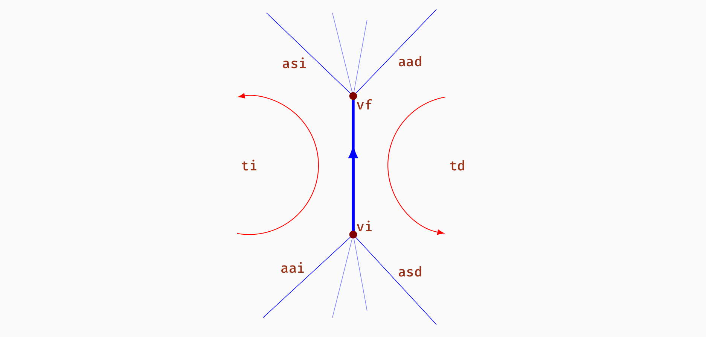

### Uso de las aristas siguiente y anterior

El hecho de almacenar las aristas siguiente y anterior permite hacer recorridos por las entradas de la tabla de aristas siguiendo esos índices:
- Dada una arista y un triángulo adyacente (el izquierdo o el derecho), se pueden obtener estas listas:
	- Aristas adyacentes al triángulo.
	- Vértices adyacentes al triángulo
- Dada una arista y un vértice adyacente (el inicial o el final), se pueden obtener estas listas:
	- Aristas que inciden en el vértice (esto permite resolver fácilmente adyacencias arista-arista)
	- Triángulos adyacentes al vértice.

Con toda esta información (los 8 valores), se puede resolver directamente cualquier adyacencia que involucre una arista al menos (consultando su entrada). Aun no podemos resolver el resto.
### Tablas adicionales. Uso

Para hacer todas las consultas en $O(1)$, añadimos `taver` y `tatri`:
- `taver`: Tabla de aristas de vértice: para cada vértice, almacenamos el índice de una arista adyacente cualquiera:

> Dado un vértice, permite recuperar todas las aristas, vértices y triángulos adyacentes. Por tanto, permite consultas de adyacencia vértice-vértice y vértice-triángulo.

- `tatri`: Tabla de aristas de triángulo: para cada triángulo, se almacena el índice de una arista cualquiera adyacente:

> Dado un triángulo, permite recuperar todas las aristas, vértices y triángulos adyacentes. Por tanto, permite consultas de adyacencia triángulo-triángulo y vértice-triángulo (esta última se puede hacer de dos formas).

# 4. Transformaciones Geométricas

## 4.1 Concepto de transformación geométrica

### Coordenadas del mundo e instanciación de objetos

Las mallas que hemos visto en la sección anterior tienen las coordenadas de sus vértices definidas respecto de un sistema de referencia local (coordenadas maestras o locales) , pero en una escena con varias mallas (o, en general, varios objetos) todos los vértices deben aparecer referidos a un único sistema
de referencia común.

Dicho sistema es el llamado **marco de coordenadas de la escena**, o **marco de coordenadas del mundo**, (_world coordinate system_), y es un marco cartesiano.

> Las coordenadas de los vértices, respecto de dicho sistema de referencia, se llaman **coordenadas del mundo** (_world
coordinates_)

Esto permite separar la definción de los objetos (en coordenadas maestra), de su uso en una escena concreta, lo
cual es usual en la industria de la infografía 3D actualmente.

### Instanciación de una malla en una escena

Un objeto se define una vez pero se puede **instanciar** muchas veces en una o distintas escenas.

> A modo de ejemplo, una malla indexada se podría instanciar varias veces en distintas posiciones, orientaciones y tamaños:

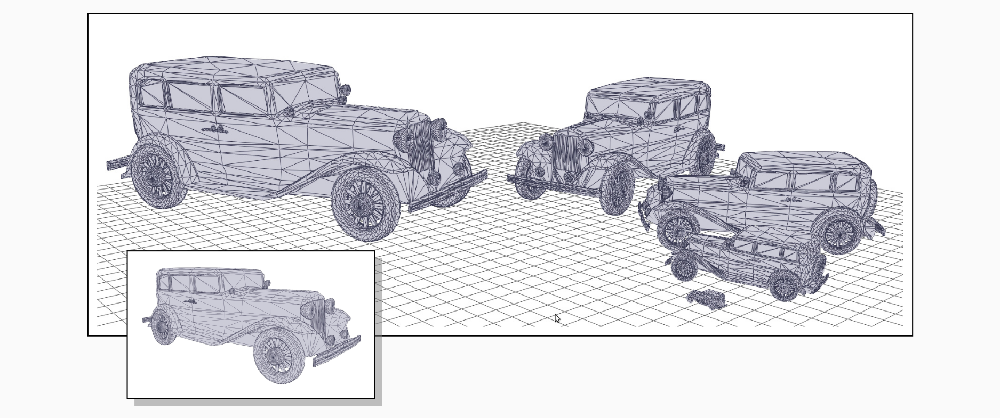

### Transformación geométrica

Para lograr la instanciación, hay que modificar la posición de los vértices de cada objeto, o, lo que es lo mismo, calcular sus coordenadas del mundo a partir de las coordenadas locales o maestras. Para esto se usan transformaciones geométricas.

Lo más frecuente es que esas transformaciones sean transformaciones afines:
- **Rotaciones**: Rotar los puntos un ángulo en torno a un eje
$$R(\dot{p}) = \begin{pmatrix} \cos \theta & - \sin \theta & 0 & t_x \\ \sin \theta & \cos \theta & 0 & t_y \\ 0 & 0 & 1 & t_z \\ 0 & 0 & 0 & 1\end{pmatrix} \begin{pmatrix} \dot{p}_x \\ \dot{p}_y \\ \dot{p}_z \\ 1 \end{pmatrix}$$
- **Traslaciones**: Desplazar todos los puntos del espacio de igual forma, es decir, en la misma dirección y la misma distancia.
$$T(\dot{p}) = \begin{pmatrix} 1 & 0 & 0 & t_x \\ 0 & 1 & 0 & t_y \\ 0 & 0 & 1 & t_z \\ 0 & 0 & 0 & 1\end{pmatrix} \begin{pmatrix} \dot{p}_x \\ \dot{p}_y \\ \dot{p}_z \\ 1 \end{pmatrix}$$
- **Escalado**: Estrechar o alargar las figuras en una o varias direcciones.
$$S(\dot{p}) = \begin{pmatrix} s_x & 0 & 0 & 0 \\ 0 & s_y & 0 & 0 \\ 0 & 0 & s_z & 0 \\ 0 & 0 & 0 & 1\end{pmatrix} \begin{pmatrix} \dot{p}_x \\ \dot{p}_y \\ \dot{p}_z \\ 1 \end{pmatrix}$$
- **Reflexión**: Imagen especular de un punto al otro lado de un plano.
$$M(\dot{p}) = \begin{pmatrix} 1 - 2n_x n_x & n_x n_y & n_x n_z & 0 \\ n_y n_x & 1 - 2n_y n_y & n_y n_z & 0 \\ n_z n_x & n_z n_y & 1 - 2n_z n_z & 0 \\ 0 & 0 & 0 & 1\end{pmatrix} \begin{pmatrix} \dot{p}_x \\ \dot{p}_y \\ \dot{p}_z \\ 1 \end{pmatrix}$$
- **Cizallas**: Se puede ver como un desplazamiento de todos los puntos en la misma dirección, pero con distancias distintas.
$$C(\dot{p}) = \begin{pmatrix} 1 & \lambda & 0 & 0 \\ 0 & 1 & 0 & 0 \\ 0 & 0 & 1 & 0 \\ 0 & 0 & 0 & 1\end{pmatrix} \begin{pmatrix} \dot{p}_x \\ \dot{p}_y \\ \dot{p}_z \\ 1 \end{pmatrix}$$

> Las transformaciones geométricas se usan para instanciar objetos, o, en general, modificar su posición, orientación y tamaño.

## 4.3 Transformación de normales

Sea una superficie (2-variedad), donde a cada punto $\dot{p}$ le podemos asociar una normal $\vec{n}( \dot{p})$. Supongamos que transformamos todos sus puntos según una transformación afín $T$, con matriz $A$ en un marco cartesiano $C$:

- Si $T$ conserva los ángulos (aunque sea en valor absoluto), entonces conserva la dirección de las normales. Este es el caso de las traslaciones, reflexiones, rotaciones y escalados uniformes.
- Si $T$ no conserva los ángulos, entonces tampoco conserva las normales. Es el caso de los escalados no uniformes y las cizallas.

> En cualquier caso siempre existe una transformación afín (con matriz $U$ en $C$ ) que transforma las normales ($U$ depende de $A$). En todos los casos, decimos que una transformación conserva las normales cuando conserva su dirección, aunque no conserve su longitud.

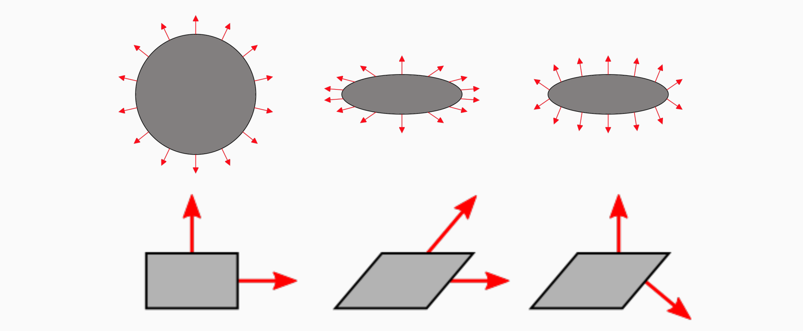

> Normales originales, mal transformadas, y bien transformadas.

### La matriz de transformación de normales

Para obtener la expresión de la matriz $U$ en términos de la matriz $A$, hacemos estas consideraciones:
- Representamos las normales como vectores columna, igual que los vectores.
- Al igual que los vectores, las normales no se ven afectadas por traslaciones, es decir, podemos considerar $A$ como una matriz $3 \times 3$ sin términos de traslaciones.
- Supongamos que un vértice (en la malla original) tiene una normal $\vec{n}$, y que el vector tangente a la superficie en el vértice es $\vec{t}$, puesto que $\vec{t}$ y $\vec{n}$ son perpendiculares, se cumple
$$ \vec{t} \cdot \vec{n} = 0 \iff \begin{pmatrix} t_1 & t_2 & t_3 \end{pmatrix} \begin{pmatrix} n_1 \\ n_2 \\ n_3 \end{pmatrix} = 0$$
- Al transformar la superficie por $A$ el vector tangente transformado es $A\vec{t}$ (los vectores tangentes son vectores libres y se transforman como cualquier otro vector).
- El vector normal se transforma la matriz $U$ (desconocida en principio). Si queremos que la transformación preserve la perpendicularidad, se debe cumplir esto:
$$A \vec{t} \cdot U \vec{n} = 0 \iff (A \vec{t})^T (U \vec{n}) = (\vec{t}^T A^T) (U \vec{n}) = 0$$

De (5) deducimos que $\vec{t}^T(A^TU)\vec{n} = 0$, luego deducimos que $A^T U = I$, y así sabemos que $U$ es la inversa de la traspuesta de $A$:
$$U = (A^T)^{-1} = (A^{-1})^T$$
## 4.5 Gestión de _modelview_ en un Cauce Básico

## 4.6 Gestión de _modelview_ en Cauces 3D

## 5. Modelos Jerárquicos. Representación y Visualización

## 5.1 Modelos Jerárquicos y Grafo de Escena

En una escena típica se incluyen muchas instancias distintas de malas u objetos geométricos 
$$S = \{0_1, O_2, \dotsc, O_n\}$$
Cada objeto $O_i$ se incluye con una transformación $T_i$, pudiendo ser un objeto instanciado más de una vez pero condistintas transformaciones. Cada transformación sirve para situar al objeto (definido en su propio marco de referencia $\mathcal{R}_i$) en su lugar en relación al marco de referencia de la escena, llamado **marco de referencia del mundo**, $\mathcal{W}$.

> Intuitivamente cada transformación $T_i$ la podemos ver como la conversión desde coordenadas relativas a $\mathcal{R}_i$ hacia coordenadas relativas a $\mathcal{W}$.

A pesar de ser versátil, el esquema anterior es complejo de usar para escenarios muy complejos. En estos casos se usan los **modelos jerárquicos**. Cada objeto $O_i$ del esquema anterior puede ser de dos tipos de objetos geométricos:
- **Objeto Simple**: El objeto $O_i$ es una malla u otros objetos que no están compuestos de otros objetos más simples.
- **Objeto Compuesto**: El objeto $O_i$ es una sub-escena, es decir, está compuesto de varios objetos que se instancian mediante diferentes transformaciones.

> Una escena ahora es un único objeto, que puede ser simple o compuesto, siendo, por tanto, una estructura de tipo **Grafo Dirigido Acíclico** (_Directed Acyclic Graph_).

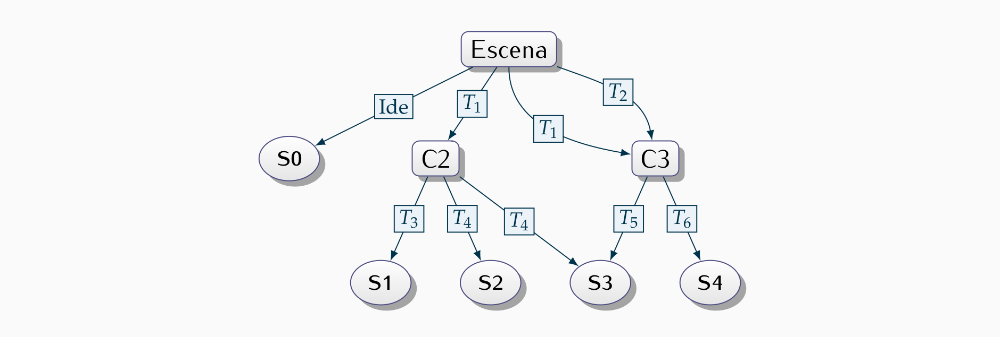

> Cada objeto compuesto se identifica mediante un nodo no terminal. 
> Cada objeto simple se identifica mediante un nodo terminal. 
> Cada arco se etiqueta mediante una transformación geométrica.

## 5.2 Grafos PHIGS

Por su mayor simplicidad y proximida a la implementación de OpenGL, usaremos una notación inspirada en el antiguo estándar PHIGS. El grafo anterior puede expresarse de forma equivalente así:

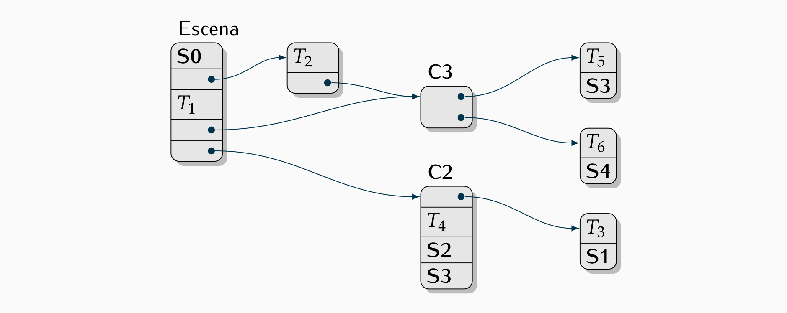

### Objeto Compuesto: Puerta


### Objeto Compuesto: Ventana

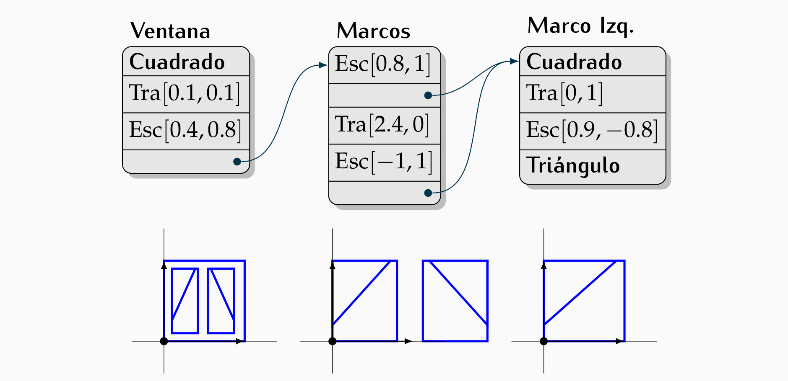

### Objeto Compuesto: Fachada

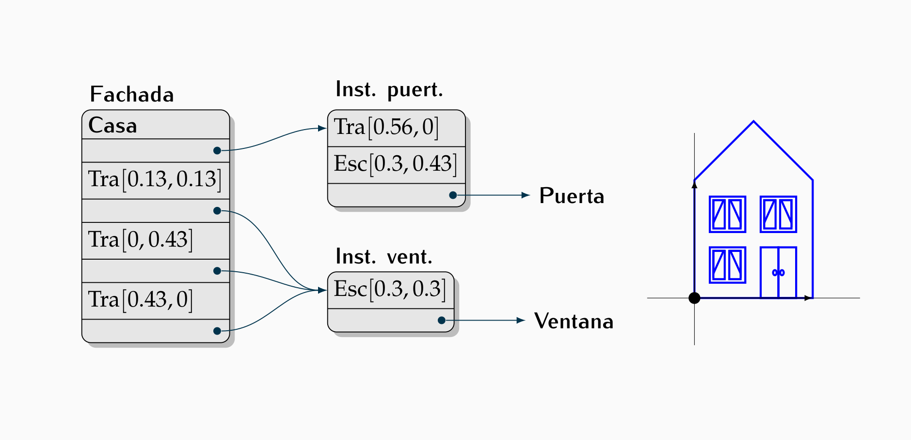

## 5.3 Representación de Grafos

Cada nodo del grafo de escena es un tipo especial de `Objeto3D` con una lista o vector de entradas. Cada entrada puede ser de dos tipos:
- Un puntero a un `Objeto3D` 
- Un puntero a una matriz `glm::mat4` que representa una transformación

> Una escena se puede representar usando un puntero al nodo raíz. Un nodo puede verse como un objeto 3D compuesto de otros objetos y transformaciones.

### Entradas de los nodos

```c++
// Tipo enumerado con los tipos de entradas de los nodos del grafo:
enum class TipoEntNGE { objeto, transformacion, .... } ;

// Entrada del nodo del Grafo de Escena
struct EntradaNGE
{
	TipoEntNGE tipoE; // Tipo de entrada
	union 
	{ 
		Objeto3D* objeto ; // ptr. a un objeto (propietario)
		glm::mat4* matriz ; // ptr. a matriz 4x4 transf. (prop.)
		. . . 
	};
	// Constructores
	EntradaNGE(Objeto3D * pObjeto);
	EntradaNGE(const glm::mat4 & pMatriz);
	.....
};
```

### Los Objetos 3D tipo nodo del grafo

```c++
class NodoGrafoEscena : public Objeto3D
{
protected:
	std::vector<EntradaNGE> entradas ; // Vector de entradas
public:
	// Visualiza usando OpenGL
	virtual void visualizarGL( ) ;
	// Añadir una entrada (al final). Devuelve índice entrada.
	unsigned agregar(EntradaNGE * entrada);// Genérica
	// Construir una entrada y añadirla (al final)
	unsigned agregar(Objeto3D * pObjeto); // Objeto (copia puntero)
	unsigned agregar(const glm::mat4 & pMatriz); // Matriz (crea copia)
};
```

### Creación de estructuras

Para crear la estructura se pueden crear clases concretas derivadas de `NodoGrafoEscena`:
- Los constructores de dichas clases se encargan de crear las entradas.
- Cada constructor crea los sub-objetos de forma recursiva, así como las transformaciones necesarias.
- Si la estructura es de árbol, la liberación de la memoria puede hacerse recursivamente, si es un grafo acíclico, dicha liberación puede ser más complicada.

### Ejemplo


```c++
// Clase para el nodo del grafo etiquetado como Ventana
class Ventana : public NodoGrafoEscena
{ 
public:
	Ventana();
} ;
// Clase para el nodo del grafo etiquetado como Marcos
class Marcos : public NodoGrafoEscena
{ 
public:
	Marcos();
} ;
// clase para el nodo del grafo etiquetado como Marco Izq.
class MarcoIzq : public NodoGrafoEscena
{ 
public:
	MarcoIzq();
};
```

```c++
Ventana::Ventana()
{
	agregar(new Cuadrado); // Cuadrado
	agregar(translate(vec3(0.1, 0.1, 0.0))); // Tra[0.1, 0.1]
	agregar(scale(vec3(0.4, 0.8, 1.0))); // Esc[0.4, 0.8]
	agregar(new Marcos); // Marcos
}
MarcoIzq::MarcoIzq()
{
	agregar(new Cuadrado); // Cuadrado
	agregar(translate(vec3(0.0, 1.0, 0.0 ))); // Tra[0, 1]
	agregar(scale(vec3(0.9, -0.8, 1.0 )));// Esc[0.9, −0.8]
	agregar(new Triangulo); // Triangulo
}
Marcos::Marcos()
{
	MarcoIzq* marco_izq = new MarcoIzq ;
	agregar(scale(vec3(0.8, 0.1, 1.0))); // Esc[0.8, 0.1]
	agregar(marco_izq); // Marco Izq.
	agregar(translate(vec3(2.4, 0.0, 0.0))); // Tra[2.4, 0]
	agregar(scale(vec3( -1.0, 1.0, 1.0)));// Esc[−1, 1]
	agregar(marco_izq);// Marco Izq.
}
```

## 5.4 Visualización de Grafos en OpenGL

La visualización de grafos en OpenGL se basa en operaciones que permiten guardar y recuperar la matriz **modelview**.

