> Autor: Miguel Ángel Moreno Castro
>
> Source: Carlos Ureña Almagro

# 1. Cauce gráfico y definicón de la cámara

## 1.1 El cáuce gráfico del algoritmo Z-buffer

El término **cauce gráfico** (_graphics pipeline_) se suele usar para referirnos al conjunto de pasos de cálculo que se realizan para visualizar polígonos en el contexto del algoritmo de **Z-buffer**

El algoritmo de Z-buffer se usa para presentar polígonos, incluyendo **eliminación de partes ocultas** (EPO) en 3D, es decir, lograr presentar únicamente las partes visibles de los polígonos que se dibujan.

> OpenGL, DirectX y otras librerías 3D usan Z-buffer.

Estos pasos se implementan en hardware en las tarjetas gráficas modernas y no se aplican en otros algoritmos de visualización y EPO en 3D, como por ejemplo en Ray-tracing.

Los pasos del cauce gráfico suelen implementarse en secuencia, cada paso obtiene datos del anterior, los transforma de alguna manera y los entrega al siguiente paso. Los pasos (muy resumidos) son:
1. **Transformación de coordenadas de vértices**: Cálculo de donde se proyecta en pantalla cada vértice.
2. **Recortado**: Eliminación de partes de polígonos fuera de la zona visible.
3. **Rasterización y EPO**: Cálculo de los píxeles donde se proyecta un polígono.
4. **Iluminación y texturización**: Cálculo del color de cada pixel donde se proyecta un polígono.

> La transformación y el recortado se pueden mezclar de diversas formas, ambos pasos son necesariamente previos a los otros dos, que también se pueden combinar de varias formas entre ellos.

### Esquema de la transformación y recortado

En estas etapas del cauce gráfico, esencialmente los datos que se transforman son coordenadas de vértices y conectividad entre ellos. El esquema es el siguiente:

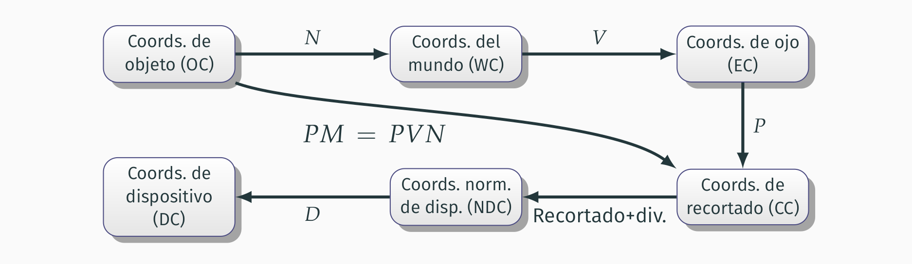

> Este esquema corresponde al recortado en CC (hay otras posibilidades, esta es la mejor)

### Sistemas de coordenadas

El cauce gráfico de OpenGL contempla una secuencia de 6 sistemas de coordenadas distintos. La transformación de coordenadas entre cada sistema de referencia y el siguiente en la lista se hace mediante una matriz específica.
1. **Master coordinates, OC**: Las coordenadas son distancias relativas a un sistema de referencia específico o distinto de cada objeto, que se crea en este espacio.
2. **World coordinates, WC**: Son distancias relativas a un sistema de referencia único, común para todos los objetos de una escena.
3. **Eye coordinates or view-coordinates, EC**: Son distancias relativas a un sistema de referencia posicionado y alineado con la cámara virtual en uso.
4. **Clip coordinates, CC**: Son distancias normalizadas (los vértices visibles están en el rango $[−1, +1]$ en $X$, $Y$ y $Z$), y con $w \neq 1$, relativas a un sistema asociado al rectángulo que forma la imagen en pantalla.
5. **Normalized device coordinates, NDC**: son similares a las coordenadas de recortado, pero con $w = 1$, y con todos los vértices en $[−1, +1]$  (los que están fuera se han eliminado).
6. **Device coordinates, DC**: Similares a NDC, pero ahora con las componentes X e Y en unidades de pixels.

Las **matrices de transformación** ($4 \times 4$) involucradas permiten convertir coordenadas de un sistema de coordenadas a coordenadas en otro:
- La **matriz de modelado y vista** (_modelview_) $M$, compuesta de:
	- **Matriz de modelado** $N$: Convierte de OC a WC
	- **Matriz de vista** $V$: Convierte de WC a EC
- La **matriz de proyección** $P$: Convierte de EC a CC. (recibe coordenadas con $w = 1$, pero produce coordenadas en general con $w \neq 1$)
- La **matriz del viewport** D: Convierte de NDC a DC (depende de la resolución de la imagen en pantalla y de la zona de esta donde se visualiza).

> Las coordenadas de dispositivo (con $w = 1$ y en unidades de pixels) se usan como entrada para las siguientes etapas del cauce gráfico (rasterización, EPO, iluminación y texturas)
## 1.2 Transformación de vista 3D

La transformación de vista es el cálculo que permite convertir coordenadas de mundo (_world coordinates_, WC) en coordenadas de cámara (_eye or camera coordinates_, EC).

Se usa un marco de referencia cartesiano 
$$\mathcal{V} = [ \hat{x}_{ec}, \hat{y}_{ec}, \hat{z}_{ec} , \dot{o}_{ec} ]$$
llamado **marco de cámara** (o de vista), que está posicionado y alineado con la cámara virtual. 

> Las **coordenadas de cámara** de un punto son las coordenadas de ese punto en el marco $\mathcal{V}$ y estas se calculan gracias a la matriz de cambio de sistema de referencia $V = \mathcal{M}(\mathcal{W}, \mathcal{V})$.


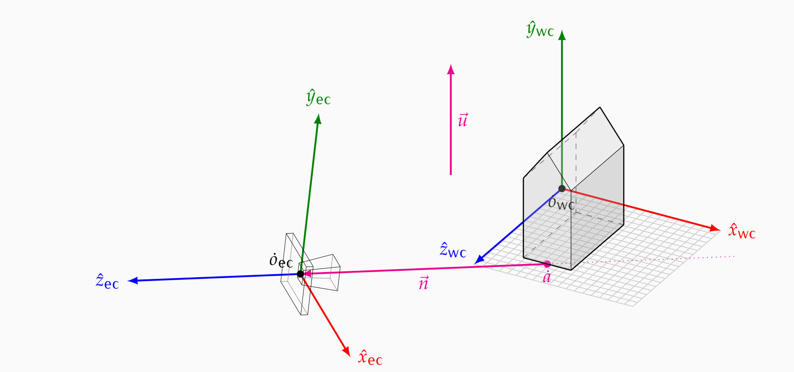

El sistema de referencia de vista $\mathcal{V}$, se define a partir de los siguientes parámetros:
- $\dot{o}_{ec}$ : Es el punto del espacio foco de la proyección, donde estaría situado el observador ficticio que contempla la escena (_projection reference point_, PRP).
- $\vec{n}$: Es el vector libre perpendicular al plano de visión (plano ficticio donde se proyecta la imagen perpendicular al eje óptico de la camara virtual, _view plane normal_, VPN).
- $\dot{a}$: Es el punto en el eje óptico, también llamado punto de atención (_look-at point_);
- $\vec{u}$: Es un vector libre que indica una dirección que el observador ve proyectada en vertical en la imagen (apuntando hacia arriba, _view-up vector_, VUP).

> De los tres parámetros $\dot{o}_{ec}$ , $\vec{n}$ y $\dot{a}$ solo hay que especificar dos, ya que no son independientes (se cumple $\dot{o}_{ec} = \dot{a} + \vec{n}$).

A partir de esos parámetros se obtiene se calculan los vectores de la base ortonormal del sistema de referencia de vista:
$$\hat{z}_{ec} = \frac{\vec{n}}{\|\vec{n}\|} \hspace{1cm} \hat{x}_{ec} = \frac{\vec{u} \times \vec{n}}{\|\vec{u} \times \vec{n}\|} \hspace{1cm} \hat{y}_{ec} = \hat{z}_{ec} \times \hat{x}_{ec}$$
> Para que este cálculo pueda hacerse, los vectores $\vec{u}$ y $\vec{v}$ no pueden ser nulos ni paralelos, de forma que siempre $\|\vec{u} \times\vec{n}\|  > 0$.

La matriz de vista se puede construir explícitamente usando las funciones de creación de matrices. Podemos usar la función `lookAt` de GLM, que tiene como parámetros las tuplas $\dot{o}_{ec}$, $\dot{a}$ y $\vec{u}$:

```c++
glm::mat4 lookAt(const glm::vec3 & oec, const glm::vec3 & a, const glm::vec3 & u);
```

O bien, si se conocen las tuplas $\hat{x}_{ec}$, $\hat{y}_{ec}$ , $\hat{z}_{ec}$ y $\dot{o}_{ec}$ que definen el marco de cámara, se puede componer la matriz explícitamente usando la función `MAT_Vista` :

```c++
// Construye V usando la matriz de traslación seguida con la de alineamiento
glm::vec3 ejes[3] = {xec , yec , zec};
glm::mat4 V = MAT_Vista(ejes, oec);
```

```c++
glm::mat4 MAT_Vista(const glm::vec3 ejes[3], const glm::vec3 & origen)
{
	// Declaramos la matriz del sistema de referencia
	glm::mat4 v = mat4(1.0);
	// Copiamos cada vector de la base en una fila de la matriz
	for (unsigned i = 0; i < 3; i++)
		for (unsigned j = 0; j < 3; j++)
			v[i][j] = ejes[j][i]; // en GLM, M[i][j] es la columna i, fila j de M
	// Devolver la traslación del origen seguida de la matriz de la base
	return v * translate(-origen);
}
```

> Estas funciones producen las matrices dispuestas en memoria por columnas (que es como las espera OpenGL).

### Matriz de vista en el cauce programable

En un cauce programable, la aplicación debe dar estos pasos:
- Construir la matriz de vista $V$, usando las coordenadas de los vectores y el punto que definen el marco de coordenadas de vista 3D.
- Declarar un parámetro _uniform_ en el _vertex shader_ que contiene la matriz de vista.
- Escribir el código del _vertex shader_ de forma que la posición de los vértices sea transformada usando la matriz de modelado y después la matriz de vista (o bien ambas a la vez usando la matriz _modelview_), de forma que obtengamos su posición en coordenadas de cámara.
### Transformación de modelado y vista en el vertex shader

Usando la matriz de vista y la de modelado, se calculan la posición y la normal, en coordenadas de cámara, a partir de las coordenadas de objeto:

```c++
uniform mat4 u_mat_modelado; // Matriz de modelado
uniform mat4 u_mat_modelado_nor; // Matriz de modelado para normales
uniform mat4 u_mat_vista; // Matriz de vista
. . .
void main()
{
	// Calcular posición y normal en coords de mundo
	vec4 posic_wcc = u_mat_modelado * vec4(in_posicion_occ, 1.0);
	vec3 normal_wcc = (u_mat_modelado_nor * vec4(in_normal,0)).xyz;
	// Calcular posición y normal en coordenadas de cámara
	v_posic_ecc = u_mat_vista*posic_wcc ;
	v_normal_ecc = (u_mat_vista*vec4(normal_wcc,0)).xyz ;
. . .
}
```

Para facilitar la definición de la matriz de vista en el cauce fijo y el programable, se puede usar la función `fijarMatrizVista(V)` de la clase `Cauce`, usando una variable `mat4` con la matriz de vista `V`:

```c++
void Cauce::fijarMatrizVista(const glm::mat4 & nue_mat_vista)
{
	// Reinicializa la matriz de vista usando nue_mat_vista
	mat_vista = nue_mat_vista;
	// Esto no se lo que hace
	glUseProgram(id_prog);
	glUniformMatrix4fv(loc_mat_vista, 1, GL_FALSE, value_ptr(mat_vista));
	// Vaciar las pilas de modelado y de modelado de normales
	pila_mat_modelado.clear();
	pila_mat_modelado_nor.clear();
	// Asignar la matriz identidad a la matriz de modelado y de modelado de normales
	mat_modelado = mat4(1.0f);
	mat_modelado_nor = mat4(1.0f);
	actualizarUniformsMatricesMN();
}
```

## 1.3 Transformación de proyección 3D

La transformación de proyección 3D (perspectiva) emula la proyección que ocurre idealmente en una cámara oscura, sobre la pared opuesta a la apertura. 

> Es similar a lo que ocurre en una cámara de fotografía, al proyectarse la escena sobre el sensor.

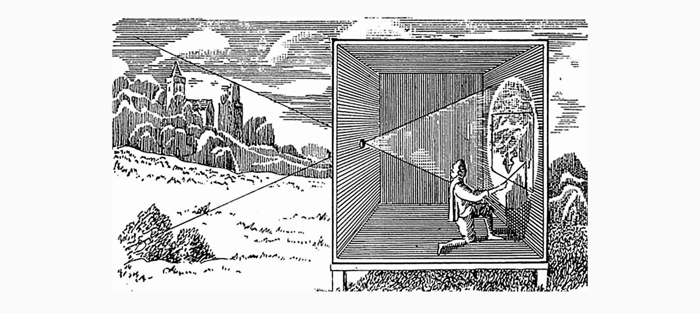

Los vértices se proyectan sobre un plano alineado con el sistema de referencia de la cámara. Dicho plano se denomina **plano de visión** (_viewplane_), es siempre perpendicular al eje $Z$ del marco de vista.

La proyección puede ser de dos tipos:
- **Proyección perspectiva**: Los vértices se proyectan sobre el plano de visión usando líneas que van desde cada punto al origen del marco de coordenadas de la cámara (a esas líneas se les llama **proyectores**, el origen actua como **foco** de la proyección). La coordenada $Z$ del plano de visión debe ser estrictamente positiva.
- **Proyección ortográfica o paralela**: Los proyectores son todos paralelos al eje $Z$. El plano de visión puede estar situado en cualquier valor de $Z$. Es un caso límite de la perspectiva, con el foco infinitamente alejado de la escena.

> Aunque ninguna de las dos formas de proyección es igual al comportamiento del sistema visual humano, la proyección perspectiva nos parece más natural (la ortográfica es poco realista):


### Proyección perspectiva

Cambia el tamaño de los objetos, usando un factor de escala $s$ que crece de forma inversamente proporcional a la distancia ($d_z$) en $Z$ desde el objeto al foco ($s$ es de la forma $1/( ad_z + b)$)

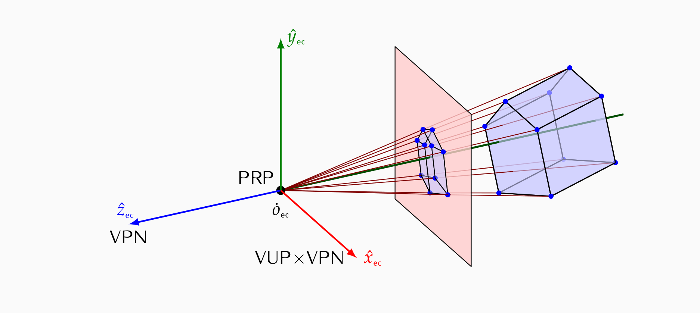

### Proyección paralela

En este caso, no hay transformación de escala, y la proyección se puede ver como una transformación afín:

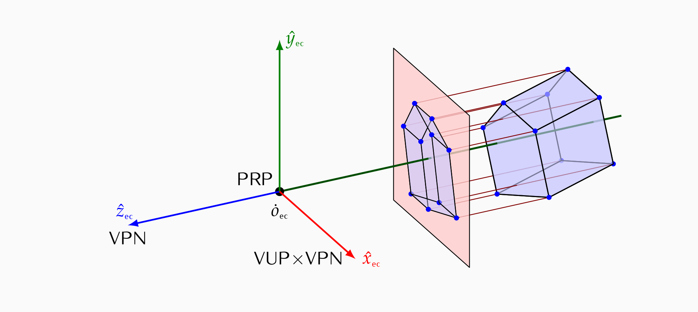

### El view-frustum

El **view-frustum** designa la región del espacio de la escena que es visible en el viewport. Su forma depende del tipo de proyección:
- Perspectiva: Es un tronco de pirámide rectangular (izquierda).
- Ortográfica: Es un paralelepípedo ortogonal u ortoedro (derecha).

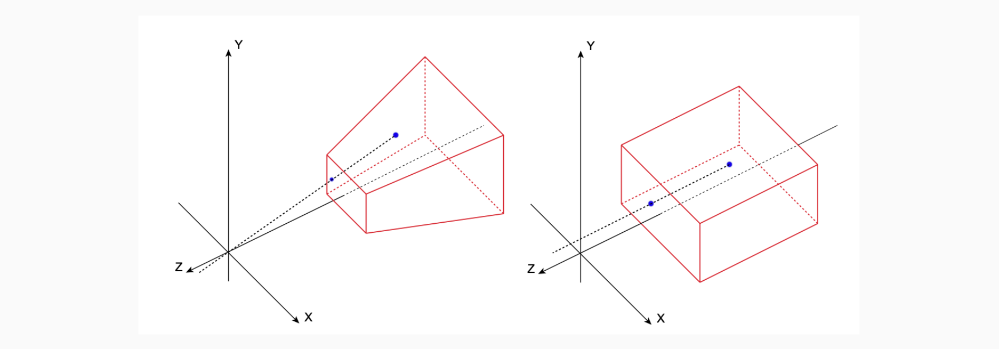

El **view-frustum** está determinado por los 6 planos que contienen a las 6 caras que lo delimitan.
- Estos planos se determinan por sus coordenadas en el marco de coordenadas de vista.
- La transformación de proyección transforma el view-frustum (en coordenadas de vista) en un cubo de lado 2 centrado en el origen, entre $-1$ y $1$ en los tres ejes (en coordenadas de recortado, normalizadas).

> La proyección ortográfica es una transformación afín, es decir,  una traslación seguida de escalado no necesariamente uniforme.

> La proyección perspectiva no es una transformación afín, aunque se puede expresar usando una transformación afín en coordenadas homogeneas 4D, seguida de una proyección de 4D a 3D.

### Parámetros del view-frustum. Extensión en Z

Los 6 valores $l$, $r$, $t$, $b$, $n$ y $f$ (los parámetros de frustum) determinan la transformacion de la tupla ($x_{ec}, y_{ec} , z_{ec}$), que está en coordenadas de vista en la tupla ($x_{ndc} , y_{ndc} , z_{ndc}$) en NDCC (coordenadas normalizadas de dispositivo, entre $-1$ y $1$):

Los valores $n$ (_near_) y $f$ (_far_) son los límites en $Z$ del view-frustum, pero cambiados de signo (se cumple $n \neq f$).
- El plano $z_{ec} = −n$ en EC se transforma en el plano $z_{ndc} = −1$ en NDC.
- El plano $z_{ec} = − f$ en EC se transforma en el plano $z_{ndc} = +1$ en NDC.

> En la proyección perspectiva, se exige además $0 < n$ y $0 < f$ .

Aunque no se exige así, lo usual es que seleccione $n < f$ , es decir, el view-frustum se extiende en $Z$ en el intervalo $[− f , −n]$. En adelante supondremos $n < f$ , de forma que:
- El plano $z_{ec} = −n$ se llama **plano de recorte delantero**.
- El plano $z_{ec} = − f$ se llama **plano de recorte trasero**.

### Parámetros del view-frustum. Extensión en X e Y

Respecto de los otros cuatro valores, determinan la extensión en $X$ y en $Y$:
- $l$ (_left_) y $r$ (_right_) son los límites en $X$ del view-frustum ($l \neq r$).
- $b$ (_bottom_) y $t$ (_top_) son los límites en $Y$ ($b \neq t$).

- En proyección ortográfica:
	- El plano $x_{ec} = l$ en EC se transforma en el plano $x_{ndc} = −1$ en NDC.
	- El plano $x_{ec} = r$ en EC se transforma en el plano $x_{ndc} = +1$ en NDC.
	- El plano $y_{ec} = b$ en EC se transforma en el plano $y_{ndc} = −1$ en NDC.
	- El plano $y_{ec} = t$ en EC se transforma en el plano $y_{ndc} = +1$ en NDC.
- En proyección perspectiva:
	- El plano $-nx_{ec} = lz_{ec}$ en EC se transforma en el plano $x_{ndc} = −1$ en NDC.
	- El plano $-nx_{ec} = rz_{ec}$ en EC se transforma en el plano $x_{ndc} = +1$ en NDC.
	- El plano $-ny_{ec} = bz_{ec}$ en EC se transforma en el plano $y_{ndc} = −1$ en NDC.
	- El plano $-ny_{ec} = tz_{ec}$ en EC se transforma en el plano $y_{ndc} = +1$ en NDC.

Hay que tener en cuenta que:
- Aunque esto no es requerido estrictamente, usualmente se seleccionan los parámetros de forma que $l < r$ y $b < t$.
- Cuando se cumple $l = −r$ y $b = −t$, decimos que el view-frustum está **centrado** (el eje $Z$ pasa por el centro de las caras delantera y trasera). Esto es lo más usual, y se corresponde con lo que ocurre en una cámara.
- El valor $(r − l )/(t − b)$ suele coincidir con la relación de aspecto del viewport (ancho/alto, o bien núm.columnas/núm.filas). Si esto no ocurre los objetos aparecerán deformados en la imagen.

### Parámetros en la proyección ortográfica

En proyección ortográfica el view-frustum es un ortoedro. Contiene los puntos cuyas coordenadas de cámara ($x_{ec} , y_{ec} , z_{ec}$) cumplen:
$$l \leq x_{ec} \leq r \hspace{1cm} b \leq y_{ec} \leq t \hspace{1cm} −f \leq z_{ec} \leq −n$$


### Parámetros en la proyección perspectiva

En perspectiva, el view-frustum es una pirámide rectangular truncada. Los puntos dentro del view-frustum son aquellos cuyas coordenadas de cámara ($x_{ec}, y_{ec} , z_{ec}$) cumplen:
$$l \leq x_{ec} \left(\frac{n}{-z_{ec}}\right) \leq r \hspace{1cm} b \leq y_{ec}\left(\frac{n}{-z_{ec}}\right) \leq t \hspace{1cm} − f \leq z_{ec} \leq − n$$

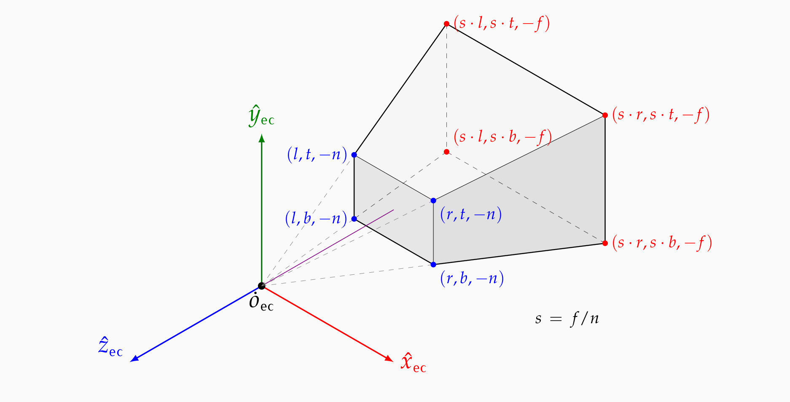

### Ejemplo

Suponemos que partimos de una escena que vamos a proyectar usando perspectiva. En el espacio de coordenadas de cámara, la escena es esta:

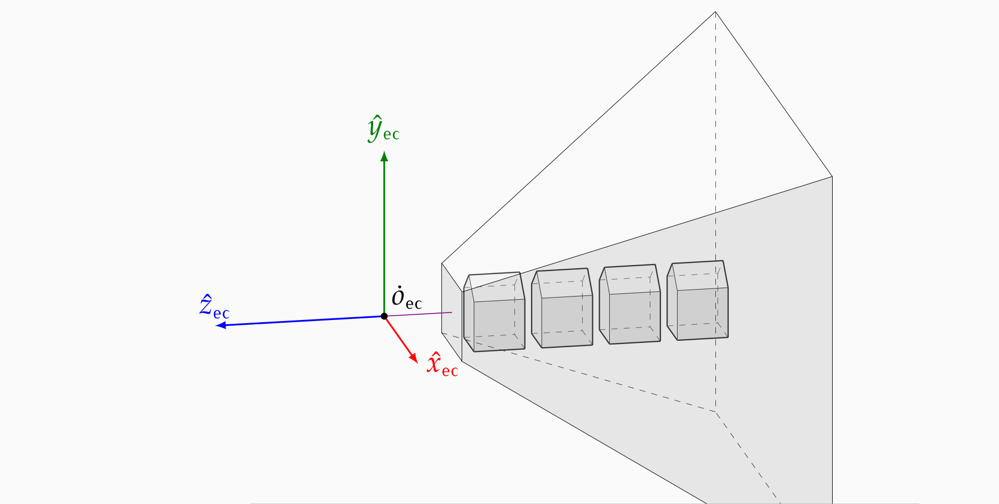

El efecto de la transformación de proyección perspectiva será hacer más pequeños los objetos más alejados del observador, y situar la escena en un cubo de lado 2 y centrado en el origen del marco de NDC:

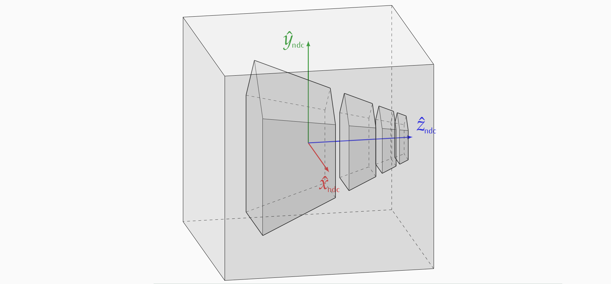

### Proyección perspectiva sobre el plano delantero

Podemos suponer que los puntos se proyectan sobre el plano frontal del view-frustum (coordenada $Z$ igual a $−n$) con foco en $o_{ec}$ :

> Dado un punto $p = V(x_{ec} , y_{ec} , z_{ec} , w_{ec})$ queremos calcular las coordenadas de su proyección ($x' , y' , z' , w')$

Si se asume $z_{ec} < 0$, es decir, el punto está en la rama negativa del eje $Z$, podemos hacer
$$x' = \frac{x_{ec} n}{-z_{ec}} \hspace{1cm} y' = \frac{y_{ec} n}{-z_{ec}} \hspace{1cm} z' = \frac{z_{ec} n}{-z_{ec}} = -n$$

Esta transformación presenta dos problemas:

> Las coordenadas resultado no están en el intervalo $[-1, 1]$ y además colapsa todas las coordenadas $Z$, pues todas son $-n$.

### Normalización de coordenadas X e Y

Si el punto original está en el view-frustum, entonces:
$$x' \in [l, r] \hspace{1cm} y' \in [b, t]$$
Queremos dejar ambas coordenadas en el intervalo $[−1, 1]$, por lo que podemos usar un escalado y traslación adicionales en $X$ e $Y$:
$$x'' = 2\left(\frac{x' - l}{r - l}\right) - 1 \hspace{1cm} y'' = 2\left(\frac{y' - b}{t - b}\right)$$
### Información de profundidad y normalización en Z

El problema de hacer $z' = −n$ está en que se pierde informacion de profundidad en $Z$, que es necesaria para EPO. Para
evitarlo, se usa una función lineal de $z$ con dos constantes:
$$z'' = \frac{c_0 z_{ec} + c_1}{-z_{ec}} \hspace{0.5cm} \text{ donde } \hspace{0.5cm} c_0 = \frac{n + f}{n - f}, \hspace{0.5cm} c_1 = \frac{2fn}{n - f}$$

> Esta transformación conserva el orden (invertido) de las coordenadas $Z$ (no aplana). Ahora, valores menores de $Z$ implican más cercanos al observador, y valores mayores, más lejanos.

### Coordenadas cartesianas del punto proyectado

En resumen, tenemos estas tres igualdades:
$$x'' = \frac{a_0 x_{ec} + a_1 z_{ec}}{- z_{ec}} \hspace{1cm} y'' = \frac{b_0 x_{ec} + b_1 z_{ec}}{-z_{ec}} \hspace{1cm} z'' = \frac{c_0 z_{ec} + c_1}{-z_{ec}}$$
donde
$$a_0 = \frac{2n}{r - l} \hspace{1cm} a_1 = \frac{r + l}{r - l} \hspace{1cm} b_0 = \frac{2n}{t - b} \hspace{1cm} b_1 = \frac{t + b}{t - b} \hspace{1cm} c_0 = \frac{n + f}{n - f} \hspace{1cm} c_1 = \frac{2fn}{n - f}$$

> Esta transformación incluye una división, y por tanto no se puede implementar con una matriz como hacíamos con las anteriores (no es lineal), aunque sí transforma líneas rectas en líneas rectas.

### Obtención de las coordenadas de recortado

Para solventar el problema anterior (para poder usar una matriz), se definen las **coordenadas de recortado** (_clip coordinates_), a partir de las coordenadas de cámara del original:
$$x_{cc} = a_0 x_{ec} + a_1 z_{ec} \hspace{1cm} y_{cc} = b_0 y_{ec} + b_1 z_{ec} \hspace{1cm} z_{cc} = c_0 z_{ec} + c_1 \hspace{1cm} w_{cc} = -z_{ec}$$

> Esta transformación ya sí se puede hacer con una matriz 4x4

### La matriz de proyección perspectiva Q

Con todo lo dicho, la proyección perspectiva se puede realizar usando una matriz $Q$, que se aplica a coordenadas de cámara y produce coordenadas de recortado:
$$\begin{pmatrix} x_{cc} \\ y_{cc} \\ z_{cc} \\ w_{cc} \end{pmatrix} = \begin{pmatrix} a_0 & 0 & a_1 & 0 \\ 0 & b_0 & b_1 & 0 \\ 0 & 0 & c_0 & c_1 \\ 0 & 0 & -1 & 0 \end{pmatrix} \begin{pmatrix} x_{ec} \\ y_{ec} \\ z_{ec} \\ 1 \end{pmatrix}$$
### La proyección ortográfica

En el caso de la **proyección ortográfica** (_orthographic projection_), se hace proyección en una dirección paralela al eje $Z$. Esta transformación solo requiere la normalización de los rangos de valores en los tres ejes (se usa traslación más escalado)
- Traslación para llevar el centro del paralepípedo al origen:
$$\vec{t} = \left(-\frac{l + r}{2}, -\frac{t + b}{2}, - \frac{f + n}{2}\right)$$
- Escalado para dejar los valores de los tres ejes en el intervalo $[−1, 1]$:
$$\vec{s} = \left(\frac{2}{r - l}, \frac{2}{t - b}, \frac{-2}{f - n}\right)$$
> En Z se cambia de signo para invertir el eje Z

La matriz de proyección ortográfica O se obtiene por tanto como composición de $T$ seguido de $S$, o lo que es lo
mismo:
$$O = \begin{pmatrix} \frac{2}{r - l} & 0 & 0 & -\frac{r + l}{r - l} \\ 0 & \frac{2}{t - b} & 0 & -\frac{t + b}{t - b} \\ 0 & 0 & \frac{-2}{f - n} & - \frac{f + n}{f - n} \\ 0 & 0 & 0 & 1 \end{pmatrix}$$

Para construir una matriz de proyección a partir de los seis valores reales $l, r, b, t, n$ y $f$ , podemos usar estas dos funciones:

```c++
// Construye matriz O
mat4 ortho(const float l, const float r, const float b, const float t, const float n, const float f);
// Construye matriz P
mat4 frustum(const float l, const float r, const float b, const float t, const float n, const float f);
```

> Ambas funciones generan las matrices por columnas (como las espera OpenGL).

La función `perspective` de GLM permite generar una matriz de proyección perspectiva de forma más fácil en ocasiones:

```c++
mat4 perspective(const float β, const float a, const float n, const float f);
```

esta función equivale a `frustum` (centrado) con:
$$t = n \tan\frac{\beta}{2} \hspace{1cm} b = -t \hspace{1cm} r = at \hspace{1cm} l = -r$$

donde
- $\beta$: Es la apertura vertical del campo de visión (_fovy_), es el ángulo en grados (entre 0 y 180.0) que hay entre la cara superior y la inferior del frustum
- $a$: Relación de aspecto (_aspect ratio_) de la imagen a producir: su ancho dividido por el alto.

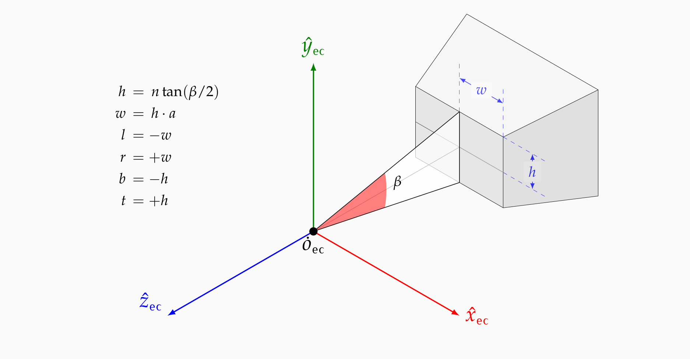

> Esta perspectiva es centrada, ya que $r = −l$ y $t = −b$

### Matriz de proyección en el cauce programable

Si se usa un cauce programable 3D, es necesario:
- Declarar un parámetro _uniform_ en el _vertex shader_ de tipo `mat4`, que contendrá la matriz de proyección.
- Incluir código en el _vertex shader_ de forma que la última etapa de transformación de la posición de un vértice sea multiplicar por esa matriz.
- Como parte de la inicialización del cauce, obtener y guardar la localización de dicho parámetro (con `glGetUniformLocation`).
- Al inicio de la aplicación (o al inicio de la visualización de un frame), se debe construir la matriz de proyección $P$ (de tipo `mat4`) usando `frustum`, `ortho` u otras funciones parecidas.
- Finalmente, usando la localización y $P$, se debe fijar el valor del parámetro _uniform_ con `glUniformMatrix4fv`.

### Matriz de proyeccion en la clase `Cauce`

Para la gestión de la matriz de proyección, en la clase `Cauce` y sus shaders se incluyen:
- Una variable de instancia con la matriz de proyección actual (`mat_proyeccion`).
- Un parámetro _uniform_ con esa matriz (`u_mat_proyeccion`).
- El método `fijarMatrizProyeccion`, implementado de esta forma:

```c++
void Cauce::fijarMatrizProyeccion( const glm::mat4 & nue_mat_pro )
{
	mat_proyeccion = nue_mat_pro; // No es estrictamente necesario
	glUseProgram(id_prog);
	glUniformMatrix4fv(loc_mat_proyeccion, 1, GL_FALSE, mat_proyeccion);
}
```

En el _vertex shader_ se usa la matriz uniform `u_mat_proyeccion` para transformar la posición del vértice en coordenadas de vista (`v_posic_ecc`) hacia coordendas de recortado (en `gl_Position`):

```c++
void main()
{
	// Calcular posición y normal en coordenadas de mundo (transf. de modelado)
	vec4 posic_wcc = u_mat_modelado * vec4(in_posicion_occ, 1.0);
	vec3 normal_wcc = (u_mat_modelado_nor * vec4(in_normal, 0.0)).xyz;
	// Calcular posicion y normal en coordenadas de vista (transf. de vista)
	v_posic_ecc = u_mat_vista * posic_wcc;
	v_normal_ecc = (u_mat_vista * vec4(normal_wcc, 0.0)).xyz;
	. . .
	// Calcular posición en coords. de recortado (transf. de proyección)
	gl_Position = u_mat_proyeccion * v_posic_ecc;
}
```

> `gl_Position` es la variable de salida predefinida.
## 1.4 Recortado y división por $W$

Una vez se tienen las coordenadas de recortado de los vértices, se comprueban que primitivas estan dentro o fuera del viewfrustum (que en CC es un cubo de lado dos unidades centrado en el origen):
- Las primitivas completamente dentro de la zona visible se mantienen
- Las primitivas completamente fuera de la zona visible se descartan
- Las primitivas parcialmente dentro se dividen en partes unas completamente dentro (que se visualizan) y otras completamente fuera (que se descartan). 

>Esto causa la inserción de nuevas primitivas con algunos vértices nuevos justo en los planos que delimitan el view-frustum.

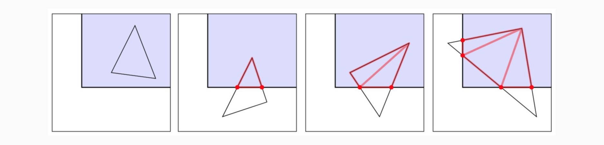

Los vértices (en el view-frustum) resultado del recorte tienen coordenadas de recorte con $w_{cc} \neq 0$ (si $P = Q$, entonces además $w_{cc} \neq 1$). El siguiente paso es hacer la división por $w_{cc}$ de las tres componentes. Se obtienen las coordenadas normalizadas de dispositivo, con componente $W$ de nuevo a $1$:
$$(x_{ndc}, y_{ndc}, z_{ndc}, 1) = \frac{1}{w_{cc}} (x_{cc} , y_{cc} , z_{cc} , w_{cc})$$

los valores $x_{ndc}, y_{ndc}$ y $z_{ndc}$ están los tres en el intervalo $[−1, 1]$ (los vértices ya han pasado el recortado).

## 1.5 Transformación de viewport

El siguiente paso consiste en calcular en que posiciones de la imagen se proyecta cada vértice. Este paso se puede modelar como una transformación lineal que llamaremos **transformación de viewport**. 

> El término **viewport** hace referencia a la zona rectangular de la ventana donde se proyectarán los polígonos que están en el cubo visible (un bloque rectangular de pixels).

Esta transformación produce **coordenadas de dispositivo** o de ventana (_device coordinates_, DC). 

> Las coordenadas $X$ e $Y$ en DC se expresan en unidades de pixels.

La transformación de viewport es lineal y consta simplemente de escalados y traslaciones. La coordenada $Z$ se transforma y se conserva para poder hacer después eliminación de partes ocultas.

En coordenadas de dispositivo, podemos asociar una región cuadrada, de lado unidad, a cada pixel en el plano de la ventana. El viewport (rojo) es un bloque rectangular de pixels, contenido en el bloque rectangular correspondiente a la ventana o imagen completa:

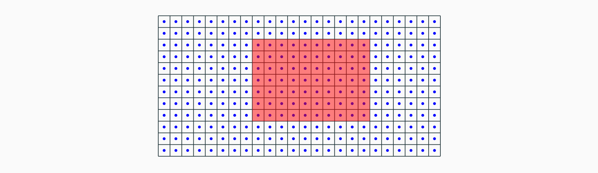

> Los centros de los pixels (puntos azules) tienen coordenadas de dispositivo con parte fraccionaria igual a $1/2$. Los bordes entre pixels tienen coordenadas sin parte fraccionaria (enteras).

### El espacio de coordenadas de dispositivo

En 3D el espacio de coordenadas de dispositivo es un ortoedro. Se puede visualizar como aparece aquí, incluyendo el marco de coordenadas de dispositivo:

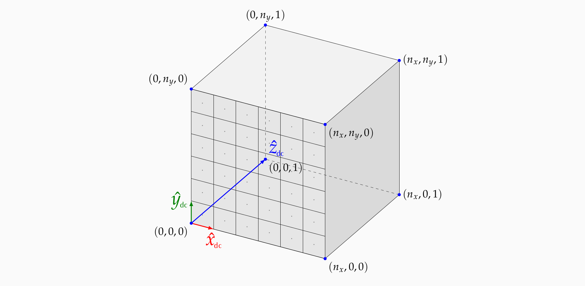

OpenGL tiene en su estado una matriz $4 \times 4$ que llamaremos $V$, y que depende de estos parámetros:

- El número de columna ($x_l$) y fila ($y_b$) del pixel que ocupa, en la ventana, la esquina inferior izquierda del viewport.
- La anchura ($w$) y altura ($h$) en número total de columnas y de filas de pixels (respectivamente) que ocupa el viewport.
- El rango de valores $n_d, f_d$ de salida en $Z$ en DC. El valor $n_d$ es la profundidad más cercana posible al observador, y $f_d$ la más lejana. Por defecto $n_d = 0$ y $f_d = 1$.

> Aunque los cuatro parámetros relevantes ($x_l$ ,$y_b$ ,$w$ y $h$) son enteros, las coordenadas de dispositivos son valores reales, ya que las posiciones de los vértices en DC son en general no enteras (no coinciden necesariamente con los centros o bordes de los pixels).

Suponemos que la ventana tiene $s_x$ columnas y $s_y$ filas, y que el gestor de ventanas acepta coordenadas de pixels enteras no negativas:

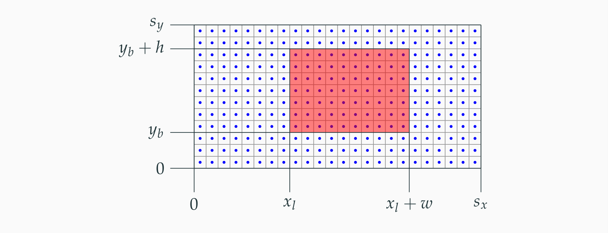

Se deben cumplir estas desigualdades:
$$ 0 \leq x_l < x_l + w \leq s_x \hspace{1cm} 0 \leq y_b < y_b + h \leq s_y$$

### La trasnformación de viewport

En NDC las coordenadas están en $[−1, 1]$, luego hay que hacer:
1. Traslación de la esquina $(−1, −1, −1)$ al origen.
2. Escalado uniforme de razón $1/2$ más un escalado no uniforme respecto a ($w$, $h$, $f_d − n_d$)
3. Traslación del origen a $(x_l , y_b , n_d)$.

Con lo cual la transformación $D$ queda como:
$$D = \begin{pmatrix} 1 & 0 & 0 & x_l \\ 0 & 1 & 0 & y_b \\ 0 & 0 & 1 & n_d \\ 0 & 0 & 0 & 1\end{pmatrix}\begin{pmatrix} w & 0 & 0 & 0 \\ 0 & h & 0 & 0 \\ 0 & 0 & f_d - n_d & 0 \\ 0 & 0 & 0 & 1\end{pmatrix}\begin{pmatrix} 1/2 & 0 & 0 & 0 \\ 0 & 1/2 & 0 & 0 \\ 0 & 0 & 1/2 & 0 \\ 0 & 0 & 0 & 1\end{pmatrix}\begin{pmatrix} 1 & 0 & 0 & 1 \\ 0 & 1 & 0 & 1 \\ 0 & 0 & 1 & 1 \\ 0 & 0 & 0 & 1\end{pmatrix}$$
de forma que
$$\begin{pmatrix} x_{dc} \\ y_{dc} \\ z_{dc} \\ 1 \end{pmatrix} = D\begin{pmatrix}x_{ndc} \\ y_{ndc} \\ z_{ndc} \\ 1 \end{pmatrix}$$


### Fijar la matriz de viewport en OpenGL

En cualquier momento (independientemente del _matrix mode_ activo en dicho momento) es posible cambiar la matriz $D$ que OpenGL almacena como parte de su estado. Para ello llamamos a la función `glViewport`, declarada como sigue:

```c++
glViewport(GLint xl , GLint yb , GLsizei w, GLsizei h);
```

- Los rangos de valores permitidos para estos parámetros dependen de la implementación, del hardware subyacente y del gestor o librería de ventanas en uso.
- Si $w$ y/o $h$ son demasiado grandes, no se produce error, pero se truncan.

> Por defecto, OpenGL fija el viewport ocupando todos los pixels de la ventana.
## 1.6 Representación de cámaras

La clase `Camara` encapsula todos los parámetros relacionados con la matriz de vista y proyección.
- Es una clase base con funcionalidad mínima. Se derivan clases con funcionalidad más avanzada.
- Incluye una matriz de vista $V$ y otra de proyección $P$.
- El método `activar(c)` permite activar una cámara en un cauce `c` (referencia a una instancia de una clase derivada de `Cauce`). Este método simplemente fija la matrices en el cauce usando las que hay en la instancia.
- El método `actualizarMatrices` es un método virtual, que se encarga de calcular `V` y `P` a partir de los parámetros específicos de cada tipo de cámara.

> Por defecto, esta clase base define una cámara ortográfica que visualiza un cubo de lado $2$ unidades en $X$ y centro en el origen (en coordenadas de $W$).

```c++
class Camara
{
public:
	// Fija las matrices model-view y projection en el cauce
	void activar(Cauce & cauce);
	// Cambio el valor de ’ratio_vp’ (alto/ancho del viewport)
	void fijarRatioViewport(const float nuevo_ratio);
	// Lee la descripción de la cámara (y probablemente su estado)
	virtual std::string descripcion();
protected:
	bool matrices_actualizadas = false; // true si las matrices están actualizadas
	glm::mat4 matriz_vista = glm::mat4(1.0f); // Matriz de vista
	glm::mat4 matriz_proye = glm::mat4( 1.0f ); // Matriz de proyección
	float ratio_vp = 1.0; // Aspect-Ratio viewport (alto/ancho)
	virtual void actualizarMatrices(); // Actualiza matriz_vista y matriz_proye
};
```

> El ratio $Y/X$ se almacena siempre para evitar deformaciones.

### Activación y actualización de una cámara

Cualquier tipo de cámara se activa fijando las matrices en el cauce a partir de las que se guardan en la instancia. Antes de eso se actualizan las matrices (recalcula `matriz_vista` y `matriz_proye` si no estaban actualizadas)

```c++
void Camara::activar(Cauce & cauce)
{
	actualizarMatrices(); // Recalcula si no están actualizadas
	cauce.fijarMatrizVista(matriz_vista);
	cauce.fijarMatrizProyeccion(matriz_proye);
}
```

El método `fijarRatioViewport` permite cambiar `ratio_vp` para adaptarlo a las proporciones del viewport en uso:

```c++
void Camara::fijarRatioViewport(const float nuevo_ratio)
{
	ratio_vp = nuevo_ratio; // Registrar nuevo ratio
	matrices_actualizadas = false; // Matrices deben actualizarse antes de activar
}
```

### Matrices de la clase base Camara

La cámara básica define un view-frustum de lado $2$ en $X$ y en $Z$, y de lado $2r$ en $Y$ (donde $r$ es el ratio del viewport, $ratio_vp$). Está centrado en el origen de $W$ . Por tanto, el método `actualizarMatrices` queda así:

```c++
virtual void Camara::actualizarMatrices()
{
	if (matrices_actualizadas)
		return;
	matriz_vista = mat4(1.0f);
	matriz_proye = scale(vec3( 1.0f, 1.0f/ratio_vp, 1.0f));
	matrices_actualizadas = true;
}
```

### Cámara orbital simple

En prácticas usamos una instancia de `CamaraOrbitalSimple` (derivada indirectamente de `Camara`), que define una cámara centrada en el origen con tres parámetros: dos ángulos (`a` y `b`) y una distancia al origen (`d`):

```c++
void CamaraOrbitalSimple::actualizarMatrices()
{
	matriz_vista = translate(vec3(0.0, 0.0, -d)) *
				   rotate(radians(b), vec3(1.0,0.0,0.0)) *
				   rotate(radians(-a), vec3( 0.0,1.0,0.0));
	constexpr float fovy_grad = 60.0;
	constexpr float near = 0.05;
	constexpr float far = near + 1000.0;
	matriz_proye = perspective(fovy_grad, 1.0f/ratio_vp, near, far);
	matrices_actualizadas = true ;
}
```

# 2. Modelos de iluminación, texturas y sombreado

En este capítulo se hará una introducción a las últimas etapas del cauce gráfico de OpenGL, las encargadas de calcular un color en cada pixel.

Dicho cálculo se puede hacer emulando la iluminación real que ocurre en los objetos de la naturaleza. Para ello es necesario diseñar un modelo de iluminación, es decir, un modelo formal que incluya las características relevantes del
color de los polígonos.

> OpenGL incorpora un modelo sencillo y computacionalmente eficiente para esto.
## 2.1 Radiación visible: características, percepción y reproducción

La luz que observamos es radiación electromagnética (variaciones periódicas del campo eléctrico y magnético) de naturaleza similar a las ondas que se usan para los móviles, wifi, radio y televisión:

> El sistema visual humano ha evolucionado para percibir esa radiación solo cuando su longitud de onda λ está aprox. entre 390 y 750 nanómetros, lo equivalente al conocido como **espectro visible**. La emisión e interacción de las ondas en los átomos nos permite percibir el entorno.

Físicamente, la radiación se describe como algo que tiene características de onda y de corpúsculo a la vez (modelos complementarios). En Informática Gráfica se usa más frecuentemente el modelo de partículas (óptica geométrica) en lugar del modelo de ondas (óptica física).

### El modelo de partículas. La radianza

Bajo este modelo, la radiación se puede describir de forma idealizada como un flujo en el espacio de partículas puntuales llamadas **fotones**, con trayectorias rectilíneas. Cada uno tiene una energía radiante que depende únicamente de su longitud de onda.

En un entorno de punto $p$ del espacio (típicamente en la superficie de un objeto) podemos medir la densidad de energía radiante por unidad de tiempo de los fotones de una cierta longitud de onda $\lambda$ que pasan por $p$ en una determinada dirección $v$. Esa energia se denomina **radiancia** y se nota como $\mathcal{L}(\lambda, p, v)$.

> La radiancia determina el tono de color y el brillo con el que observamos el punto $p$ cuando lo vemos desde la dirección $v$.

Desde un punto $p$ en una dirección $v$ pueden emitirse o reflejarse una gran cantidad de fotones con longitudes de onda distintas. La intensidad o brillo de la luz depende de la cantidad de fotones (es decir, de la radiancia total sumada en todas las longitudes de onda). El color con el que percibimos la luz depende de las distribución de las longitudes de onda de los fotones en el espectro visible.

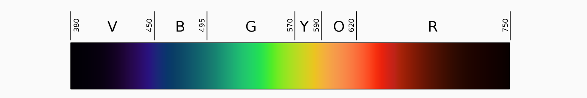

El ojo es la parte del **sistema visual humano (SVH)** capaz de enviar señales eléctricas al cerebro que dependen de las características de la luz que incide sobre las neuronas de su cara interna (la retina).

En cada neurona de la retina, y para cada longitud de onda $\lambda$, se recibe una radiancia $\mathcal{L}(\lambda)$ distinta. El ojo funciona de tal forma que simplifica esa gran cantidad de información y la reduce (en cada neurona) a tres valores reales
positivos que forman una tupla $(s, m, l )$ que depende de $\mathcal{L}$, es decir, el ojo tiene asociada una función f tal que:
$$f(\mathcal{L}) = (s, m, l )$$

Esta simplificación es aproximadamente lineal, es decir si $f (\mathcal{L}) = (s, m, l )$ y $f ( \mathcal{L}' ) = (s' , m', l' )$, entonces:
$$f (a\mathcal{L} + b\mathcal{L}') = a (s, m, l ) + b (s', m', l')$$
donde $a$, $b$ son valores reales arbitrarios no negativos.

### Los primarios RGB

Si $x$ es un valor real positivo, entonces:
- La señal $( x, 0, 0)$ enviada desde el ojo se interpreta o percibe en el cerebro (SVH) como de color **rojo**.
- La señal $(0, x, 0)$ se percibe de color **verde**.
- La señal $(0, 0, x )$ se precibe de color **azul**.

Como consecuencia, supongamos que tenemos tres distribuciones de radiancia $L_r$ ,$L_g$ y $L_b$ tales que:
$$f (L_r) ≈ (1, 0, 0) \hspace{0.5cm} f ( L_g ) ≈ (0, 1, 0) \hspace{0.5cm} f (L_b) ≈ (0, 0, 1)$$
A una terna de distribuciones $L_r$ ,$L_g$ y $L_b$ que cumplen lo anterior se le denomina una terna de primarios RGB, ya que son percibidos como rojo, verde y azul, respectivamente.

Podemos usar una mezcla aditiva (suma ponderada) de tres primarios RGB para producir una señal arbitraria (r, g, b) en el ojo, ya que se cumple:
$$f(rL_r + gL_g + bL_b) ≈ (r, g, b)$$
### Reproducción de ternas RGB

Un dispositivo de salida de color (monitor, impresora, proyector) tiene asociados tres primarios RGB (las distribuciones obtenidas cuando se muestra el rojo, verde y azul a máxima potencia en el dispositivo). Como consecuencia, cualquier color reproducible en un dispositivo se puede representar por una terna $(r, g, b)$, con
$$0 \leq r,\,g,\,b \leq 1$$
> Una misma terna $(r, g, b)$ produce tonos de color y niveles de brillo ligeramente distintos en dispositivos distintos.

Al conjunto de todas las ternas RGB con componentes entre 0 y 1 se le llama **espacio de color RGB**, y se puede visualizar como un cubo 3D con colores asociados a cada punto del mismo.

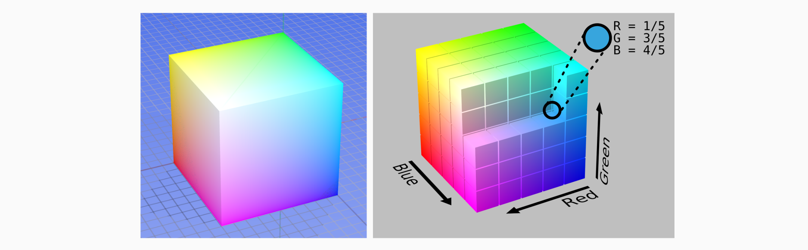

> El espacio RGB no es el único esquema para representar computacionalmente los colores, pero sí el más usado hoy en día.
## 2.2 Emisión y reflexión de la radiación

La radiación electromagnética visible se genera en las fuentes de luz, por diversos procesos físicos que convierten otras formas de energía en energía radiante. Hay de dos tipos:

- **Fuentes naturales**: Sol o estrellas, fuego, objetos incandescentes, órganos de algunos animales, etc...
- **Fuentes artificiales (luminarias)**: Filamentos incandescentes, tubos fluorescentes, LEDs, etc...

Los fotones creados en las luminarias interactúan con los átomos de la materia, que absorben su energía y después pueden radiar de nuevo una parte de ella, proceso conocido como reflexión:

- Parte de la energía recibida se convierte en **calor**
- Parte de la energía recibida se convierte en **radiación reflejada**

> La radiación reflejada puede reflejarse de nuevo varias veces.
### Modelo de la reflexión local en un punto

La radiancia $\mathcal{L}(\lambda, p, v)$ se puede escribir como suma de:
- La radiancia emitida desde $p$ en la dirección $v$ ($0$ si $p$ no está en una fuente de luz),  que llamamos $L_{em} (\lambda, p, v)$.
- La radiancia reflejada, suma, para cada dirección $u_i$ del producto de:
	- $L_{in}(\lambda, p, u_i)$: Radiancia incidente sobre $p$ desde $u_i$
	- $f_r(\lambda, p, v, u_i)$: Fracción de radiancia que se refleja desde $p$ en la dirección $v$, respecto del total incidente sobre $p$ proveniente de la dirección $u_i$ con longitud de onda $\lambda$.

$$\mathcal{L}(\lambda, p, v) = L_{em} (\lambda, p, v) + \sum_{i} L_{in}(\lambda, p, u_i)f_r(\lambda, p, v, u_i)$$
### Reflexión local en un punto

Hay muchas trayectorias de fotones que no acaban siendo detectadas por el observador (la mayoría), además las que sí llegan pueden hacerlo por muchos caminos distintos:

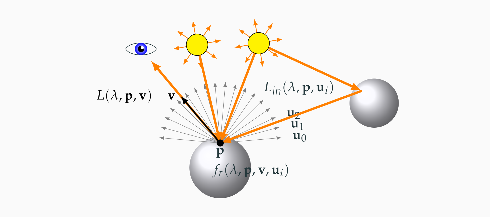

## 2.3 Modelos computacionales simplificados

La ecuación anterior es complicada (larga) de calcular. Por tanto, en OpenGL básico se hacen varias simplificaciones:
1. No se considera la radiancia emitida.
2. No se considera la luz incidente que no provenga directamente de las fuentes de luz.
3. Las fuentes de luz son puntuales o unidireccionales, no extensas, y hay un número finito de ellas.
4. Los objetos o polígonos son totalmente opacos (no hay transparencias ni materiales traslúcidos).
5. No se consideran sombras arrojadas (las fuentes son visibles desde cualquier cara delantera respecto de ellas).
6. El espacio entre los objetos no dispersa la luz (la radiancia se conserva en el espacio entre los objetos).
7. En lugar de considerar todas las longitudes de onda $\lambda$ posibles, usamos el modelo RGB.

### Modelo simplificado

El modelo que hemos visto antes se simplifica:
- La iluminación indirecta se reduce a un termino ambiente que no depende de $v$.
- De todas las direcciones $u_i$, solo es necesario considerar las que apuntan hacia una fuente de luz.
- Todas las fuentes de luz son visibles desde un punto.
- Los valores de radiancia son tuplas no acotadas $(r, g, b)$
- Los valores de reflectividad ($f_r$) son tuplas $(r, g, b)$

Por tanto:
$$\mathcal{L}(p, v) = \sum_{i = 0}^{n-1} L_{in} (p, l_i) f_r(p, v, l_i)$$
donde $n$ es el número de fuentes de luz, $l_i$ un vector que apunta desde $p$ en la dirección de la $i$-ésima fuente de luz.

> Ahora solo consideramos trayectorias desde las luminarias hacia $p$, las luminarias se cuentan aunque la trayectoria esté bloqueada (no hay sombras arrojadas)

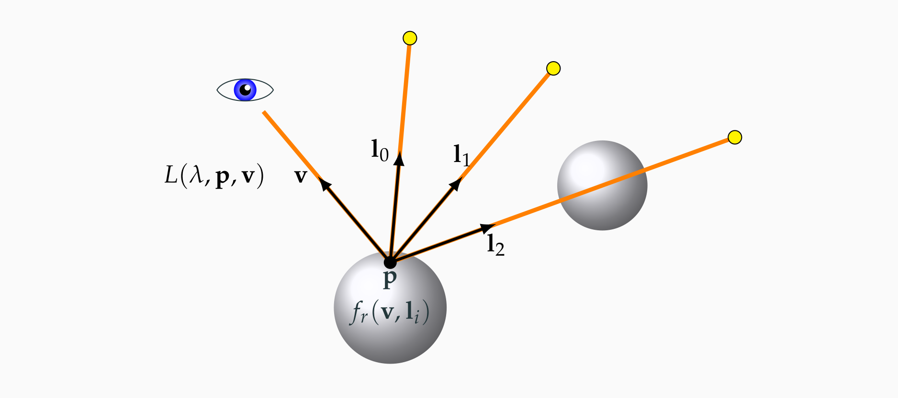

> La iluminación ($f_r$) depende la orientación de la superficie en el punto $p$. Esta orientación esta caracterizada por el vector normal $n_p$ asociado a dicho punto.
### Tipos y atributos de las fuentes de luz

En el modelo de escena se puede incluir un conjunto de $n$ fuentes de luz, cada una de ellas puede ser de dos tipos:

- **Fuentes de luz posicionales**: Ocupan un punto del espacio $q_i$. Dado un punto $p$, el vector unitario que apunta hacia la fuente de luz desde $p$ se calcula como:
$$l_i = \frac{q_i − p}{\|q_i − p\|}$$

- **Fuentes de luz direccionales**: Están en un punto a distancia infinita, por tanto hay un vector $l_i$ que apunta a la fuente y que es el mismo para cualquier punto $p$ donde se quiera evaluar el MIL (_Modelo de Iluminación Local_). Además de esto, cada fuente de luz emite una radiancia $S_i = (r, g, b)$, en general, no acotada.

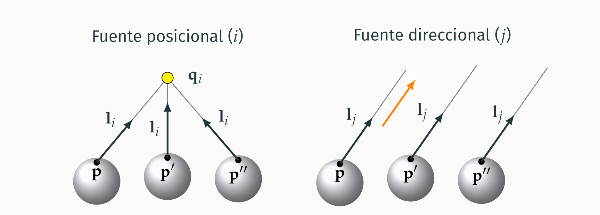

### Radianza incidente y tipos de reflexión. Componentes del MIL

En la ecuación del modelo simplificado, los términos que aparecen pueden reescribirse en términos de los atributos de las fuentes de luz y el material:
- El término $L_{in}(p, l_i)$ se hace igual a $S_i$ (no tenemos en cuenta la distancia a la que está la fuente de luz)
- El término $f_r(p, v, l_i)$ se descompone en tres sumandos o componentes:
	- Luz indirecta reflejada, o término **ambiental**: $f_{ra}(p, v, l_i)$.
	- Luz reflejada de forma **difusa**: $f_{rd}(p, v, l_i)$.
	- Luz reflejada de forma **pseudo-especular**: $f_{rs}(p, v, l_i)$.

$$\mathcal{L}(p, v) = \sum_{i=0}^{n-1} S_i \left[ f_{ra}(p, v, l_i) + f_{rd}(p, v, l_i) + f_{rs}(p, v, l_i) \right]$$
### Color del objeto en un punto

En cada punto $p$ de la superficie de un objeto hay una terna RGB, $C(p)$, con valores entre $0$ y $1$, que es el color del objeto en el punto $p$.

- Para cada componente RGB, expresa la fracción de luz reflejada, y por tanto determina el color con el que apreciamos el objeto.
- Puede ser el mismo (constante) en todos los puntos $p$ de la superficie de un objeto.
- Puede variar de un punto a otro dentro del mismo objeto. En rasterización, esto puede ocurrir de dos formas:
	- Por el uso de texturas.
	- Por el uso de una tabla de colores como atributos de vértice (en cada punto $p$, $C(p)$ sería el color RGB interpolado).
- El color del objeto afecta únicamente a las componentes ambiental y difusa (no a la componente especular).

### Componente ambiental

Cada objeto puede reflejar más o menos cantidad de iluminación indirecta proveniente de la $i$-ésima fuente de luz.
- Esa iluminación indirecta es complicada de calcular y se ignora en este modelo.
- Por tanto, los objetos aparecerían negros donde no haya iluminación directa.
- Para suplir esto, se usa la componente ambiental $f_{ra}$ .

La componente ambiental, por tanto, no depende de $v$ ni $l_i$ , y se hace igual a:
$$f_{ra}(p, v, l_i) = k_a(p) \cdot C(p)$$

Donde $k_a(p)$ es un valor real entre $0$ y $1$ que determina la fracción de luz reflejada de esta forma.

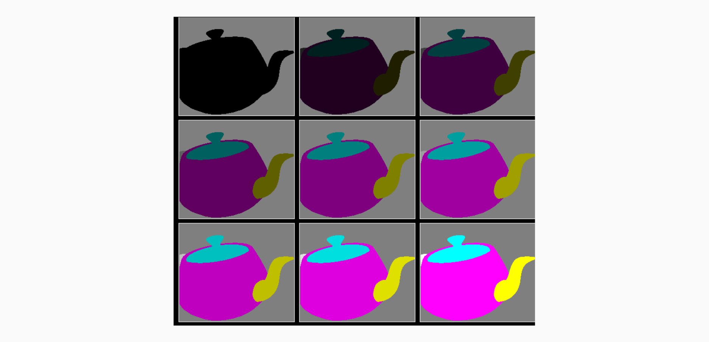

> En este ejemplo, el color $C(p)$ depende la parte de la tetera donde está $p$, mientras que $k_a$ es constante en toda la tetera (aunque crece en sucesivas imágenes).
### Componente difusa

La componente difusa modela como se refleja la luz en los objetos mate o difusos:
- Depende de la posición u orientación de la fuente de luz (es distinta según como esté orientada la fuente respecto de la superficie en $p$, es decir, depende de $n_p$ y $l_i$),
- No depende de la dirección $v$ en la que miramos $p$ (el punto $p$ se ve de un color igual desde cualquier dirección que lo veamos.

La expresión concreta de $f_{rd}$ es esta:
$$f_{rd}(p, v, l_i) = k_d (p) \cdot C(p) \cdot \max\{0, n_p \cdot l_i\}$$
Donde $k_d (p)$ es un valor entre $0$ y $1$ que indica la fracción de luz reflejada de forma difusa.

La orientación de la superficie respecto de la fuente de luz viene determinada por el valor $\alpha$, que es el ángulo que hay entre los vectores $n_p$ y $l_i$ (el valor $n_p \cdot l_i$ es igual al $\cos \alpha$). Se pueden distinguir dos casos:
- Si $\alpha > 90º$ , entonces la superficie, en $p$, está orientada de espaldas a la fuente de luz, luego la contribución de esa fuente debe ser 0.
- Si $0 \leq \alpha \leq 90º$, entonces la superficie, en $p$, está orientada de cara a la fuente de luz.

> Se puede demostrar que el valor $\cos(\alpha)$ es proporcional a la densidad de fotones por unidad de área que inciden en el entorno de $p$, provenientes de la $i$-ésima fuente de luz.

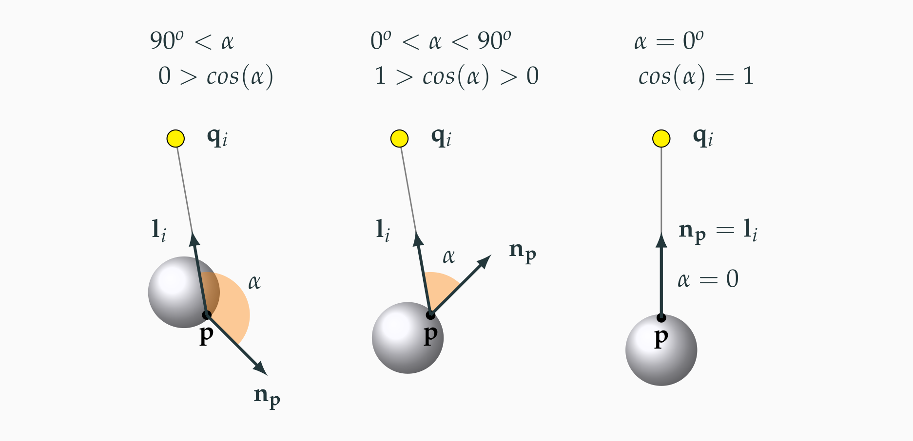

A continuación, presentamos un ejemplo con dos fuentes de luz direccionales, $k_a(p) = 0$ y $k_d(p) = 1$ (solo hay componente difusa). Además, $C(p)$ varía de unos polígonos a otros:

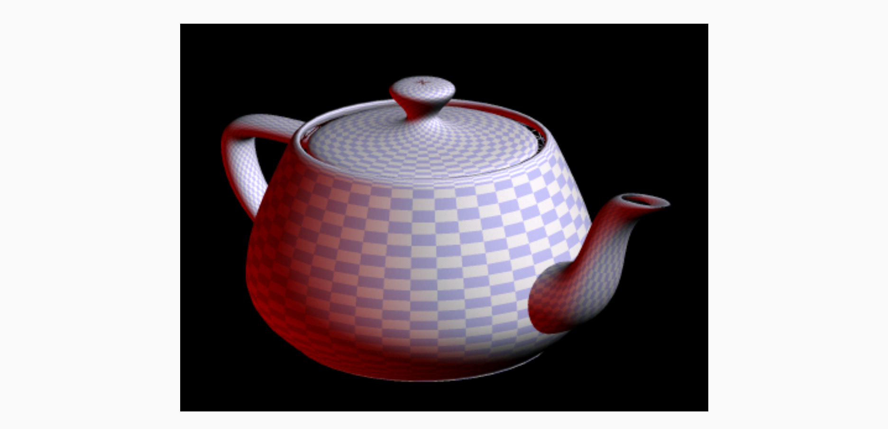

Aquí $k_a$ crece de izquierda a derecha, y $k_d$ de arriba abajo:

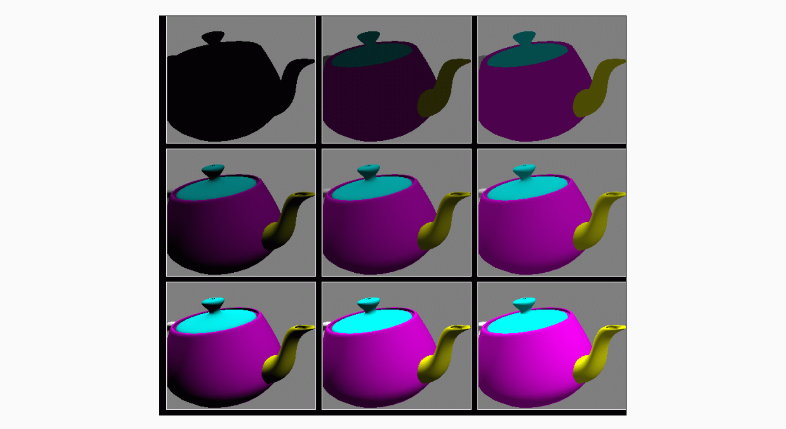

### Componente pseudo-especular: Modelo de Phong

La componente pseudo-especular modela como se refleja la luz en los objetos brillantes, en los cuales dichas zonas brillantes dependen de la posición del observador:

- Depende de la posición u orientación de la fuente de luz (es distinta según como esté orientada la fuente respecto de la superficie en $p$).
- Depende de la dirección en la que miramos $p$ (el punto $p$ se ve de un color diferente según la dirección en la que lo veamos).

La expresión ideada por Bui Tuong Phong, y conocida como modelo de Phong es esta:
$$f_{rs}(p, v, li ) = k_s(p) d_i [\max\{0, ri \cdot v\}]^e$$

Donde $k_s(p)$ es un valor real entre $0$ y $1$, representa la fracción de luz reflejada de forma pseudo-especular. Además $r_i$  es el vector reflejado, depende tanto de $l_i$ como de $n_p$ , y está en el plano formado por ambos, con $n_p$ como bisectriz de ellos, se obtiene como:
$$r_i = 2(l_i \cdot n_p)n_p − l_i$$
Además, $e$ es el exponente de brillo, es decir, un valor real positivo que permite variar el tamaño de las zonas brillantes (a mayor valor, menor tamaño y más pulida o especular) y, $d_i$ vale $1$ si $n_p \cdot l_i > 0$ (fuente de cara a la superficie), y $0$ en otro caso (de espaldas).

> El vector $r_i$ indica la dirección desde $p$ en la cual la $i$-ésima fuente de luz produce el máximo brillo.

El valor $r_i \cdot v$ es el coseno del ángulo $\beta$ que hay entre la dirección de máximo brillo $r_i$ y la dirección $v$ hacia el observador. Cuando $r_i = v$ entonces $\beta = 0$ , $\cos( \beta) = 1$, y el brillo es máximo:

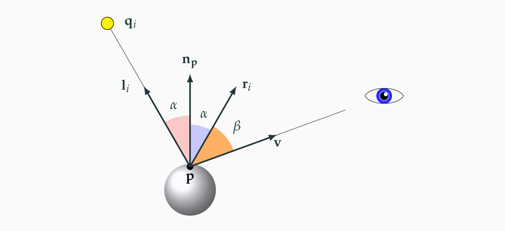

### Componente pseudo-especular: modelo de Blinn-Phong

Una alternativa al modelo anterior consiste en usar el vector _halfway_ $h_i$ (bisectriz de $l_i$ y $v$, normalizado). Ahora el brillo es proporcional al coseno del ángulo $\gamma$ entre $h_i$ y $n_p$ (máximo cuando coinciden)

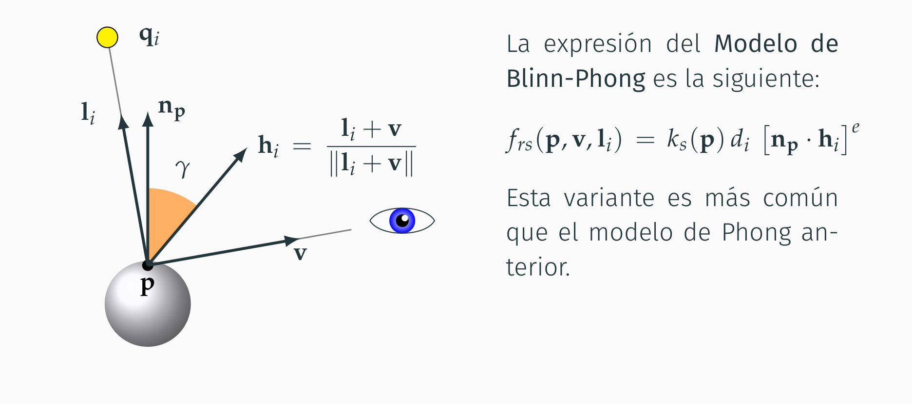

Aquí $k_a(p) = k_d(p) = 0$, $k_s(p) = 1$ y $e = 5.0$:

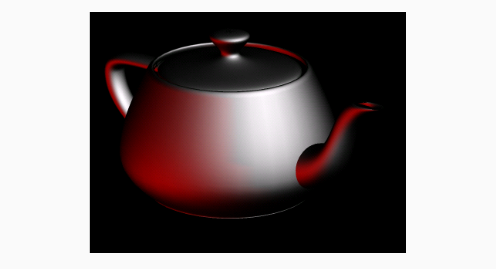

### Efecto del exponente de brillo

Aquí el exponente $e$ crece de izquierda a derecha y decrece de arriba abajo:

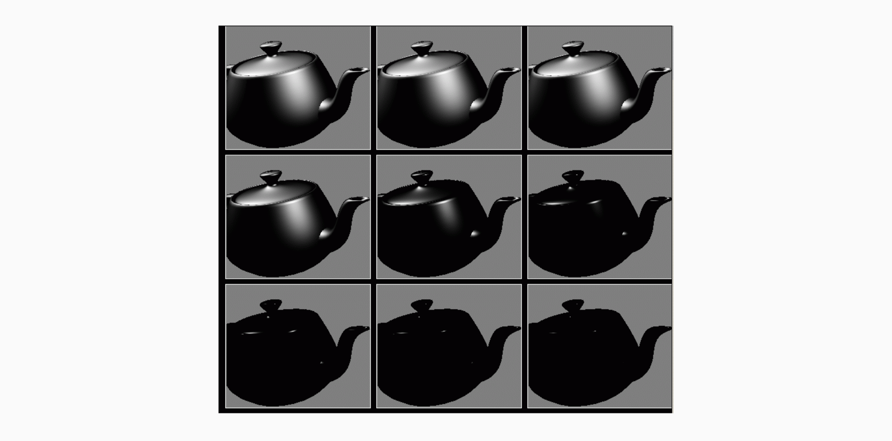

### Ejemplo de material combinado

Combinación ambiental, más difusa, más pseudo especular:

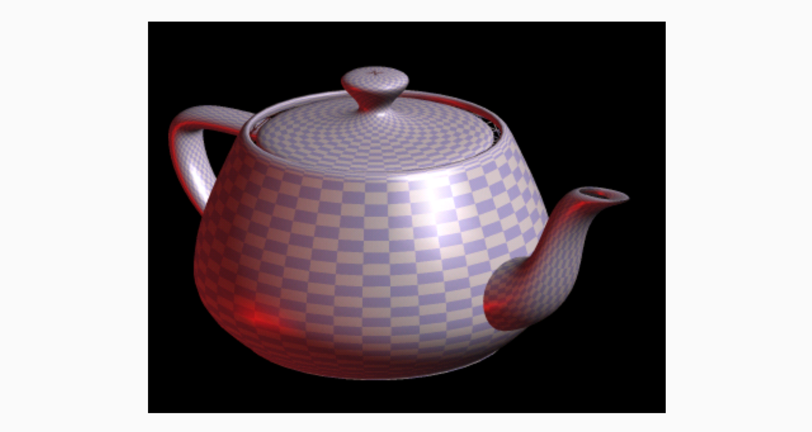

### Combinaciones material difuso + pseudo especular

Aquí $k_d$ crece de izquierda a derecha y $k_s$ de arriba abajo:

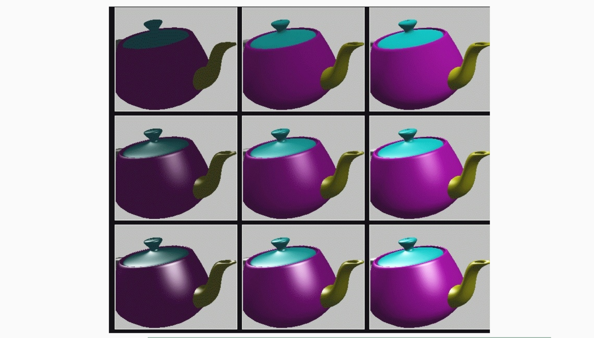

## 2.4 Texturas

Los objetos reales presenta a veces detalles a pequeña escala, como son manchas, defectos, motivos ornamentales, rugosidades, o, en general, cambios en el espacio de los atributos que determinan su apariencia:

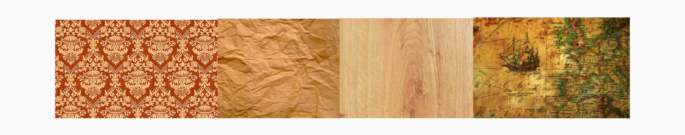

Estas variaciones se pueden modelar como funciones que asignan a cada punto de la superficie de un objeto un valor
diferente para algunos parámetros del MIL. Lo más usual es variar las reflectividades difusa y ambiente, pero se hace tambien con la normal (rugosidades), o a veces otros parámetros.

Para reproducir detalles a pequeña escala se pueden usar polígonos de detalle, son polígonos pequeños adicionales a los que definen la geometría de la escena, pero con materiales y/o orientación distintos entre ellos:


La desventaja de está opción es su enorme complejidad en espacio (necesario para almacenar muchos polígonos pequeños) y tiempo (empleado en su visualización).

Una opción mejor (mucho más eficiente) es usar imágenes para representar las funciones antes citadas. A estas imágenes se les llama (en el contexto de la Informática Gráfica) **texturas**:

Una **textura** se puede interpretar como una función $T$ que asocia a cada punto $s$ de un dominio $D$ (usualmente $[0, 1] \times [0, 1]$) un valor para un parámetro del MIL (típicamente el color $C(p)$). La función $T$ determina como varía el parámetro en el espacio.

- La función $T$ puede estar representada en memoria como una matriz de pixels RGB (una imagen discretizada), a cuyos pixels se les llama **texels** (_texture elements_). A esta imagen se le llama **imagen de textura**. 
- La función $T$ puede tambien representarse como un subprograma que calcula los valores a partir de $s$ (que se le pasa como parámetro). A este tipo de texturas le llamamos **texturas procedurales**.

### La textura como una función

En este ejemplo vemos una imagen de textura (bidimensional). El dominio $D$ es $[0, 1]^2$. Cada punto del dominio es un par $s = (u, v)$. Los valores $T(s) = T (u, v)$ son ternas RGB.

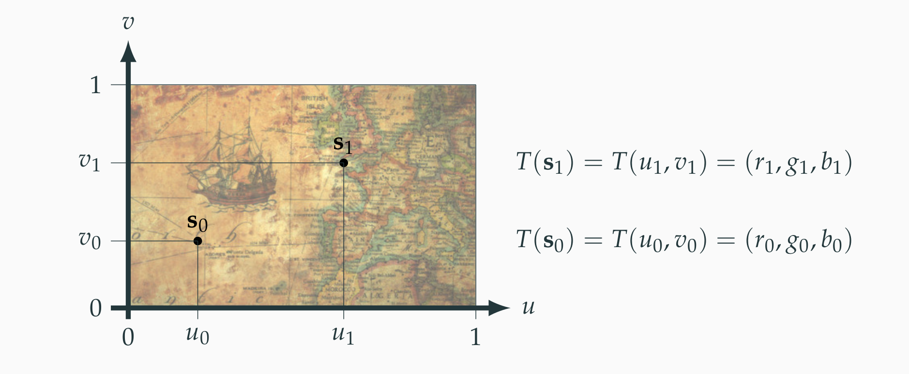

### Coordenadas de textura

Para poder aplicar una textura a la superficie de un objeto, es necesario hacer corresponder cada punto $p = ( x, y, z)$ de su superficie con un punto $(u, v)$ del dominio de la textura:

- Debe existir una función $f$ tal que $(u, v) = f ( x, y, z)$
- Si $(u, v) = f ( x, y, z)$ entonces decimos que $(u, v)$ son las coordenadas de textura del punto $p = ( x, y, z)$.
- Normalmente $f$ se descompone en dos componentes $f_u$, $f_v$ , de forma que $u = f_u( x, y, z)$ y $v = f_v( x, y, z)$.

> La función $f$ puede implementarse usando una tabla de coordenadas de textura de los vértices, o bien calcularse proceduralmente con un subprograma.

### Ejemplo de coordenada de textura

Vemos como a cada vértice de un triángulo del modelo se le asignan sus coordenadas de textura $(u_i , v_i)$, donde $i$ es el índice del vértice en la tabla de vértices.

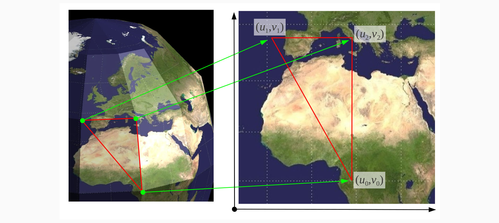

### Asignación explícita o procedural

La asignación de coordenadas de textura se puede hacer usando:

- **Asignación explícita a vértices**: Las coordenadas forman parte de la definición del modelo de escena, y son un dato de entrada al cauce gráfico, en forma de un vector o tabla de coordenadas de textura de vértices 
$$(v_0 , u_0 ), (v_1 , u_1), \dotsc, (u_{n−1} , v_{n−1})$$

> Se puede hacer manualmente en objetos sencillos, o bien de forma asistida usando software para CAD. Hace necesario realizar una interpolación de coordenadas de textura en el interior de los polígonos.

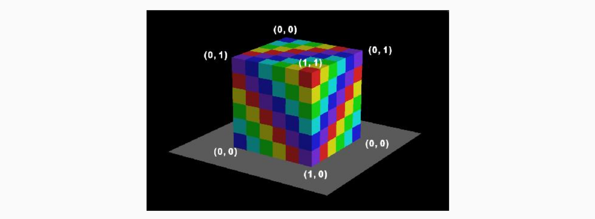

> En este ejemplo se busca una asignación de coordenadas de texturas que sea continua en las aristas.

- **Asignación procedural**: La función $f$ se implementa como un subprograma $CoordText(p)$ que calcula las coordenadas de textura (para un punto $p$ devuelve el par $(u, v) = f (p)$ con las coordenadas de textura de $p$). Hay dos opciones:
	- **Asignación procedural a vértices**: Se invoca `CoordText(vi)` para calcular las coordenadas de textura en cada vértice $v_i$ , y las coordenadas obtenidas se almacenan y después se interpolan linealmente en el interior de los polígonos de la malla. Funciona de forma totalmente correcta (exacta) solo cuando $f$ es lineal, en otro caso es una aproximación lineal a trozos.
	- **Asignación procedural a puntos**: Se invoca `CoordText(p)` cada vez que sea necesario evaluar el MIL en un punto de la superficie $p$. Permite exactitud incluso aunque $f$ sea no lineal.

> En OpenGL, esto requiere programación del cauce gráfico, invocando a `CoordText` en cada pixel desde el fragment shader.

### Funciones lineales (proyección)

En este caso el punto $p = ( x, y, z)$ se proyecta en un plano, y se usan las coordenadas del punto proyectado (en el sistema de referencia del plano), como coordenadas de textura.

El plano estará definido por un punto por el que pasa ($q$) y por dos vectores libres ($e_u$ y $e_v$ , de longitud unidad y perpendiculares entre sí). En estas condiciones:
$$u = f_u(p) = (p − q) \cdot e_u \hspace{1cm} v = f_v(p) = (p − q) \cdot e_v$$

### Ejemplo de proyección paralela a Z

Las coordenadas de $p$ que se usan en las funciones lineales pueden ser las coordenadas de objeto (izquierda) o bien o las coordenadas de mundo (derecha). Aquí vemos un ejemplo de una proyección paralela al eje $Z$:

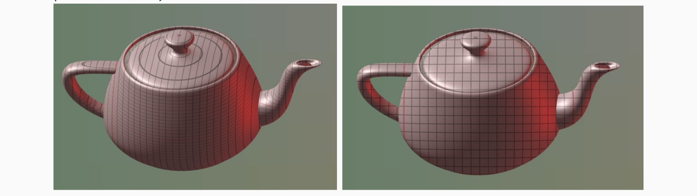

Este método funciona mejor (menor deformación) cuando la normal es aproximadamente paralela a la dirección de proyección (parte frontal en el ejemplo de la izquierda).

### Coordenadas paramétricas

Una **superficie paramétrica** es una variedad plana de dos dimensiones (que puede ser abierta o cerrada), para la cual existe una función $g$ (con dominio en $[0, 1] \times [0, 1]$) tal que, si $p$ es un punto de la superficie, entonces existen $(s, t)$ tales que $p = g(s, t)$.

> En este caso, al par $(s, t)$ se le llaman **coordenadas paramétricas** del punto $p$, y a la función $g$ se le llama **función de parametrización** de la superficie.

Usando la capacidad de evaluar $g$, podemos construir una malla que aproxima cualquier superficie paramétrica. La posición $p_i$ del $i$-ésimo vértice se obtiene como $g(s_i , t_i)$, donde los $(s_i , t_i)$ forman una rejilla en $[0, 1] \times [0, 1]$.

> En estas condiciones, podemos hacer $(u, v) = f (p) = (s, t)$, es decir, podemos usar las coordenadas paramétricas como coordenadas de textura.

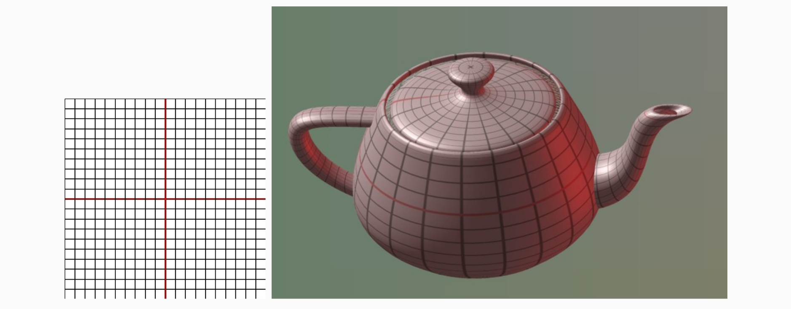
### Coordenadas esféricas

Se basa en usar las coordenadas polares (longitud, latitud y radio) del punto $p$. Las coordenadas $(\alpha, \beta, r )$ se obtienen a partir de las coordenadas cartesianas $(x, y, z)$ , normalmente coordenadas de
objeto, con el origen en un punto central de dicho objeto).
$$\alpha = a\tan2(z, x) \hspace{1cm} \beta = a\tan2(y, \sqrt{x^2 + y^2})$$
Se obtiene $\alpha$ en el rango $[−\pi, \pi]$ y $\beta$ en el rango $[−\pi/2, \pi/2]$. Por tanto, podemos calcular $u$ y $v$ como sigue:
$$u = \frac{1}{2} + \frac{\alpha}{2\pi} \hspace{1cm} v = \frac{1}{2} + \frac{\beta}{\pi}$$

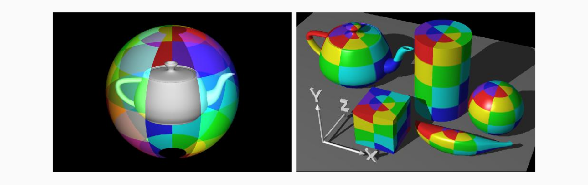
### Coordenadas cilíndricas

Se usan las coordenadas polares (ángulo y altura) del punto $p$. Las coordenadas $(\alpha, h, r )$ se obtienen a partir de las coordenadas cartesianas $( x, y, z)$,  también con origen en el centro del objeto.
$$\alpha = a \tan 2(z,x) \hspace{1cm} h = y$$

El valor de $\alpha$ está en el rango $[−\pi, \pi]$ y $h$ en el rango $[y_{min} , y_{max}]$. Por tanto, podemos calcular $u$ y $v$ como:
$$u = \frac{1}{2} + \frac{\alpha}{2\pi} \hspace{1cm} v = \frac{y - y_{min}}{y_{max} - y_{min}}$$

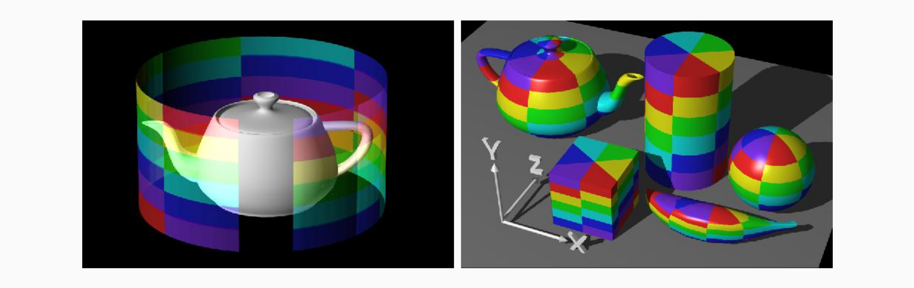

### Consulta de texels en texturas de imagen

En una textura de imagen con $n_x$ columnas de texels y $n_y$ filas, podemos interpretar que cada texel tiene asociada un pequeño rectangulo contenido en $[0, 1]^2$ . El texel en la columna $i$, fila $j$ tendrá un área con centro en el punto $(c_i , d_j)$.

La consulta del color de la textura en un punto $(u, v)$ puede hacerse de dos formas:
- Usar el color del texel cuyo centro sea **más cercano** a la posición $(u, v)$, es equivalente a seleccionar el texel cuya área contiene a $(u, v)$.
- Realizar un interpolación (bilineal) entre los colores de los cuatro texels con centros más cercanos al punto $(u, v)$.

> Las diferencias entre ambos métodos son visibles cuando la proyección en la ventana de un texel ocupa muchos pixels.

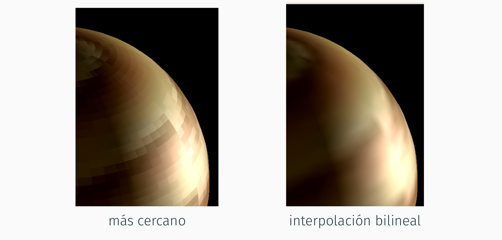

## 2.5 Métodos de sombreado para rasterización

En el algoritmo de Z-buffer, la evaluación del MIL puede hacerse en tres puntos distintos del cauce gráfico:

- **Sombreado plano** (_flat shading_): Una vez por cada polígono que forma el modelo, asignando el resultado (una terna RGB única) a todos los pixels donde se proyecta el polígono.
- **Sombreado de vértices** (_smooth shading_ o _Gouroud shading_): Una vez por vértice, cada color RGB obtenido se usa para interpolar los colores de los pixels en cada polígono.
- **Sombreado de pixel** (_pixel shading_ o _Phong shading_): Una vez por cada pixel donde se proyecta el polígono

### Sombreado plano

Este método de sombreado es muy eficiente en tiempo si el modelo es sencillo, es decir, si el número de polígonos es pequeño en comparación con el de pixels.

Se debe seleccionar un punto cualquiera $p$ de cada polígono, típicamente se usa un vértice, pero podría ser cualquier otro. Se usa la normal al polígono $n_p$  y se calcula el vector al observador $v$ en $p$.

Las desventajas son:
- Puede no ser deseable que se aprecien los polígonos del modelo.
- Produce discontinuidades en el brillo de los pixels en las aristas.
- No es realista si el tamaño del polígono es grande en comparación con la distancia que lo separa al observador, en proyección perspectiva y/o brillos pseudo-especulares.


> Aquí vemos un objeto curvo aproximado con caras planas y visualizado con sombreado plano (MIL difuso).

### Bandas Mach

La Bandas Mach son una ilusión visual producida por la inhibición lateral de las neuronas de la retina, que es un mecanismo desarrollado evolutivamente para resaltar el contraste en aristas entre colores planos:

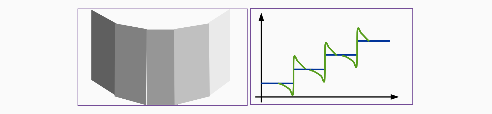

> Si no se quiere modelar un objeto formado realmente por caras planas, esta forma de visualizar produce resultados pobres. En algunos casos (objetos hechos de caras planas, iluminación puramente difusa) puede ser muy eficiente y realista.

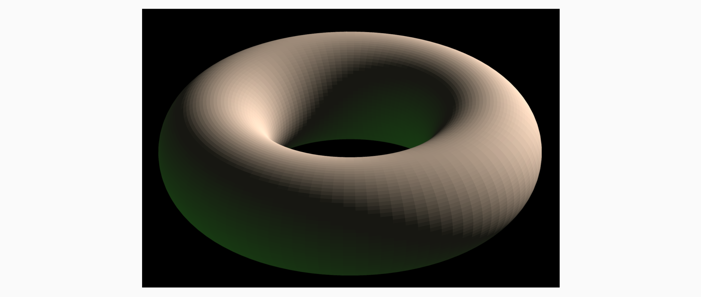

### Sombreado en los vértices

En esta modalidad (_vertex shading_), el MIL se evalua una vez en cada vértice del modelo.

> Si la malla de polígonos aproxima un objeto curvo, la normal $n_p$ puede calcularse como el promedio de las normales de los polígonos adyacentes al vértice.

La evaluación del MIL produce un color único para cada vértice, que se usan como valores extremos para interpolar los colores de los pixels donde se proyecta el polígono. 

La eficiencia en tiempo es parecida al sombreado plano aunque los resultados son muchas veces más realistas. Aun así,  pueden persistir problemas de bandas Mach y poco realismo.

### Pérdida de zonas brillantes

Los resultados mejoran, pero puede haber problemas de pérdida de zonas brillantes (componente pseudo-especular), en modelos con pocos polígonos que aproximan objetos curvos:

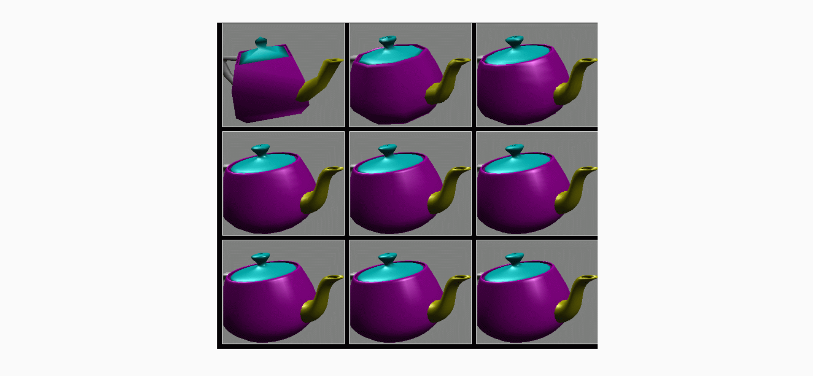

### Discontinuidad en la derivada

A veces pueden aparecer problemas parecidos a las bandas Mach, en este caso por exageración en la retina de las discontinuidades de primer orden (cambios bruscos en la pendiente de la iluminación)

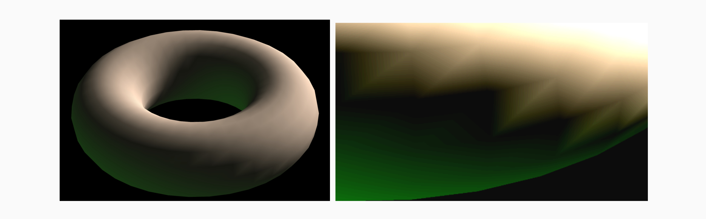

### Sombreado en los píxeles

En esta modalidad (_pixel shading_), el MIL se evalua en cada pixel del viewport en el que se proyecta un polígono. Requiere interpolar las normales asociadas a los vértices.

Es computacionalmente más costoso que los anteriores, pero no cuando el número de polígonos visibles es del orden del número de pixels del viewport (o superior). Aunque produce resultados de más calidad, hay muchos menos defectos por discontinuidades.

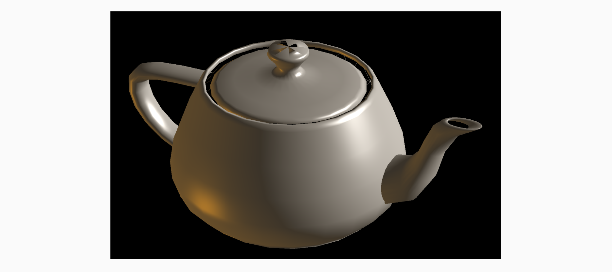

Con este sombreado se reproducen los brillos incluso a baja resolución:

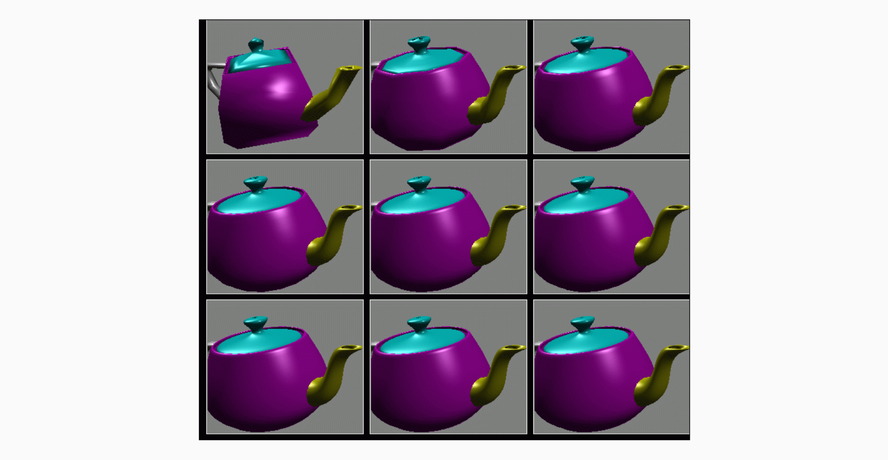

### Comparación de sombreado de vértices y píxeles

Sombreado de vértices (_arriba_) y de píxeles (_abajo_), en iguales condiciones de iluminación, observador y atributos material:

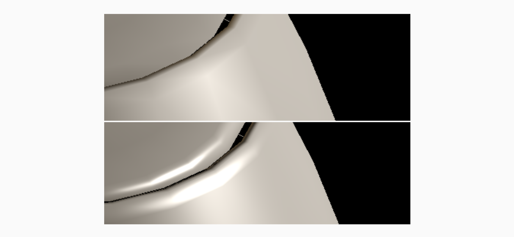

# 3. Iluminación y texturas en el cauce programable

## 3.1 Carga y configuración de texturas

### Nombre de textura

OpenGL puede gestionar más de una textura a la vez. Para diferenciarlas usa un valor entero (`GLuint`) único para cada una de ellas, que se denomina nombre (o identificador) de textura (**texture name**):

> Para crear o generar un nuevo nombre de textura único (distinto de cualquiera ya existente) usamos:

```c++
GLuint nombre_tex;
glGenTextures(1, &nombre_tex); // nombre_tex = nuevo nombre
```

> Para crear $n$ nuevos nombres de textura (en un array de `GLuint`), hacemos:

```c++
GLuint arr_nombres_tex[n] ; // n es una constante entera (n > 0)
glGenTextures(n, arr_nombres_tex); // crea n nuevos nombres
```

### Unidades de textura

OpenGL permite configurar distintas unidades de textura, y activar distintas texturas en las distintas unidades.

> Para cambiar la unidad de textura activa podemos usar:

```c++
// Activa textura con identificador ’idTex’:
glActiveTexture(GL_TEXTUREi); // GL_TEXTURE0, GL_TEXTURE1, GL_TEXTURE2, ...
```

En el estado interno de OpenGL, por cada unidad de textura, hay en cada momento un nombre o identificador de una única textura activa:
- Cualquier operación de visualización de primitivas usará la textura asociada a dicho nombre.
- Cualquier operación de configuración de la funcionalidad de texturas se referirá a dicha textura activa.

> Para cambiar la textura activa podemos hacer:

```c++
// Activa textura con identificador nombre_tex:
glBindTexture(GL_TEXTURE_2D, nombre_tex);
```

### Alojamiento en RAM de imágenes de textura

Antes de usar una textura en OpenGL (de tamaño $n_x \times n_y$), es necesario alojar en la memoria RAM una matriz con los colores de sus texels:

- Cada texel se representa (usualmente) con tres bytes (enteros sin signo entre $0$ y $255$), que codifican la proporción de rojo, verde y azul, respecto al valor máximo ($255$).
- Los tres bytes de cada texel se almacenan contiguos, usualmente en orden RGB.
- Se conoce la dirección de memoria del primer byte, que llamamos `texels` (es un puntero de tipo `void *`) con este esquema la imagen ocupará, lógicamente, $3 n_x n_y$ bytes consecutivos en memoria.

### Especificación de los texels de la imagen de textura

La copia de los texels hacia la GPU se hace con `glTexImage2D`, y la generación de versiones a resolución reducida con `glGenerateMipmap`:

```c++
glTexImage2D
( 
	GL_TEXTURE_2D, // GLenum target: tipo de textura.
	0, // GLint level: nivel de mipmap.
	GL_RGB, // GLint internalformat: formato de destino en GPU.
	ancho, // GLsizei width: número de columnas de texels.
	alto, // GLsizei height: numero de filas de texels.
	0, // GLint border: borde, no se usa, se pone a 0.
	GL_RGB, // GLenum format: formato origen en memoria apl.
	GL_UNSIGNED_BYTE, // GLenum type: tipo valores.
	imagen // const void * data: puntero a texels en memoria apl.
);
// Generar mipmaps (versiones a resolución reducida)
glGenerateMipmap(GL_TEXTURE_2D);
```

### Selección de texels para texturas cercanas (magnificadas)

OpenGL permite especificar como se seleccionarán los texels en cada consulta posterior de la textura activa, cuando el pixel actual es igual o más pequeño que el texel que se proyecta en él:

> Seleccionar el texel con centro más cercano al centro del pixel:

```c++
glTexParameteri(GL_TEXTURE_2D, GL_TEXTURE_MAG_FILTER, GL_NEAREST);
```

> Hacer interpolación bilineal entre los cuatro texels con centros más cercanos al centro del pixel:

```c++
glTexParameteri(GL_TEXTURE_2D, GL_TEXTURE_MAG_FILTER, GL_LINEAR);
```

> La opción inicialmente activada es la segunda de ellas, es la que se usa normalmente.

### Selección de texels para texturas lejanas (minimizadas)

Por otro lado, OpenGL también permite especificar como se seleccionarán los texels en cada consulta cuando el pixel actual es más grande que los multiples texels que se proyectan en él:

En este caso, es acosejable usar los mipmaps (versiones de la textura a resoluciones inferiores a la original).

> Para seleccionar el texel con centro más cercano al centro del pixel:

```c++
glTexParameteri(GL_TEXTURE_2D, GL_TEXTURE_MIN_FILTER, GL_NEAREST_MIPMAP_LINEAR);
```

> Hacer interpolación bilineal entre los cuatro texels con centros más cercanos al centro del pixel:

```c++
glTexParameteri(GL_TEXTURE_2D, GL_TEXTURE_MIN_FILTER, GL_LINEAR_MIPMAP_LINEAR);
```

### Selección de texels con coordenadas de textura fuera de rango

Por último, es posible seleccionar que se hace cuando se especifican coordenadas de textura fuera de rango (es decir, fuera de $[0, 1]$).

- En este caso, se puede elegir entre truncar las coordenadas al valor mínimo o máximo, repetir la textura (descartar la parte entera), o repetirla con espejo.
- Esto se puede hacer de forma independiente para la coordenada $S$ o para la coordenada $T$.

> Para repetir la textura en ambas coordenadas, hacemos:

```c++
glTexParameteri(GL_TEXTURE_2D, GL_TEXTURE_WRAP_S, GL_REPEAT);
glTexParameteri(GL_TEXTURE_2D, GL_TEXTURE_WRAP_T, GL_REPEAT);
```

## 3.2 Shaders para iluminación y texturas

En OpenGL moderno se usa **sombreado de Phong** (sombreado en los pixels), por tanto:
- En el vertex shader se hace:
	- Generación de coordenadas de textura (si está activada, en otro caso se pasan las coordenadas de textura del vértice)
- En el fragment shader se hace:
	- Lectura de parámetros del MIL:
	- Vector normal y el vector al observador
	- Posiciones y colores de las fuentes de luz.
	- Parámetros del material.
	- Color de la textura (si está habilitada).
	- Evaluación del MIL.

El MIL se evalua en el espacio de coordenadas de vista (ECC).
### Atributos de vértice (entradas _vertex shader_)

Recordamos los atributos de vértice (distintos por cada vértice) que son parte de las entradas al vertex shader:

```c++
// Posición del vértice en coordenadas de objeto
layout(location = 0) in vec3 in_posicion_occ;
// Color del vértice
layout(location = 1) in vec3 in_color;
// Normal del vértice (en coordenadas de objeto)
layout(location = 2) in vec3 in_normal_occ;
// Coordenadas de textura del vértice
layout(location = 3) in vec2 in_coords_textura;
```

### Parámetros _uniform_ para iluminación y texturas

```c++
// Parámetros relativos al MIL y material actual
uniform bool u_eval_mil; // evaluar el MIL sí (true) o no (false)
uniform float u_mil_ka; // reflect. ambiental del MIL (ka)
uniform float u_mil_kd; // reflect. difusa del MIL (kd)
uniform float u_mil_ks; // reflect. pseudo-especular (ks)
uniform float u_mil_exp; // exponente para pseudo-especular (e)

// Parámetros relativos a texturas
uniform bool u_eval_text; // false –> no evaluar texturas, true -> sí
uniform int u_tipo_gct; // tipo gen.cc.tt. (0=desact., 1=obj., 2=cam.)
uniform vec4 u_coefs_s; // coefficientes para gen.cc.t (coordenada S)
uniform vec4 u_coefs_t; // coefficientes para gen.cc.t (coordenada T)

// Sampler de textura (objeto usado para consultar la textura)
uniform sampler2D u_tex ; // ligado a la unidad de texturas 0

// Parámetros de las fuentes de luces actuales
uniform int u_num_luces ; // núm. de luces
uniform vec4 u_pos_dir_luz_ecc[max_num_luces];// posic. o direcciones
uniform vec3 u_color_luz[max_num_luces]; // colores (Si )
```

### Variables _varying_ para iluminación y texturas

Las variables varying relacionadas con iluminación y texturas incluyen: la posición del punto, la normal al punto, el vector hacia el
observdor (todos ellos en coordenadas de vista) y las coordenadas
de textura.

```c++
out vec4 v_posic_ecc ; // posicion del punto (en coords de camara)
out vec4 v_color ; // color del vértice (interpolado a los pixels)
out vec3 v_normal_ecc ; // normal (en coords. de camara)
out vec2 v_coord_text ; // coordenadas de textura
out vec3 v_vec_obs_ecc ;// vector hacia el observador (en coords de cámara)
```

Estas variables se calculan en el vertex shader, se interpolan, y se leen en el fragment shader. La normal y el vector al observador no está normalizados (ya que son resultado de una interpolación que rompe la normalización)

### Código en el vertex shader

La función principal del vertex shader hace la transformación de coordenadas del vértice, pero también calcula las variables varying.

```c++
void main()
{
	// Calcular posicion y normal en coordenadas de mundo
	vec4 posic_wc = u_mat_modelado * vec4(in_posicion_occ, 1.0);
	vec3 normal_wc=(u_mat_modelado_nor * vec4(in_normal_occ, 0.0)).xyz;
	// Calcular variables varying
	v_posic_ecc = u_mat_vista * posic_wcc;
	v_normal_ecc = (u_mat_vista * vec4(normal_wcc, 0.0)).xyz;
	v_vec_obs_ecc = (-v_posic_ecc).xyz;
	v_color = vec4(in_color, 1);
	v_coord_text = CoordsTextura();
	// Calcular posición del vértice en coords. de recortado
	gl_Position = u_mat_proyeccion * v_posic_ecc ;
}
```

### Cálculo de coordenadas de textura

La función `CoordsTextura` se encarga de calcular las coordenadas de textura del vértice. Pueden ser las enviadas por la aplicación o generadas:

```c++
vec2 CoordsTextura()
{
	// Si textura desactivada
	if (!u_eval_text) 
		return vec2(0.0, 0.0);
	// Si text. activadas, pero generacion de coord. text. desactivada
	if (u_tipo_gct == 0 )
		return in_coords_textura.st;
	vec4 pos_ver;
	// Si generación en coords. de objeto
	if (u_tipo_gct == 1)
		pos_ver = vec4(in_posicion_occ, 1.0); // dev. coords. obj.
	else
		pos_ver = v_posic_ecc; // dev. coords. de cámara
	return vec2(dot(pos_ver, u_coefs_s), dot(pos_ver, u_coefs_t));
}
```

### Evaluación del MIL en el _fragment shader_. Parámetros

El fragment shader se encarga de evaluar el Modelo de Iluminación Local (MIL) sencillo que hemos introducido antes (el mismo que el cauce fijo). La evaluación produce como resultado el color del pixel.

Usa estos parámetros:
- Un valor lógico que indica si se debe evaluar el MIL o no. Otro que indica si se debe usar la textura o no.
- Vector normal (normalizado), el vector al observador (posición en EC negada), coordenadas de textura.
- El número de fuentes de luz activas.
- Parámetros de las fuentes de luz: para cada una, su posición o dirección y el color, (en sendos arrays).
- Parámetros del material: reflectividades difusa, ambiental y especular, color y exponente de brillo.
- Textura activa actualmente, coordenadas de textura calculadas en el fragment shader.

### Código del fragment shader

La función principal del fragment shader calcula `out_color_fragmento`, haciendo consulta de texturas y
evaluando el MIL, si procede:

```c++
void main()
{
	// Calcular el color base del objeto (color_obj)
	vec4 color_obj;
	// Consultar textura si hay o usar color interpolado
	if (u_eval_text)
		color_obj = texture(u_tex, v_coord_text);
	else
		color_obj = v_color;
	// Calcular el color del pixel (out_color_fragmento)
	if (!u_eval_mil)
		out_color_fragmento = color_obj; // color pixel <– color objeto
	else
		out_color_fragmento = vec4(EvalMIL(color_obj.rgb), 1.0);
}
```

### Cálculo de vector hacia el observador y normal

```c++
// Devuelve vector hacia observador normalizado
vec3 VectorHaciaObsECC()
{
	return normalize(v_vec_obs_ecc);
}
// Calcula la normal al triángulo (prod. vect. de las tangentes)
vec3 NormalTrianguloECC()
{
	vec4 tx = dFdx(v_posic_ecc); // tangente al tri. en horizontal
	ty = dFdy(v_posic_ecc); // tangente al tri. en vertical
	return normalize(cross(tx.xyz, ty.xyz)); // producto vectorial
}
// Calcula el vector normal apuntando al observador, normalizado
vec3 NormalECC( vec3 vec_obs_ecc )
{
	vec3 n = u_usar_normales_tri ? NormalTrianguloECC() : normalize( v_normal_ecc );
	return dot(n, vec_obs_ecc) >= 0.0 ? n : -n;
}
```

### Vector hacia una fuente de luz

El vector hacia la i-ésima fuente de luz (normalizado), en coordenadas de cámara, se calcula en función de la componente W de la posición o dirección a dicha fuente.

```c++
vec3 VectorHaciaFuenteECC(int i)
{
	return (u_pos_dir_luz_ecc[i].w == 1.0) ?
		normalize(u_pos_dir_luz_ecc[i].xyz - v_posic_ecc.xyz) :
		normalize(u_pos_dir_luz_ecc[i].xyz) ;
}
```

### Evaluación del MIL

```c++
vec3 EvalMIL( vec3 color_obj )
{
	vec3 v = VectorHaciaObsECC() ;
	vec3 n = NormalECC(v);
	vec3 sum = vec3(0.0, 0.0, 0.0);
	for( int i = 0 ; i < u_num_luces ; i++ )
	{
		sum = sum + u_color_luz[i]*color_obj*u_mil_ka ;
		vec3 l = VectorHaciaFuenteECC(i) ;
		float nl = dot(n, l) ;
		if ( 0.0 < nl )
		{ 
			float hn = max(0.0, dot( n, normalize(l+v)));
			vec3 col = color_obj*(u_mil_kd*nl)+pow(hn,u_mil_exp)*u_mil_ks;
			sum = sum + (u_color_luz[i] * col);
		}
	}
	return sum ;
}
```

## 3.3 Implementación de la clase `Cauce`

### Iluminación usando la clase `Cauce`

La clase Cauce incluye estos dos métodos:

- El método `fijarEvalMIL` actualiza el uniform `u_eval_mil`:

```c++
void Cauce::fijarEvalMIL(const bool nue_eval_mil)
{
	eval_mil = nue_eval_mil ;
	glUseProgram(id_prog);
	glUniform1ui(loc_eval_mil, eval_mil ? 1 : 0);
}
```

- El método `fijarUsarNormalesTri` actualiza el parámetro uniform `u_usar_normales_tri`:

```c++
void Cauce::fijarUsarNormalesTri(const bool nue_usar_normales_tri)
{
	usar_normales_tri = nue_usar_normales_tri ;
	glUseProgram(id_prog);
	glUniform1ui(loc_usar_normales_tri, usar_normales_tri);
}
```

### Parámetros de las fuentes

El método `fijarFuentesLuz` se invoca una vez por cuadro:

```c++
void Cauce::fijarFuentesLuz(const vector<vec3> & color, const vector<vec4> & pos_dir_wcc)
{
	const unsigned nl = color.size();
	vector<vec4> pos_dir_ecc;
	for (unsigned i = 0 ; i < nl ; i++)
		pos_dir_ecc.push_back(mat_vista * pos_dir_wcc[i]);
	glUseProgram(id_prog);
	glUniform1i(loc_num_luces, nl);
	glUniform3fv(loc_color_luz, nl, (const float *)color.data());
	glUniform4fv(loc_pos_dir_luz_ecc, nl, (const float *)pos_dir_ecc.data());
}
```

> Transforma las direcciones o posiciones por la matriz de vista actual, así que las interpreta en coords. de mundo y produce E.C.

### Parámetros del MIL (material)

El método `fijarParamsMIL` fija los parámetros del material (reflectividades ambiente, difusa y especular, y el exponente)

```c++
void Cauce::fijarParamsMIL(const float mil_ka, const float mil_kd, const float mil_ks, const float exp)
{
	glUseProgram(id_prog);
	glUniform1f(loc_mil_ka, mil_ka);
	glUniform1f(loc_mil_kd, mil_kd);
	glUniform1f(loc_mil_ks, mil_ks);
	glUniform1f(loc_mil_exp, exp);
}
```

> Se debe invocar cada vez que se quiera activar un nuevo material

### Habilitar una textura

El método `fijarEvalText` permite habilitar (o deshabilitar) las texturas, y en el primer caso requiere el identificador de la textura a activar:

```c++
void Cauce::fijarEvalText(const bool nue_eval_text, const int nue_text_id)
{
	eval_text = nue_eval_text;
	glUseProgram(id_prog);
	if (eval_text)
	{ 
		glActiveTexture(GL_TEXTURE0);
		glBindTexture(GL_TEXTURE_2D, nue_text_id);
		glUniform1ui(loc_eval_text, true);
	}
	else
		glUniform1ui(loc_eval_text, false);
}
```

### Fijar parámetros de generación de cc.t.

El método `fijarTipoGCT` fija los parámetros relacionados con generación automática de coordenadas de textura (generación activada sí/no, tipo de generación, coeficientes):

```c++
void Cauce::fijarTipoGCT(const int nue_tipo_gct, const float * coefs_s, const float * coefs_t)
{
	tipo_gct = nue_tipo_gct ;
	glUniform1i(loc_tipo_gct, tipo_gct);
	if (tipo_gct == 1 || tipo_gct == 2)
	{
		glUniform4fv(loc_coefs_s, 1, coefs_s);
		glUniform4fv(loc_coefs_t, 1, coefs_t);
	}
}
```

# 4. Representación de materiales, texturas y fuentes

En esta sección veremos como representar en una aplicación los diversos parámetros relacionados con la iluminación y texturas:
- Clase `Textura`: Incluye un puntero a los texels en RAM, y los parámetros de generación de coordenadas de textura.
- Clase `Material`: Incluye los parámetros del MIL (reflectividades ambiente, difusa y especular, exponente de brillo), y opcionalmente un puntero a una instancia de una textura.
- Clase `FuenteLuz` y `ColFuentesLuz`: Parámetros que definen cada fuente de luz (posición o dirección, color), y conjunto de fuentes de luz a usar en una escena.
- Clase `NodoGrafoEscena`: En esta clase se podrán incluir entradas de tipo material.
- Clase `Escena`: Contendrá una colección de fuentes, y un material inicial.

Las instancias de estas las clases `Textura`, `Material` y `ColFuentesLuz` incorporan un método para activarlas.

> La activación es el proceso por el cual el cauce se configura para que en la siguientes operaciones de visualización se use una textura, un material, o una colección de fuentes.

Para las texturas, materiales y colecciones de fuentes, se definen clases derivadas con constructores que implementan distintas variantes.

## 4.1 Las clases `Textura` y `Material`

### Clase `Textura`

La clase textura se declara así:

```c++
class Textura
{
public:
	Textura(const std::string & nombreArchivoJPG);
	~Textura();
	void activar(); // Activación en el cauce actual (apl->cauce)
protected:
	void enviar(); // Envia la imagen a la GPU (gluBuild2DMipmaps)
	unsigned char * imagen = nullptr; // Texels en memoria dinamica
	bool enviada = false;
	GLuint ident_textura = -1 ; // Identificador de textura
	unsigned ancho = 0; // Número de columnas de la imagen
	unsigned alto = 0; // Número de filas de la imagen
	ModoGenCT modo_gen_ct = mgct_desactivada ; // modo gen. cc.t.
	float coefs_s[4] = {1.0,0.0,0.0,0.0}; // Coeficientes (S)
	float coefs_t[4] = {0.0,1.0,0.0,0.0}; // Coeficientes (T)
};
```

### Clase `Material`

Encapsula una textura y los cuatro parámetros del MIL (reales):

```c++
class Material
{
public:
	Material(){};
	// Constructor sin textura
	Material(const float p_k_amb, const float p_k_dif, const float p_k_pse, const float p_exp_pse);
	// Constructor con textura
	Material(Textura * p_textura, const float p_k_amb, const float p_k_dif, const float p_k_pse, const float p_exp_pse);
	void activar(); // Activación en el cauce actual (apl->cauce)
	~Material() ;
protected:
	Textura * textura = nullptr;
	float k_amb = 0.2f; // Coeficiente de reflexión ambiente
	float k_dif = 0.8f; // Coeficiente de reflexión difusa
	float k_pse = 0.0f; // Coeficiente de reflexión pseudo-especular
	float exp_pse = 0.0f; // Exponente de brillo para reflexion pseudo-especular
} ;
```


## 4.2 Fuentes de luz. La clase `ColeccionFuentes`

### Clase `FuenteLuz`

Ejemplo de fuente de luz direccional y manipulable interactivamente:

```c++
class FuenteLuz
{
public:
	FuenteLuz(GLfloat p_longi_ini, GLfloat p_lati_ini, const glm::vec3 & p_color);
	void actualizarLongi(const float incre);
	void actualizarLati(const float incre);
	float longi; // Longitud actual (en grados, entre 0 y 360)
	float lati; // Latitud actual (en grados, entre -90 y 90)
protected:
	glm::vec3 color; // Color de la fuente
	float longi_ini; // Valor inicial de longitud
	float lati_ini ; // Valor inicial de latitud
};
```

### Clase `ColFuentesLuz`

Colección de fuentes manipulable (con una fuente actual):

```c++
class ColFuentesLuz
{
public:
	ColFuentesLuz();
	~ColFuentesLuz();
	void insertar(FuenteLuz * pf); // Inserta nueva fuente
	void activar();
	void sigAntFuente( int d ); // Cambiar fuente actual (d=+1/-1)
	FuenteLuz * fuenteLuzActual(); // Devuelve puntero a fuente actual
private:
	std::vector<FuenteLuz*> vpf; // Vector de punteros a fuentes
	GLint max_num_fuentes = 0; // Máximo número de fuentes
	unsigned i_fuente_actual = 0; // Índice de fuente actual
};
```

### Visualización con materiales y luces

El código de la aplicación, para visualizar una escena con iluminación activada, debe:
- Antes de visualizar los objetos:
	1. activar la evaluación del MIL,
	2. activar una colección de fuentes de luz y
	3. activar un material por defecto.
- Durante la visualización, para visualizar un objeto que tiene un material específico, se debe
	1. guardar un puntero al material activado antes,
	2. activar el material específico,
	3. visualizar el objeto y
	4. activar el material anterior.

Para recordar un puntero al material activo, podemos usar una pila de materiales.

### Clase `PilaMateriales`

Para gestionar eso en las prácticas se define una clase que encapsula una pila de materiales:

```c++
class PilaMateriales
{
public:
	PilaMateriales(){};
	// Guarda material actual en la pila (no puede ser nulo)
	void push();
	// Cambia el material actual y lo activa
	void activar(Material * nuevo_actual);
	// Invoca activar para el material en el tope y lo elimina del tope
	void pop();
private:
	// Pila de materiales guardados
	std::vector<Material*> vector_materiales;
	// Material actual
	Material * actual = nullptr ;
} ;
```

Si queremos visualizar un objeto (`objeto`) con algún material específico (`material`), podemos usar un objeto con la pila de materiales (`pila_materiales`):

```c++
Material * material = ....... ; // crear e inicializar el material
....
pila_materiales->push();
pila_materiales->activar( material );
objeto->visualizarGL();
pila_materiales->pop();
....
```

Antes de visualizar una escena, debemos de activar algún material por defecto en la pila, de esta forma, si algún objeto visualizado no activa su propio material tomará el material por defecto.

## 4.3 Materiales en el grafo de escena

En los grafo de escena vamos a incorporar la posibilidad de asignar distintos materiales a distintas partes o nodos del grafo:
- Hay un nuevo tipo de entrada en los nodos, las entradas de tipo **material**, siendo estas un puntero a una instancia de `Material`.
- Un material en una entrada de un nodo afecta a todas las entradas posteriores de dicho nodo, hasta el final del nodo o bien hasta otra entrada posterior del nodo también de tipo material.
- Por tanto, toda entrada está afectada del primer material encontrado en el camino desde esa entrada hasta la primera entrada del nodo raíz (si no hay ninguno, se usaría uno por defecto).

> Disponemos de las primitivas Cubo, Esfera y Ejes, y cuatro materiales posibles (se muestran en azul):

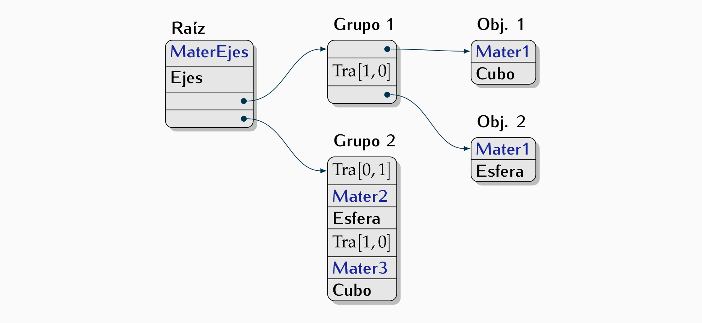

### Entradas de tipo `material`

Ahora las entradas de los nodos del tipo grafo de escena pueden contener un puntero a un material cualquiera:

```c++
struct EntradaNGE
{
	unsigned char tipoE ; // 0 => objeto, 1 => transformacion, 2 => material
	union
	{ 
		Objeto3D * objeto; // Ptr. a un objeto
		Matriz4f * matriz; // Ptr. a matriz de transf.
		Material * material; // Ptr. a material
	};
	EntradaNGE(Objeto3D * pObjeto) ; // (copia únicamente el puntero)
	EntradaNGE(const Matriz4f & pMatriz); // (crea copia de la matriz)
	EntradaNGE(Material * pMaterial); // (copia únicamente el puntero)
} ;
```

Habrá una nueva versión del método agregar de los nodos:

```c++
class NodoGrafoEscena : public Objeto3D
{
. . .
	void agregar(Material * pMaterial); // Añadir material al final
};
```

### Procesamiento de nodos con materiales

En ell método `visualizarGL` de la clase `NodoGrafoEscena`:

- Al inicio, hacer `push` en la pila

```c++
pila_materiales->push();
```

- En el bucle, al encontrar una entrada de tipo material, se activa:

```c++
case TipoEntNGE::material : // Si la entrada es de tipo ’material’
	if (iluminación activada ) // y si está activada la iluminación
		pila_materiales->activar(entradas[i].material);
break ;
```

- Al finalizar, reactivamos el material activo originalmente

```c++
pila_materiales->pop();
```