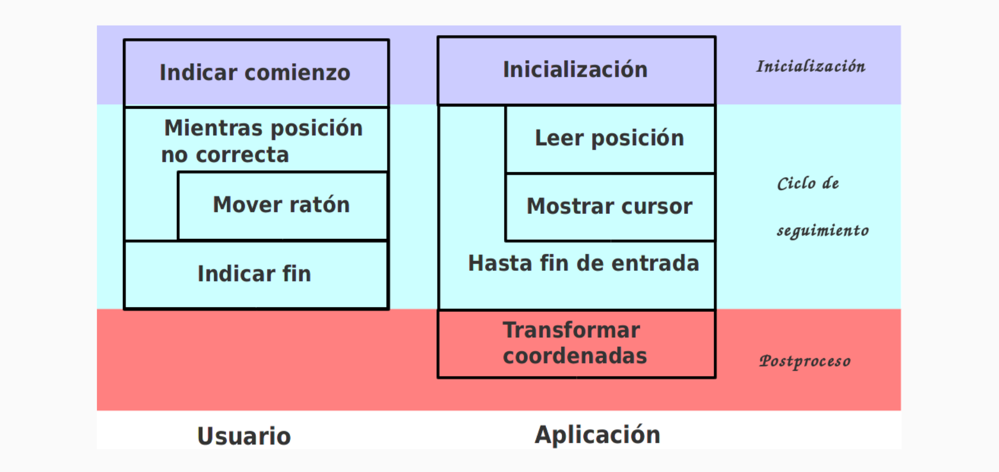
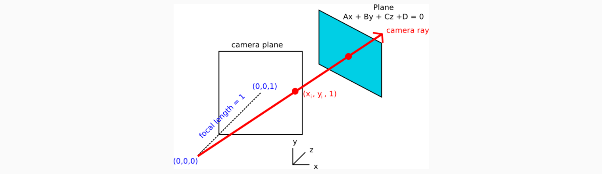
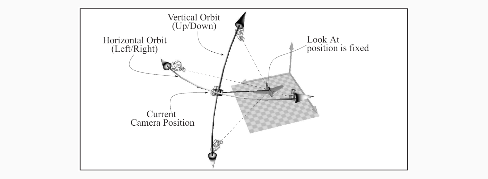
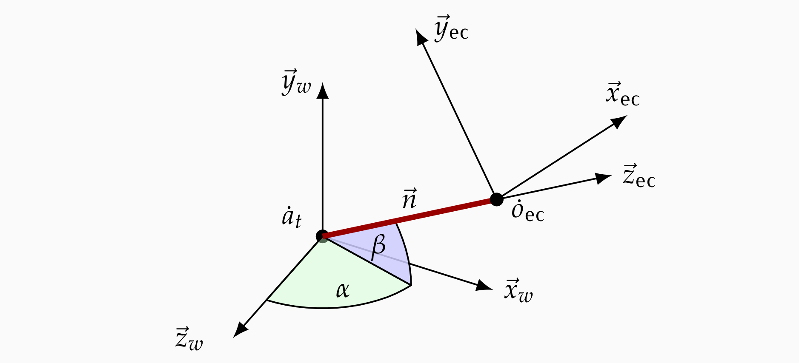
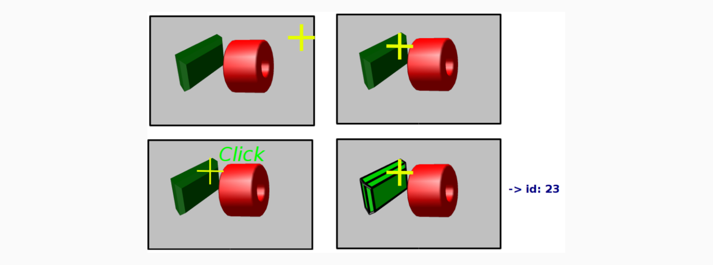
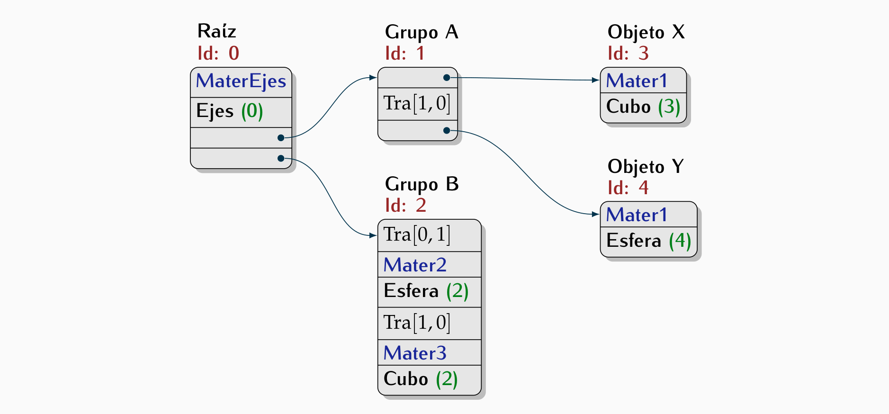
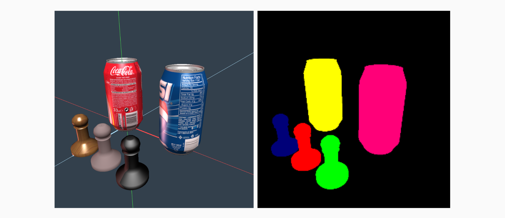
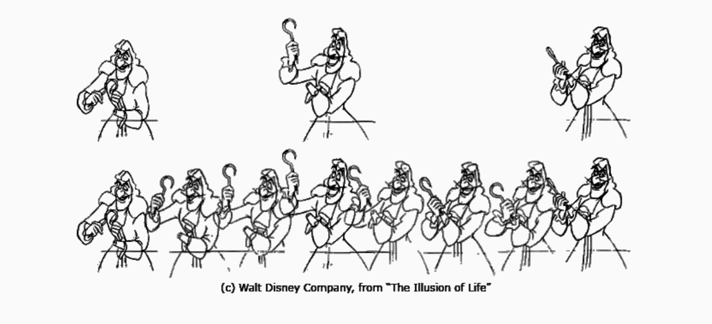
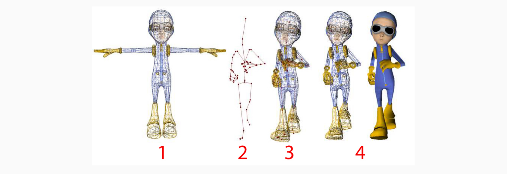

> Autor: Miguel Ángel Moreno Castro
>
> Source: Carlos Ureña Almagro

# 1. Introducción

### Sistemas Gráficos Interactivos

Un **Sistema Gráfico Interactivo (SGI)** es un sistema software cuya respuesta a cada acción del usuario ocurre (por lo general) en un tiempo corto (del orden de décimas de segundo) desde dicha acción del usuario y se presenta al usuario en forma de visualización gráfica 2D o 3D.

Un sistema SGI, por lo general, mantiene en memoria una estructura de datos (un modelo) y ejecuta un ciclo infinito, en cada iteración:
1. Espera o detecta una acción del usuario.
2. Obtiene los datos que caracterizan dicha acción.
3. Modifica el estado del modelo según dichos datos.
4. Visualiza una nueva imagen obtenida a partir del nuevo estado del modelo.

> La incoporación de interactividad permite realizar aplicaciones que respondan ágilmente a las acciones de los usuarios y les ofrezcan retroalimentación sobre el efecto de dichas acciones.

### Sistemas interactivos y de tiempo real

Los sistemas gráficos interactivos no siempre son sistemas de tiempo real:

- En un sistema interactivo se requiere que el retardo (latencia) entre la acción del usuario y la respuesta del sistema sea suficientemente pequeño como para que el usuario perciba una relacción de causa-efecto.No obstante, eventualmente la respuesta puede demorarse algo más.
- En un sistema de tiempo real la latencia debe ser menor o igual que el tiempo máximo de respuesta prefijado en las especificaciones del sistema. Un retraso superior a ese límite se considera un fallo del sistema.

### Realimentación: utilidad

La realimentación es el mecanismo mediante el cual el sistema da información al usuario útil para permitir al usuario conocer más fácilmente el estado interno del sistema y/o ayudar a decidir la siguiente acción a realizar.

La información de realimentación que el sistema genera en cada momento depende lógicamente del estado del sistema y de la información previamente entrada por el usuario.

### Dispositivos lógicos de entrada

Un dispositivos lógico de entrada es una componente software que usa uno o varios dispositivos físicos de entrada para producir información de más alto nivel o más elaborada, obtenida a partir de los datos recibidos directamente de los dispositivos físicos (o indirectamente de otros dispositivos lógicos). Ejemplos:

- **Puntero del ratón**: Permite entrar puntos en pantalla a partir de los desplazamientos físicos del ratón y del estado de sus botones.
- **Selector de componentes** (_Picker_): Permite seleccionar un componente de un modelo 3D usando el puntero de ratón.
- **Fotografía 3D**: Permite entrar imágenes con información de profundidad, a partir de pares de imágenes obtenidas con dos cámaras de fotografía convencionales.

### Lectura de datos dispositivos de entrada: modos de entrada

Un modo de entrada es un método que usa una aplicación para decidir cuando debe consultar los datos relacionados con el estado (y los cambios de estado) de un dispositivo físico o lógico. Distintos tipos de dispositivos pueden tener asociados distintos modos de funcionamiento, pudiendo alguno usar más de un modo de funcionamiento.

Veremos los tres modos básicos más frecuentes:
- **Modo de muestreo**: La aplicación consulta del estado actual en instantes arbitrarios.
- **Modo de petición**: La aplicación espera hasta que se produzca un cambio de estado.
- **Modo de cola de eventos**: La aplicación recibe una lista de cambios de estado no procesados aún.

### Estado y eventos de un dispositivo

Los cambios de estado que ocurren en un dispositivo de entrada (físico o lógico) se denominan **sucesos** o **eventos**.
- El **estado** de un dispositivo en un instante es el conjunto de valores de las variables gestionadas por el driver del dispositivo, y que representan en memoria su estado físico. 
- Un **evento** tiene asociados ciertos datos:
	- Instante de tiempo en el que el cambio ha ocurrido o se ha registrado
	- Información sobre el estado inmediatamente después del evento, y sobre como ha cambiado el estado respecto al anterior al evento.

### Modo de muestreo

El software del dispositivo mantiene en memoria variables que representan el estado actual del dispositivo, ya que la aplicación puede consultar dichas variables en cualquier momento, sin espera alguna.

Este modo tiene ciertas ventajas y/o desventajas:
- Es muy eficiente en tiempo y memoria, y simple.
- Requiere a la aplicación emplear tiempo de CPU en muestrear a una frecuencia suficiente como para no perderse posibles cambios de estado relevantes.
- No hay información de cuando ocurrió el último cambio de estado.
### Modo de petición

La aplicación hace una petición y espera a que se produzca determinado tipo de evento. Cuando se produce, la aplicación recibe datos del evento.

Este modo tiene ciertas ventajas y/o desventajas:
- Nunca se perderá el siguiente evento tras hacer una petición.
- Puede perderse un evento si no se hace una petición antes de que ocurra.
- Se puede perder mucho tiempo esperando (no se puede hacer otras cosas).
### Modos cola de eventos

Cada vez que ocurre un evento, el software del dispositivo lo añade a una cola FIFO de eventos pendientes de procesar. La aplicación accede a la cola, extrae cada evento y lo procesa.

Este modo tiene ciertas ventajas
- No se pierde ningún evento.
- La aplicación no está obligada a consultar con cierta frecuencia, ni antes de cada evento.
- La aplicación no pierde tiempo en esperas si es necesario hacer otras cosas (ya que funciona en modo asíncrono).

# 2. Eventos en GLFW

### Modelo de eventos en GLFW

**GLFW** gestiona los dispositivos de entrada en modo cola de eventos:
- Para cada tipo de evento se puede registrar una función de la aplicación que procesará eventos de ese tipo (cada función se llama **callback** o **función gestora de eventos**, FGE).
- Las _callbacks_ se ejecutan al producirse un evento del tipo.
- Los eventos cuyo tipo no tiene callback asociado se ignoran.
- Los parámetros de un callback proporcionan información del evento.
- La aplición debe incluir explícitamente un bucle de gestión de eventos, en cada iteración se espera hasta que se han procesado todos y luego se visualiza un frame o cuadro de imagen, si es necesario (si ha cambiado el estado de la aplicación).

### Funciones para registrar _callbacks_

Para cada tipo de evento, GLFW contiene una función para registrar el callback asociado a dicho tipo. Las funciones de registro y los tipos de eventos asociados son:

- `glfwSetMouseButtonCallback`: Pulsar/levantar de botones del ratón.
- `glfwSetCursorPosCallback`: Movimiento del cursor del ratón.
- `glfwSetWindowSizeCallback`: Cambio de tamaño de la ventana.
- `glfwSetKeyCallback`: Pulsar/levantar una tecla física.
- `glfwSetCharCallback`: Pulsar una tecla (o una combinación de ellas) que produce un único carácter unicode.

### Eventos de botones del ratón

Son los eventos que ocurren cuando se pulsa o se levanta un botón del ratón. Para registrar el callback asociado, usamos esta llamada:

```c++
glfwSetMouseButtonCallback(ventana, FGE_PulsarLevantarBotonRaton)
```

El callback debe estar declarado así:

```c++
void FGE_PulsarLevantarBotonRaton(GLFWwindow* window, int button, int action, int mods);
```

Los parámetros permiten conocer información del evento:

- **button**: Botón afectado (`GLFW_MOUSE_BUTTON_LEFT`, `GLFW_MOUSE_BUTTON_MIDDLE`, `GLFW_MOUSE_BUTTON_RIGHT`)
- **action** : Estado posterior del botón afectado, indica si se ha pulsado o levantado (`GLFW_PRESS`, `GLFW_RELEASE`)
- **mod**: Estado de teclas de modificación en el momento de levantar o pulsar (_shift_, _control_, _alt_ y _super_).

### Ejemplo de callback de botón del ratón

```c++
// Se encarga de procesar una pulsación del botón izquierdo o derecho del ratón
void FGE_PulsarLevantarBotonRaton(GLFWwindow* window, int button, int action, int mods)
{
	// Si se ha pulsado un botón
	if (action == GLFW_PRESS)
	{
		double x, y;
		// Leemos la posición del ratón
		glfwGetCursorPos(window, &x, &y); 
		if (button == GLFW_MOUSE_BUTTON_LEFT)
			// Acción asociada a la pulsación del botón izquierdo
			RatonClickIzq(int(x), int(y));
		else if (button == GLFW_MOUSE_BUTTON_RIGHT)
		{
			// Registramos las coordenadas de pulsación del botón derecho
			xclick_der = int(x);
			yclick_der = int(y);
		}
	}
}
```

### Eventos de movimiento del cursor del ratón

Son los eventos que ocurren cada vez que se mueve el ratón. Se pueden registrar con esta llamada:

```c++
glfwSetCursorPosCallback(ventana, FGE_MovimientoRaton)
```

El callback debe estar declarado con tres parámetros enteros:

```c++
void FGE_MovimientoRaton(GLFWwindow* window, double xpos, double ypos)
```

Los parámetros permiten conocer información del evento:
- **xpos**, **ypos**: Posición del cursor en coordenadas de pantalla, en el momento del evento.
### Ejemplo de callback de movimiento activo del ratón

```c++
// Registra el desplazamiento cada vez que se mueve el ratón estando pulsado el botón derecho
void FGE_MovimientoRaton(GLFWwindow* window, double xpos, double ypos)
{
	if (glfwGetMouseButton( window, GLFW_MOUSE_BUTTON_RIGHT ) == GLFW_PRESS)
	{
		// Calcular desplazamiento desde click
		const int dx = int(xpos) - xclick_der; 
		const int dy = int(ypos) - yclick_der;
		// Función asociada
		RatonArrastradoDer(dx, dy);
	}
}
```

### Eventos de scroll

Este callback sirve para detectar movimientos de la rueda del ratón o de otros mecanismos de scroll (por ejemplo, gestos en un touchpad). Se pueden detectar movimientos tanto verticales como horizontales, en función del dispositivo usado.

```c++
glfwSetScrollCallback(ventana, FGE_Scroll);
```

El callback debe estar declarado con estos parámetros

```c++
void FGE_Scroll(GLFWwindow* window, double xoffset, double yoffset)
```

A modo de ejemplo, si queremos detectar únicamente scroll vertical

```c++
void FGE_Scroll(GLFWwindow* window, double xoffset, double yoffset)
{
	// Si ha habido poco movimiento vertical ignoramos el evento
	if (fabs(yoffset) < 0.05)
		return;
	const int direccion = 0.0 < yoffset ? +1 : -1 ;
	// Función que asociada al scroll
	ScrollVertical(direccion);
}
```

### Bucle de gestión de eventos

Se encarga de procesar eventos y visualizar:

```c++
terminar = false;
redibujar = true;

// Mientras no sea necesario terminar
while (!terminar)
{
	// Visualizar la ventana si es necesario redibujar
	if (redibujar)
	{
		VisualizarEscena();
		redibujar = false;
	}
	// Esperar y procesar eventos
	glfwWaitEvents();
	terminar = terminar || glfwWindowShouldClose(glfw_window);
}
```

- `glfwWaitEvents`: Procesa todos los eventos pendientes, o bien, si no hay ninguno, espera bloqueada hasta que haya al menos un evento pendiente y entonces procesarlo (llama a los callbacks que haya registrados).
- `glfwWindowShouldClose`: Devuelve `true` solo si el usuario ha realizado alguna acción de cierre de ventana en el gestor de ventanas.

### Bucle de gestión de eventos con animaciones

Para animaciones, se ejecuta una función de actualización de estado cuando no hay eventos pendientes de procesar:

```c++
terminar = false;
redibujar = true;

// Mientras no sea necesario terminar
while (!terminar) // hasta que no sea necesario terminar...
{
	// Visualizar la ventana si es necesario redibujar
	if (redibujar)
	{
		VisualizarEscena();
		redibujar = false;
	}
	// Procesar eventos pendientes (sin esperar)
	glfwPollEvents();
	// Actualizamos el estado del modelo al siguiente estado de la animación
	// si no terminamos ni redibujamos
	if (!terminar && !redibujar)
		ActualizarEscena();
	terminar = terminar || glfwWindowShouldClose(glfw_window);
}
```

- `glfwPollEvents`: Si hay eventos pendientes, los procesa todos, en otro caso no hace nada.

### Bucle de gestión de eventos genérico

En realidad las animaciones pueden activarse o desactivarse:

```c++
terminar = false;
redibujar = true;
animacion = false;
while (!terminar)
{
	if (redibujar)
	{
		VisualizarEscena();
		redibujar = false;
	}
	// Si la animación está activada
	if (animacion)
	{
		// Procesar eventos pendientes (sin esperar)
		glfwPollEvents();
		if (!terminar && !redibujar)
			ActualizarEscena();
	}
	else
	{
		// Si las animaciones está desactivadas esperamos a 
		// que se produzcan eventos y procesarlos
		glfwWaitEvents();
	}
	terminar = terminar || glfwWindowShouldClose(ventana_glfw);
}
```

# 3. Posicionamiento

El posicionamiento es la operación que permite al usuario seleccionar fácilmente un punto en el espacio de coordenadas del mundo de una aplicación 2D o 3D.

Esto se lleva a cabo usando un dispositivo lógico (cursor) que permite seleccionar pixels en pantalla. El usuario opera mejorando iterativamente su selección hasta que la juzga correcta. La realimentación es esencial.
### Posicionamiento: pasos de la aplicación

El proceso en el software de tratamiento se realiza en una estructura cíclica, que se corresponde con el ciclo de búsqueda que realiza el usuario. En este proceso podemos distinguir tres etapas:

- **Inicialización**: Incialización de estado.
- **Ciclo de seguimiento**: Hasta que el usuario no indica que está satisfecho, se ejecuta un bucle en el cual se procesan los eventos de entrada y se actualiza la información visual de realimentación y la posición seleccionada.
- **Postproceso**: Se transforma la posición final.



### Modos de introducción de coordenadas

En visualización 2D de modelos planos (con una matriz de proyección ortogonal $O$ y una matriz de dispositivo $D$), usamos:
- **Transformación lineal**: Se usa la matriz $D^{-1}$ para pasar de $DC$ a $NDC$, y luego $O^{-1}$ para pasar de $NDC$ a $WC$ (la matriz usada es $M = O^{-1} D^{−1}$).

En visualización de modelos 3D en pantalla, hay varias estrategias
- **Restricción a un plano**: El punto seleccionado se obtiene proyectando un punto 2D (obtenido con un cursor convencional 2D) sobre un plano 3D.
- **Cursor virtual 3D**: Se manipulan las tres coordenadas en una vista ortográfica.
- **Tres cursores 2D ligados**: Se usan tres vistas ortográficas perpendiculares.

### Posicionamiento 2D: Transformación lineal

Usamos una transformación lineal para convertir desde $(x_d, y_d)_{DC}$  hacia $(x_w, y_w)_{WC}$ 

> Las coordenadas DC son enteras, proporcionadas por el gestor de ventanas:

$$
x_w = l + (r − l)\left(\frac{x_d + 1/2}{n_x}\right) \hspace{1cm} y_w = t − (t − b)\left(\frac{y_d + 1/2}{n_y}\right)
$$
- $l$, $r$ son los límites del view-frustum 2D en $X$.
- $b$, $t$ son los límites del view-frustum 2D en $Y$.
- $n_x$, $n_y$ son el ancho y el alto (en pixels) del viewport.

### Posicionamiento 3D: Restricción a un plano

Si se restringe la posición a un plano que no sea perpendicular al de proyección se puede obtener una posición 3D por intersección de la recta que pasa por el punto introducido (en el plano de proyección y el centro de proyección con el plano.



# 4. Control de cámaras

Un **modo de cámara** es una forma de modificar interactivamente (con retroalimentación) los parámetros de la transformación de vista. Hay varios:

- **Modo orbital (o examinar)**: Útil para visualización de objetos, la cámara mantiene como punto de atención el origen de un objeto, y rota alrededor del mismo.
- **Modo primera persona**: Útil para exploración de escenarios, manipulamos la la cámara cambiando su
	- **Posición**: Se desplaza la posición del observador en el sentido de los ejes de la cámara.
	- **Orientación**: Se rotan los ejes de la cámara entorno a la posición del observador (que no cambia). 

> Esto da lugar a tres modos distintos de control de cámara.

### Cámara en modo orbital o examinar

En este modo el usuario puede manipular la cámara virtual, pero siempre se mantiene el punto de atención proyectado en el centro de la imagen:



## 4.1 Modelo y operación de cámaras

Suponemos que el marco de coordenadas de la vista $\mathcal{V}$ tiene como componentes 
$$[\vec{x}_{ec} , \vec{y}_{ec} , \vec{z}_{ec} , \dot{o}_{ec} ]$$
las cuales están representadas en memoria por sus coordenadas homogéneas en el marco de coordenadas del mundo $\mathcal{W}$:
$$
\begin{align*}
x_{ec} =(a_x , a_y , a_z , 0)^t & \hspace{1cm} y_{ec} = (b_x, b_y, b_z, 0 )^t \\
z_{ec} = (c_x, c_y, c_z, 0)^t & \hspace{1cm} o_{ec} = (o_x , o_y , o_z , 1)^t
\end{align*}
$$

La matriz de vista $V$ es la composición de una matriz de traslación por $(−o_x , −o_y , −o_z)$ seguida de una matriz cuyas filas son las coordenadas de los ejes de $\mathcal{V}$, es decir:
$$
V = 
\begin{pmatrix} 
a_x & a_y & a_z & 0 \\
b_x & b_y & b_z & 0 \\
c_x & c_y & c_z & 0 \\
0 & 0 & 0 & 1
\end{pmatrix} 
\cdot 
\begin{pmatrix}
1 & 0 & 0 & -o_x \\
0 & 1 & 0 & -o_y \\
0 & 0 & 1 & -o_z \\
0 & 0 & 0 & 1
\end{pmatrix}
$$

### Parámetros de cámara: origen y punto de atención

Podemos determinar una cámara usando el punto de atención y el vector al origen
- **Punto de atención** ($\dot{a}_t$) : Es un punto del espacio que se va a proyectar en el centro de la imagen (está en el la rama regativa del eje $Z$ de la cámara).
- **Vector al origen** ($\vec{n}$): Es el vector que va desde el punto de atención hasta el origen del marco de coordenadas de la camara, es decir, $\vec{n} = \dot{o}_{ec} − \dot{a}_t$.

Podemos expresar el marco de cámara en función de $\vec{n}$ y $\dot{a}_t$ :
$$
\begin{align*}
\vec{z}_{ec} = \frac{\vec{n}}{\|\vec{n}\|} \hspace{1cm} & \vec{y}_{ec} = \vec{z}_{ec} \times \vec{x}_x \\
\vec{x}_{ec} = \frac{\vec{y}_w \times \vec{x}_{ec}}{\|\vec{y}_w \times \vec{z}_{ec}} \hspace{1cm} & \dot{o}_{ec} = \dot{a}_t + \vec{n}
\end{align*}
$$

> $\vec{z}_{ec}$ es paralelo a $\vec{n}$, y el vector VUP siempre es $\vec{y}_w$ 

### Modelo de cámaras. Coordenadas esféricas

Para representar una cámara podemos usar las tuplas $a_t$ , $s$ y $n$:

- **Coordenadas del punto de atención** ($a_t$), en WC.
- **Coordenadas esféricas y cartesianas del vector al origen**: Las cordenadas esféricas forman una tupla $s = (\alpha, \beta, r)$, y las coordenadas cartesianas son una terna $n = (n_x , n_y , n_z)$, ambas en WC.

Se usa una representación redundante por comodidad. Se cumple:
$$
\begin{align*}
n_x & = r(\sin \alpha)(\cos \beta) \hspace{1cm} & \alpha & = atan2(n_x, n_z) \\
n_y & = r(\sin \beta) \hspace{1cm} & \beta & = atan2(n_y, r_h) \\
n_z & = r(\cos \alpha)(\cos\beta) \hspace{1cm} & r & = \|n\|
\end{align*}
$$

donde $r_h = \sqrt{n^2_x + n^2_z}$ y $atan2(a, b)$ es como $arctan(a/b)$ pero teniendo en cuenta los signos y con valores en $(−\pi, \pi]$.
### Elementos del modelo de cámara

En esta figura se observan el marco de la cámara $\mathcal{V}$ con origen en $\dot{o}_{ec} = \dot{a}_t + \vec{n}$, junto con el marco del mundo $\mathcal{W}$ (trasladado a $\dot{a}_t$):



### Cámaras interactivas de 3 modos

En general podemos hacer tres operaciones de modificación interactiva de una cámara:
- **Izquierda/Derecha**: Rotaciones en torno a $\vec{y}_w$ o traslaciones paralelas a $\vec{x}_{ec}$
- **Arriba/Abajo**: Rotaciones en torno a $\vec{x}_{ec}$ o traslaciones paralelas a $y_{ec}$
- **Adelante/Detrás**: Traslaciones paralelas a $\vec{n}$.

Cada vez que se modifica el estado de una cámara:
5. Se actualizan las tuplas $a_t$ , $n$ y $s$
6. Se recalcula el marco de cámara (tuplas $o_{ec}$ , $x_{ec}$ , $y_{ec}$ y $z_{ec}$).

A las cámaras que se pueden actualizar así las llamamos cámaras interactivas.

```c++
class Camara
{
public:
	// Fija las matrices model-view y projection en el cauce
	void activar(Cauce & cauce);
	// Cambio el valor de ’ratio_vp’ (alto/ancho del viewport)
	void fijarRatioViewport(const float nuevo_ratio);
	// Lee la descripción de la cámara (y probablemente su estado)
	virtual std::string descripcion() ;
protected:
	bool matrices_actualizadas = false;
	// Matriz de vista
	glm::mat4 matriz_vista = glm::mat4(1.0f);
	// Matriz de proyección
	glm::mat4 matriz_proye = glm::mat4(1.0f);
	// Ratio viewport (alto/ancho)
	float ratio_vp = 1.0 ;
	// Actualiza matriz_vista y matriz_proye a partir de los parámetros 
	// específicos de cada tipo de cámara
	virtual void actualizarMatrices();
} ;
```

La clase `CamaraInteractiva` es una clase derivada de `Camara` que puede ser manipulada con estas operaciones:

```c++
class CamaraInteractiva : public Camara
{
public:
	// Operación izq/der (da) y arriba/abajo (db)
	virtual void desplRotarXY(const float da, const float db) = 0;
	// Operación acercar/alejar (dz)
	virtual void moverZ(const float dz) = 0 ;
	// Cambiar punto de atención manteniendo origen de cámara
	virtual void mirarHacia(const glm::vec3 & paten);
	// Cambiar el modo de la camara al siguiente modo o al primero
	virtual void siguienteModo();
};
```

Esta clase define un interfaz pero no se puede instanciar. Se definen clases derivadas de ella. Usaremos `CamaraOrbitalSimple` y `Camara3Modos`.

## 4.2 Modos de cámara. La cámara de 3 modos

La clase `Camara3Modos` implementa los tres modos:

```c++
class Camara3Modos : public CamaraInteractiva
{
public:
	// Cámara perspectiva por defecto
	Camara3Modos();
	// Cámara con parámetros iniciales específicos
	Camara3Modos( . . . );
	virtual void desplRotarXY(const float da, const float db);
	virtual void moverZ(const float dz);
	virtual void mirarHacia(const glm::vec3 & nuevo_punto_aten);
	virtual void siguienteModo();
	// Devuelve el punto de atención actual
	virtual glm::vec3 puntoAtencion();
private:
	// Actualiza las matrices V y P
	virtual void actualizarMatrices();
	// Actualiza ejes del MCV
	void actualizarEjesMCV();
	// Modo actual
	ModoCam modo_actual = ModoCam::examinar;
	// Punto de atención
	Tupla3f punto_atencion = {0.0, 0.0, 0.0};
	// Vector de origen (esféricas)
	Tupla3f org_polares = {0.0, 0.0, d_ini};
	// Vector de origen (cartesianas)
	Tupla3f org_cartesianas = {0.0, 0.0, d_ini};
	// Ejes del MCV
	Tupla3f eje[3] = {{1,0,0}, {0,1,0}, {0,1,0}};
};
```

> Aquí `d_ini` es el radio inicial (en las prácticas es 3 unidades).

### Cámara en primera persona con traslaciones

En el modo de primera persona con traslaciones, la actualización de la cámara supone simplemente trasladar el origen del marco de cámara oec y el punto de atención at de forma solidaria:
- La operación `desplRotarXY(∆a , ∆b)` supone:
	1. $a_t = a_t + \Delta_x x_{ec} + \Delta_y y_{ec}$
	2. $o_{ec} = a_t + n$
- La operación `moverZ(∆z)` supone:
	1. $a_t = a_t + \Delta_z z_{ec}$
	2. $o_{ec} = a_t + n$

> Las tuplas $s$, $n$, $x_{ec}$, $y_{ec}$, $z_{ec}$ no cambian.

### Cámara en primera persona con rotaciones

En este caso se usan rotaciones entorno al origen de la cámara $o_{ec}$. Dichas rotaciones se implementan modificando los ángulos $\alpha$ y $\beta$ que hay en $s$. El movimiento en $Z$ es similar al anterior

- La operación `desplRotarXY(∆a, ∆b)` supone:
	1. $s = s + (\Delta_a, \Delta_b , 0)$ (incrementa o decrementa $\alpha$ y $\beta$)
	2. $n' = Cartesianas(s)$ (es el nuevo valor de $n$).
	3. $a_t = a_t − (n' − n)$ (traslación del punto de atención a nueva posición)
	4. $n = n'$
	5. Actualizar $x_{ec}$, $y_{ec}$ y $z_{ec}$ (el origen $o_{ec}$ no cambia)
- La operación `moverZ(∆z)` supone:
	1. $a_t = a_t + \Delta_z z_{ec}$
	2. $o_{ec} = a_t + n$ (los vectores $x_{ec}$, $y_{ec}$ y $z_{ec}$ no cambian)

> Este modo es típico en videojuegos FPS (First Person Shooter), normalmente sin movimientos de rotación en vertical ($\Delta_b = 0$)

### Cámara en modo orbital o examinar

En este caso se usan rotaciones entorno al punto de atención $a_t$. El movimiento en $Z$ nos acerca o aleja a dicho punto (cambia el valor de $r$ que hay en $s$):

- La operación `desplRotarXY(∆a, ∆b)` supone:
	1. $s = s + (\Delta_a , \Delta_b , 0)$ (incrementa o decrementa $\alpha$ y $\beta$)
	2. $n = Cartesianas(s)$ (es el nuevo valor de $n$).
	3. $o_{ec} = a_t + n$, actualizar $x_{ec}$, $y_{ec}$, $z_{ec}$
- La operación `moverZ(∆z)` supone:
	1. $r = r_{min} + (r − r_{min})(1 + e)^{\Delta_z}$
	2. $n = Cartesianas(s)$
	3. $o_{ec} = a_t + n$ (los vectores $x_{ec}$, $y_{ec}$ y $z_{ec}$ no cambian)

El radio nunca es inferior a $r_{min} > 0$. Para $\Delta_z \geq 1$ aleja, y para $\Delta_z \leq −1$ acerca ($\Delta_z$ nunca debe estar en $(−1, 1)$).

### Apuntar la cámara hacia un punto

Esta operación supone hacer que el punto de atención se fije a unas coordenadas de mundo $c$ dadas, sin modificar el origen de cámara.

- La operación `mirarHacia(c)` supone:
7. $n = n + a_t − c$
8. $s = Esfericas(n)$
9. $a_t = c$
10. Actualizar $x_{ec}$, $y_{ec}$ y $z_{ec}$ (el origen $o_{ec}$ no cambia)

Esta operación permite seleccionar un objeto y que pase a ocupar el centro de la imagen (fijando el punto de atención a un punto central de dicho objeto).

# 5. Selección

## 5.1 Introducción. Métodos de selección

La selección permite al usuario identificar componentes u objetos de la escena:
- Se necesita para identificar el objeto sobre el que actuan las operaciones de edición.
- Suele realizarse como posicionamiento seguido de búsqueda.



### Identificadores de objetos

Para poder realizar la selección los componentes de la escena deben tener asociados identificadores numéricos, a distintos niveles:

- **Triángulos**: Cada triángulo o cara tiene asociado un entero, permite seleccionarlos para operaciones de edición de bajo nivel en las mallas.
- **Mallas**: Cada malla de la escena puede tener un identificador único.
- **Grupos de objetos**: Los grupos de mallas (o, en general, grupos de objetos arbitrarios), pueden tener asociados identificadores, permiten operar con partes complejas de la escena.

Para ediciones de alto nivel en objetos o partes de la escena, lo más simple es asignar identificadores enteros a los nodos del grafo de escena.

### Grafo de escena con identificadores

Todos los objetos (instancias de `Objeto3D`) tienen asociado un valor entero: $−1$ significa que heredan el identificador del padre, $0$ que no es seleccionable, $> 0$ que es seleccionable con ese identificador.



### Prodedimiento y métodos de selección

Para hacer la selección se pueden dar estos pasos:
1. El usuario selecciona un pixel en pantalla .
2. Se buscan los identificadores de los elementos (triángulos, mallas u objetos) que se proyectan en el centro de dicho pixel (o de pixels cercanos).

La búsqueda se puede hacer de varias formas:
- **Ray-casting**: Calculando intersecciones de un rayo (semirecta con origen en $o_c$ y pasando por el centro del pixel) con los objetos de la escena.
- **Clipping**: Calculando que objetos están parcial o totalmente dentro de un view-frustum pequeño centrado en el pixel.
- **Rasterización**: Visualizar la escena por rasterización usando identificadores en el lugar de los colores. Permite obtener el color (un identificador de objeto) del pixel en cuestión.

### Selección por rasterización en OpenGL

En OpenGL podemos usar visualización por rasterización, de dos formas:
- **Modo selección de OpenGL**: Se usa funcionalidad de OpenGL, específica para este fin, esta funcionalidad es declarada obsoleta desde OpenGL 3.0 y eliminada desde OpenGL 3.1.
- **Frame-buffer no visible**: Se usa algún frame buffer object, que es una zona de memoria de la GPU que contiene una imagen sobre la que se puede visualizar.

### Modo de selección de OpenGL

Se usa una funcionalidad de OpenGL, específica para este fin, requiere:
- Visualizar con el modo de selección activado, OpenGL usa identificadores en lugar de colores (tomados de la pila de nombres).
- Los identificadores visualizados se registran en un buffer de selección (en memoria) específicamente destinado a contenerlos.

> En nuestro caso, no usaremos esta funcionalidad, al no estar disponible en OpenGL 3.3.
### Selección con un _frame-buffer_ invisible

Se usa algún **frame buffer object** (array de colores de pixels en la memoria de la GPU) , hay dos opciones:

- Usar uno de los dos framebuffers que se suelen existir en OpenGL para la técnica de double buffering.
- Usar un framebuffer object específicamente creado para esto. No depende de la existencia de double buffering y del acceso a sus buffers.

Nosotros usamos la segunda opción. Se debe:
- Crear y activar un Frame Buffer Objects (FBOs) del tamaño y características que queramos.
- Visualizar la escena sobre el FBO usando identificadores en lugar de colores.
- Leer identificador de objeto en el pixel.

## 5.2 Selección con _frame-buffer object_ invisible

Si no se quiere usar funcionalidad obsoleta, se puede utilizar directamente visualización sobre un frame-buffer distinto del que se está viendo en pantalla. Se puede hacer de dos forma:

- Creando un objeto OpenGL de tipo frame-buffer object (FBO), y haciendo rasterización con ese objeto como imagen de destino (rendering target).
- Usando el modo de **doble buffer**: En este modo siempre existen dos FBOs creados por OpenGL, un buffer trasero (**back buffer**), que es donde se visualizan las primitivas, y un buffer delantero (**front buffer**), que es el que se visualiza en pantalla.

> Usaremos la primera opción al no depender de la existencia de doble buffer.

### Visualización identificadores

La visualización sobre el frame-buffer no visible requiere:
- **Codificación de identificadores**: Se necesita codificar los identificadores como colores (R,G,B), y usar esos colores en lugar de los materiales de los objetos.
- **Cambio de colores**: Durante la visualización es necesario cambiar el color actual de OpenGL (antes de cada objeto), usando esos colores, con total precisión numérica.
- **Modo de visualización**: Es necesario desactivar iluminación y texturas, activar sombreado plano y visualizar con todas las primitivas (triángulos) rellenos.

Esto constituye un nuevo modo de visualización, lo llamaremos **modo de identificadores**.

### Codificación de identificadores en colores (RGB)

Debemos cambiar el color del cauce usando un identificador. Se usa la función `ColorDesdeIdent`:

- Los identificadores son enteros sin signo (tipo `unsigned` de C/C++, de 4 bytes), con valores entre $0$ y $2^{24} − 1$ (el byte más significativo es 0, se usan los tres menos significativos).
- Cada byte del identificador (entre $0$ y $255$) se convierte a un float (en $[0..1]$) que se usa para cambiar el color actual del cauce.

```c++
glm::vec4 ColorDesdeIdent(const int ident) // 0 ≤ ident < 224
{
	// Decodificar: extraer los tres bytes menos significativos del valor entero.
	const unsigned char byteR = (ident) % 0x100U, // Rojo = byte menos significativo
	const unsigned char byteG = (ident / 0x100U) % 0x100U, // Verde = byte intermedio
	const unsigned char byteB = (ident / 0x10000U) % 0x100U; // Azul = byte más significativo
	// Crear el color normalizando desde [0..255] hacia [0..1]
	return vec4(float(byteR)/255.0f, float(byteG)/255.0f, float(byteB)/255.0f, 1.0f);
}
```

### Lectura de identificadores desde el _frame-buffer_

Para leer los colores se puede usar la función `glReadPixels`, que lee los colores de un bloque de pixels en el framebuffer activo para escritura.
- Leeremos un bloque con un único pixel.
- Se leen tres valores `unsigned char` en orden R, G, B.
- Se reconstruye el identificador unsigned, conocidos los tres bytes.
Lo podemos hacer en esta función, que reconstruye el identificador:

```c++
unsigned LeerIdentEnPixel(int xpix, int ypix)
{
unsigned char bytes[3];
	// Lee los 3 bytes del frame-buffer
	glReadPixels(xpix, ypix, 1, 1, GL_RGB, GL_UNSIGNED_BYTE, (void *)bytes);
	// Reconstruir el identificador y devolverlo:
	return bytes[0] + ( 0x100U*bytes[1] ) + ( 0x10000U*bytes[2] ) ;
}
```

### _Frame-buffer objects_

OpenGL permite crear y gestionar FBOs alojados en la memoria de la GPU

- Cada FBO tiene asociado un identificador entero único, no negativo.
- El FBO incial (que se visualiza en la ventana de la aplicación) tiene asociado el identificador 0 y está creado al inicio
- Es posible crear un FBO, indicando su tamaño.
- Un FBO puede tener asociado:
	- Un array de colores de pixels (**color buffer**): Es una textura de OpenGL alojada en la GPU.
	- Un array de profundidades (**render buffer**): Contiene la profundidad del objeto proyectado en cada pixel (es el Z-buffer usado para EPO)

La clase `Framebuffer` encapsula un identificador de FBO, y su ancho y alto. Permite activarlo, redimensionarlo y consultar un pixel (`leerPixel`). Al activarlo, se rasteriza sobre este FBO.

```c++
class Framebuffer
{
public:
	// Crea un FBO con dicho tamaño
	Framebuffer(const int pancho, const int palto);
	// Activar, recreando el FBO si hay cambio de tamaño
	void activar( const int pancho, const int palto );
	// Desactivar (activa el 0)
	void desactivar();
	~Framebuffer();
private:
	void inicializar(const int pancho, const int palto);
	// Libera memoria en la GPU
	void destruir();
	// Identificador del framebuffer (0 si no creado)
	GLuint fboId = 0;
	// Identificador de la textura de color
	GLuint textId = 0;
	// Identificador del z-buffer
	GLuint rbId = 0;
	// Ancho del framebuffer, en pixels
	int ancho = 0;
	// Alto del framebuffer, en pixels
	int alto = 0;
};
```


### Escena y FBO con identificadores

Se visualiza una escena en modo normal (izquierda) y en modo selección (derecha), con la misma cámara. Se han seleccionado los identificadores para que se correspondan con colores RGB distinguibles. Los ejes no son seleccionables.


# 6. Animación

Generar animaciones implica:
- Regenerar la imagen periodicamente (al menos 30 veces por segundo)
- Modificar la pose de los objetos de la escena

### Keyframe

El animador define dos configuraciones del modelo. El sistema calcula los fotogramas intermedios (in-betweens) por
interpolación.



### Simulación física

Para escenas con modelos físicos simples se puede calcular la configuración del escenario en cada fotograma usando las leyes de la mecánica clásica. Existen librerías específicas para realizar esta simulación:
- ODE: Open Dynamic Engine.
- Newton: Newton Physics Engine
- Bullet: Physics Library

### Esqueletos

Para conseguir que la animación de personajes resulte plausible se suelen usar esqueletos. Un esqueleto es un modelo simplificado del personaje, formado por segmentos rígidos unidos por articulaciones.



### Animación procedural

El comportamiento del objeto se describe mediante un procedimiento. Es útil cuando el comportamiento es fácil de generar pero dificil de simular físicamenete (p.e. la rotura de un vidrio).

