> Autor: Miguel Ángel Moreno Castro
>
> Fuente: Carlos Ureña Almagro

## 1. Técnicas Realistas en Rasterización

## 1.1 Mipmaps

En muchos casos la resolución a la que se ve la textura no coincide con la de la imagen sintetizada:
- Si la resolución es menor (objeto lejano), en un pixel se proyectan muchos texels.
- Si la resolución es mayor, un texel se proyecta en muchos pixels.

En ambos casos el efecto es una pérdida de realismo. El primer problema se puede solucionar usando anti-aliasing, o de forma mucho más eficiente usando la técnica de mipmaps.

Un **mipmap** (_multum in parvo maps_, _much in little_) es un serie de $n + 1$ texturas (_bitmaps_) obtenida a partir de una imagen o textura de $2^n \times 2^n$ texels.

- La primera imagen ($M_0$) coincide con la original
- La $i$-ésima imagen ($M_i$) tiene como resolución $2^{n−i} \times 2^{n−i}$ texels.
- Cada texel de la imagen $i + 1$ ($M_{i+1}$) se obtiene a partir de cuatro texels de la imagen número $i$, promediándolos:
$$M_{i+1}[j, k] = \frac{1}{4}(M_i [2j, 2k] + M_i [2j + 1, 2k] + M_i [2j, 2k + 1] + M_i [2j + 1, 2k + 1])$$
### Acceso a los mipmaps

Durante el sombreado, en cada punto $p$ a sombrear es necesario saber que versión de la trextura debemos de leer:
- Se usará la textura $M_i$, donde $i$ crece linealmente con el logaritmo de la distancia $d$ entre $p$ y el observador (menos resolución a mayor distancia).

> Esta solución puede presentar cambios bruscos de la resolución al pasar bruscamente de una resolución a otra en pixels cercanos. La solución consiste en interpolar entre las dos texturas más apropiadas en función de $\log(d)$

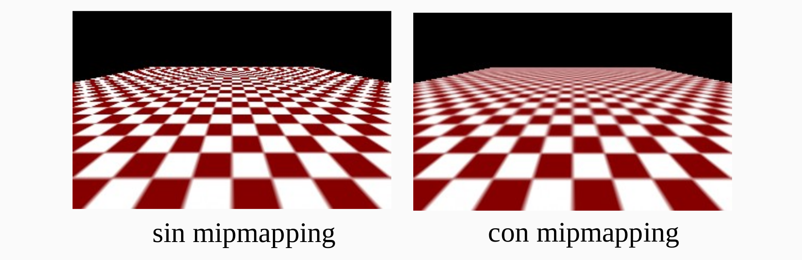

En la parte más cercana se usa en ambos casos la textura original. Con mipmaps, a distancias mayores se usan sucesivamente texturas de menos resolución.
## 1.2 Perturbación de la normal

Algunos tipos de superficies presentan cambios de orientación a pequeña escala (rugosidades). Esto se puede reproducir con mallas de polígonos con muchos polígonos pequeños, o con polígonos de detalle de diferente orientación. En cualquier caso, la complejidad en tiempo y espacio del proceso de rendering es muy alta.

Una solución consiste en usar una textura para modificar a pequeña escala el vector normal que se usa en el MIL, a esto se le llama mapas de perturbación de la normal (**bump-maps**).

Es necesario usar una función real $f_h$ , tal que para cada par de coordenadas de textura $(u, v)$, el valor real $f_h(u, v)$ se interpreta como la altura de la superficie rugosa respecto del plano del polígono en el punto de coordenadas de textura $(u, v)$

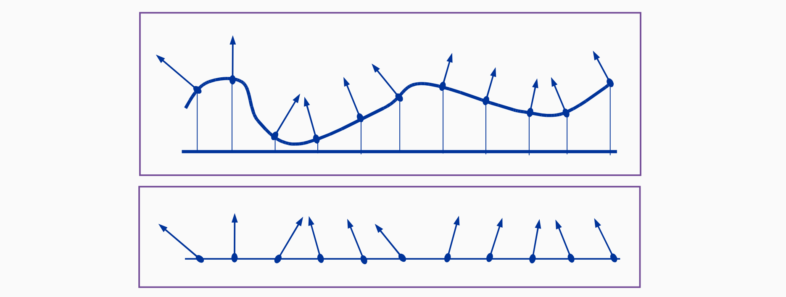

Para evaluar $f_h(u, v)$ dados $u$ y $v$ se pueden usar dos opciones:

- $f_h$ puede representarse como una función con una expresión analítica conocida y evaluable con algún algoritmo que tiene a $u$ y $v$ como datos de entrada (se llaman **texturas procedurales**).
- La opción más usual es que $f_h$ este codificada como una textura cuyos texels son valores escalares (tonos de gris) que codifican la altura. Para evaluar $f_h(u, v)$ se usa el mismo método visto para acceso a texturas en la sección anterior (se usan los texels más cercanos a $(u, v)$ en el espacio de coordenadas de textura).

El procedimiento de perturbación de la normal usa como parámetros las derivadas parciales de $f_h$ ($d_u$ y $d_v$):
$$d_u = \frac{\partial f_t(u, v)}{\partial u} \hspace{1cm} d_v \frac{\partial f_t(u, v)}{\partial v}$$

- Si $f_h$ está definido por una función analítica conocida y derivable, estas derivadas se pueden conocer evaluando las expresiones de las derivadas parciales de $f_h$.
- Si $f_h$ está codificada con una textura, se usan diferencias finitas.

### Aproximación de las derivadas por diferencias finitas

Cuando el campo de alturas $f_t$ se codifica con una textura de grises, los valores de $d_u$ y $d_v$ se deben aproximar por diferencias finitas:
$$
du = k \frac{f_h (u + \Delta, v) − f_h (u − \Delta, v)}{2\Delta} \hspace{1cm} dv = k \frac{f_h (u, v + \Delta) − f_h(u, v − \Delta)}{2\Delta}
$$
donde:
- $\Delta$ es usualmente del orden de $1/n_t$, con $n_t$ la resolución de la textura.
- $k$ es un valor real que sirve para atenuar o exagerar el relieve.

### La superficie como una función de las coordenadas de texturas

Los puntos de los polígonos que forman las superficies de los objetos pueden interpretarse como una función $f_p$ de las coordenadas de textura, es decir, si las coordenadas de textura de un punto $q$ son $(u, v)$, entonces:
$$q = f_p(u, v)$$
Para calcular la normal modificada es necesario conocer las derivadas parciales de $f_p$ (dos vectores $t_u$ y $t_v$)
$$t_u = \frac{\partial f_p(u, v)}{\partial u} \hspace{1cm} t_v = \frac{\partial f_p(u, v)}{\partial v}$$
> A los vectores $t_u$ y $t_v$ se les suele llamar **tangente** y **bitangente**. Ambos definen un plano tangente, perpendicular a la normal.

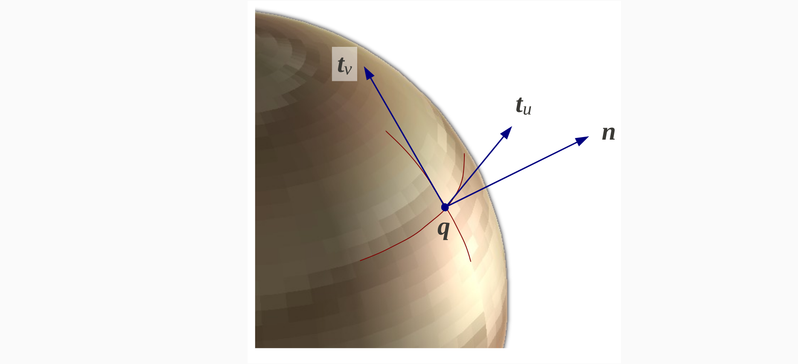

### Cálculo de los vectores tangentes modificados

Estos vectores son tangentes a la superficie del objeto, ya que la normal original $\vec{n}$ es colineal con $t_u \times t_v$. Existen varias alternativas para obtenerlos:

- Para objetos sencillos, los vectores tangentes son constantes o muy fáciles de calcular
- Para mallas de polígonos:
	- Se pueden calcular como constantes en cada polígono, a partir de las coordenadas de textura.
	- Se pueden asignar a los vértices (igual que las coordenadas de textura) y realizar una interpolación en el interior de los polígonos (igual que se interpola la normal).

Los vectores tangentes $t'_u$ y $t'_v$ a la superficie rugosa son:
$$t'_u = t_u + d_u \vec{n} \hspace{1cm} t'_v = t_v + d_v\vec{n}$$

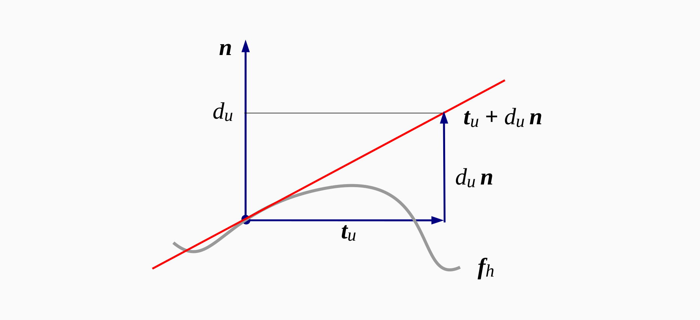

La normal modificada $\vec{n}'$ es perpendicular a estos dos vectores, por tanto se calcula usando su producto vectorial (y normalizando)
$$\vec{n}' = \frac{\vec{n}''}{\|\vec{n}''\|} \hspace{1cm} \text{ donde } \hspace{1cm} \vec{n}'' = t'_u \times t'_v$$

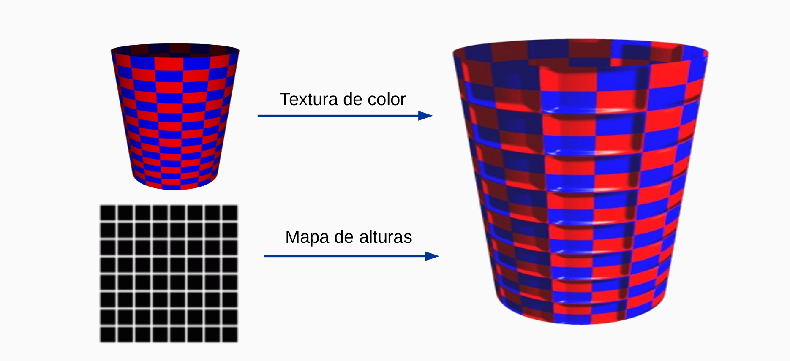

## 1.3 Sombras Arrojadas

Ninguna de las técnicas anteriores tiene en cuenta la existencia de sombras arrojadas. Se supone que todas las fuentes son visibles desde todos los puntos de la superficie, lo cual no siempre es cierto. 

Si asumimos que los polígonos son opacos, y las fuentes puntuales (o direccionales), para cada punto en una superficie y para cada fuente de luz, el punto y la fuente pueden ser mutuamente visibles o no. Cuando la fuente no ilumina el punto, el sumando del MIL correspondiente a la fuente no debe añadirse para obtener el color reflejado.

> La visibilidad de la fuente de luz (en $y$) está controlada por la función $V$:

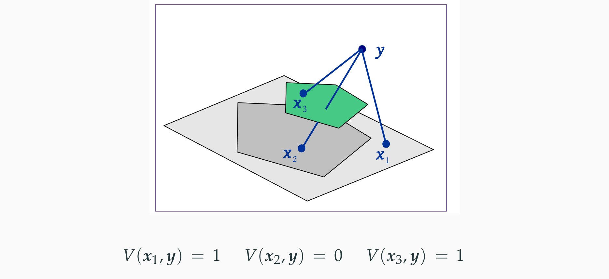

El problema de las sombras arrojadas es, por tanto, semejante al problema de la visibilidad:

- **Se pueden usar algoritmos con precisión de objetos**: Se producen en la salida los polígonos (parte de los originales) iluminados por (visibles desde) las fuentes de luz.
- **Se pueden usar algoritmos con precisión de imágen**: Se obtiene el primer punto visible en el centro de cada pixel de un plano de visión asociado a una fuente de luz.

> El papel del observador lo juega la fuente de luz. Puede ser posicional (observador a distancia finita) o direccional (observador a distancia infinita: proyección ortogonal).

### Algoritmo de fuerza bruta

Supondremos escenas formadas por poliedros opacos delimitados por caras planas o polígonos planos individuales.

- El algoritmo más sencillo consiste en proyectar todos los polígonos contra todos, usando la fuente de luz como foco.
- Para cada par de polígonos $P$ y $Q$ se calcula el polígono de sombra arrojada $S$ que proyecta $P$ sobre $Q$ (si hay alguna), y se recorta $S$ usando $Q$ como polígono de recorte.
- Los polígonos producidos se tratan como polígonos de detalle. Son polígonos superpuestos a los originales en los cuales la fuente de luz no es visible.

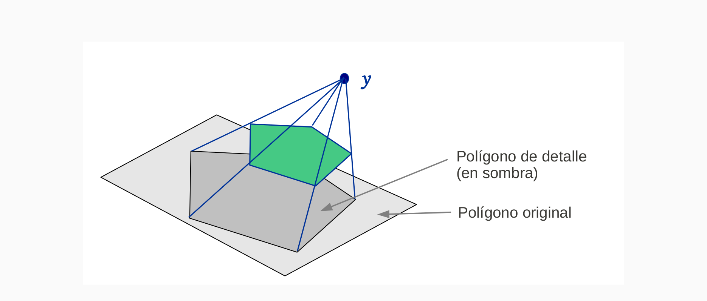

> Tiene complejidad cuadrática con el número de polígonos. Se puede usar solo para un único polígono receptor y unos pocos que arrojan sombras.

### Algoritmo de Weilter-Atherton-Greenberg

Otros algoritmos de sombras arrojadas (más eficientes) están basados en algoritmos de eliminación de partes ocultas ya existentes. Un ejemplo es el algoritmo de _Weiler-Atherton-Greenberg_ (1978) para sombras arrojadas:

- Se usa el algoritmo de Weiler-Atherton para eliminación de partes ocultas
- Se produce un modelo con polígonos iluminados asociados a los originales (son también polígonos de detalle).
- La complejidad en tiempo es mucho menor que cuadrática en el caso medio.

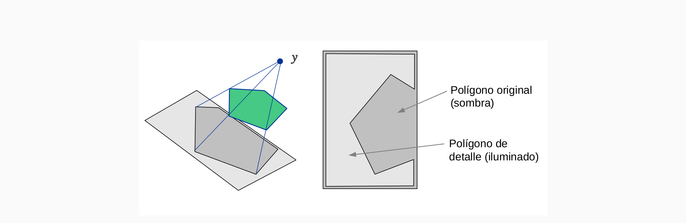

> En general, los algoritmos con precisión de objetos para sombras son muy complejos en tiempo para escenas complejas, aunque para algunas aplicaciones son los más idóneos (cuando se necesita un resultado en forma de dibujo vectorial).

### Z-buffer para sombras arrojadas

Otra posibilidad (mucho más eficiente) es usar Z-buffer para sombras arrojadas:

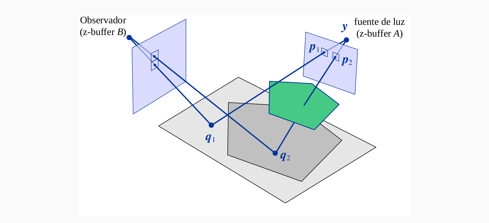

En la primera pasada se calcula el Z-buffer $A$ asociado a la fuente de luz (se proyectan los objetos contra la fuente)

La segunda pasada es semejante al Z-buffer normal, se calcula el Z-buffer $B$, para cada punto visible $q_i$ desde el observador en un pixel, se debe calcular el color con el que se ve $q_i$ , y por tanto es necesario comprobar si es visible desde la fuente, para ello:
- Se calcula $p_i$ (la proyección de $q_i$ en el plano de visión asociado a la fuente de luz)
- Se accede al pixel del Z-buffer $A$ correspondiente a $p_i$, que contiene una distancia $d$

> Si $d < \|q_i − y\|$, entonces $q_i$ no está iluminado (este es el caso de la figura), en otro caso $q_i$ sí está iluminado.

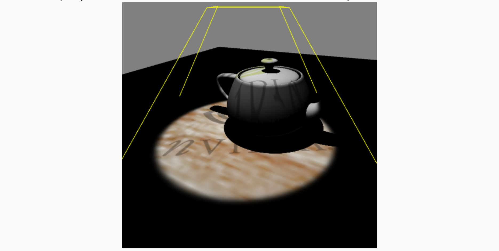
## 1.4 Superficies Transparentes. Refracción

Hay objetos sólidos o líquidos que permiten pasar (además de reflejar o absorber) algunos fotones de la luz que los alcanza. Su estructura atómica permite a los rayos de luz viajar en línea recta.

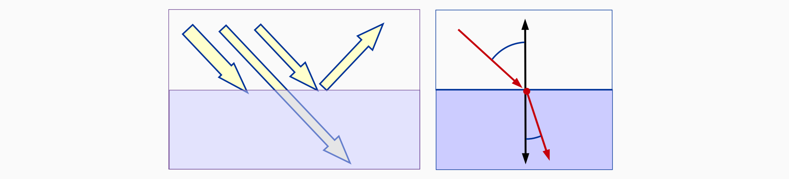

> La luz cambia de dirección debido a su progreso más lento en estos medios (debido al retraso por múltiples eventos de dispersión de fotones)

Al pasar por un objeto delgado transparente, la cantidad de luz que no es absorbida en el medio (y atraviesa el objeto) depende de la longitud de onda:

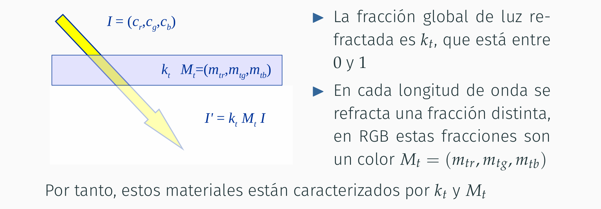

El vector $t$ puede calcularse a partir de $n$, $i$, y los índices de refracción $n_i$ y $n_t$ , teniendo en cuenta la **Ley de Snell**:
$$n_i \sin(\theta_i) = n_t \sin(\theta_t)$$
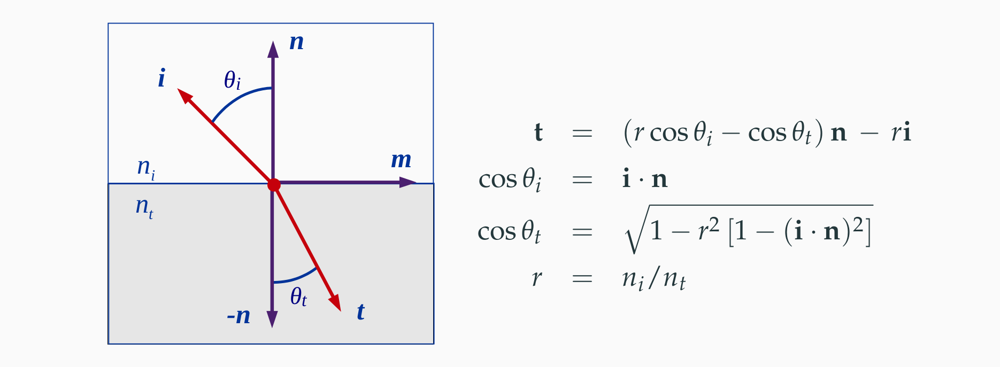

> Si $1 < r^2 (1 - (i \cdot n)^2)$ entonces no hay refracción (hay reflexión interna total). Solo puede ocurrir cuando $n_t < n_i$, para $\theta_i > \theta_{\text{max}}$.

### Superficies transparentes en Z-buffer

El método de Z-buffer solo puede tener en cuenta, para un pixel, los colores de los puntos en el proyector o rayo que pasa por el centro del pixel hacia el observador.

- Cuando $n_i \neq n_t$ los rayos se desvían, y esto no puede reproducirse con Z-buffer
- Si suponemos que $n_i = n_t$, entonces no hay cambio de dirección debida a la refracción, y por tanto $t = −i$
- Con esta simplificación, se puede adaptar el método de Z-Buffer para incluir polígonos transparentes.

```
Inicializar Z-buffer (Z) e Imagen (I)
for cada polígono opaco P do
	Rasterizar P, actualizando Z e I
for cada polígono transparente Q do
	kt = fraccion de luz refractada de Q
	Mt = color transparente de Q
	for cada pixel (x, y) ocupado por Q do
		if Q es visible en (x, y) then
			I[x, y] = kt * Mt * I[x, y]
```

### Combinación de reflexión y refracción

En la superficie entre una lámina de material transparente y el espacio (vacío) entre objetos puede también reflejarse la luz:

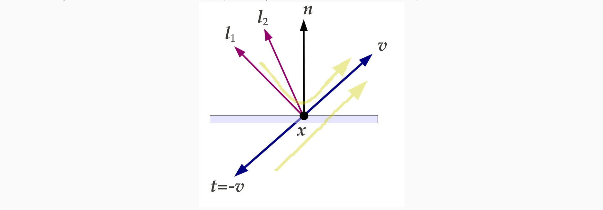

> Si $k_t > 0$, al MIL debe sumársele la luz refractada proveniente del otro lado del polígono, en la dirección de $v$

### Dependencia del orden

El color $I$ que percibe el observador depende de los colores $I_x$, $I_y$ y $I_z$ reflejados en los puntos $x$, $y$ y $z$:

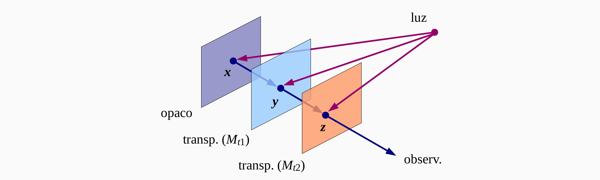

Este color depende del orden de los polígonos:
$$I = I_z + M_{t_1} I_y + M_{t_1} M_{t_2} I_x \neq I_Z + M_{t_1} I_x + M_{t_2} M_{t_1} I_y$$

### Z-buffer en superficies transparentes y reflectantes

Los polígonos transparentes deben dibujarse en orden de $Z$:

```
Inicializar Z-buffer (Z) e Imagen (I)
for cada polígono opaco P do
	Rasterizar P, actualizando Z e I
for cada polígono transparente Q (en orden de Z) do
	kt = fraccion de luz refractada de Q
	Mt = color transparente de Q
	for cada pixel (x, y) ocupado por Q do
		if Q es visible en (x, y) then
			Im = resultado de evaluar MIL
			I[x, y] = Im + kt Mt I[x, y]
```

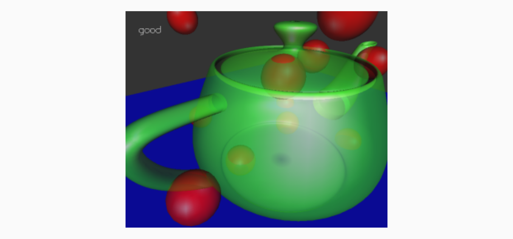

## 1.5 Superficies especulares

Algunos objetos pulidos reflejan la luz de forma especular perfecta, como los espejos planos

- La componente especular perfecta es una componente más del modelo de iluminación local, que se suma a las anteriores (se suele dar en combinación con la refractada en los objetos de cristal).
- Este efecto no puede reproducirse con ninguno de los métodos que hemos visto, pues la iluminación no procede de la dirección del rayo central a un pixel, sino de otras direcciones.

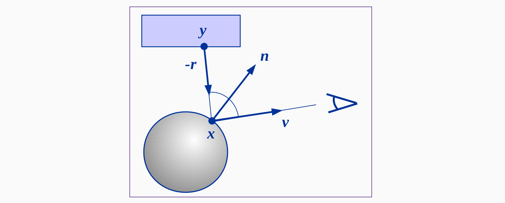

> Si la esfera es perfectamente reflectante, el color de $x$ visto desde $v$ es igual al color de $y$ visto desde la direccion $−r$ (el vector reflejado $r$, cambiado de signo).

### Box map

En esta técnica, el entorno se proyecta en las $6$ caras de un cubo centrado en el objeto reflectante, obteniéndose $6$ texturas.

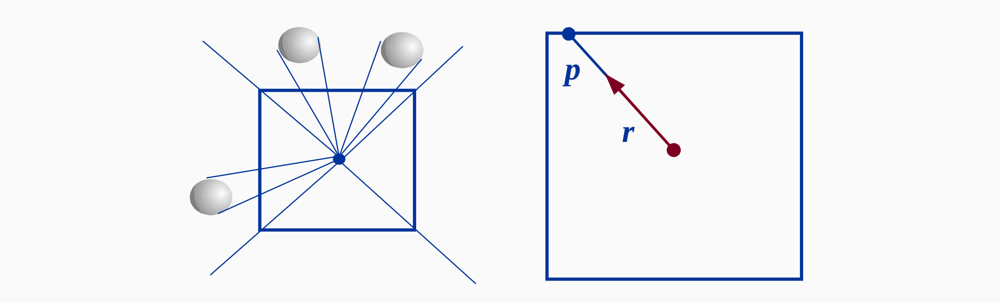

En tiempo de rendering, el vector $r$ se proyecta sobre la cara que corresponda (se calcula $p$), y se obtienen el color RGB del texel que contiene a $p$.

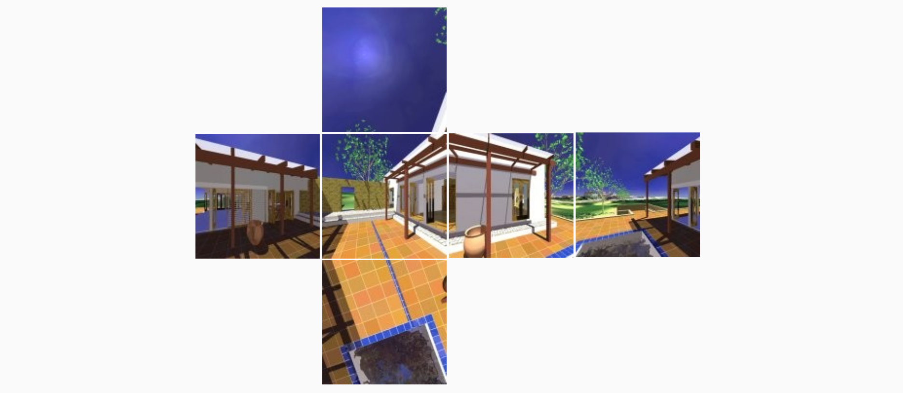

### Mapa de entorno esférico

Una sola imagen codifica el color reflejado para todas las posibles orientaciones de la normal

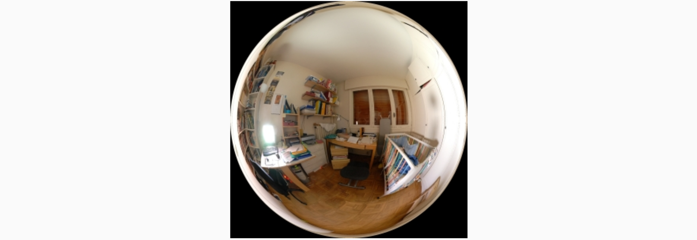

Se asume una proyección ortográfica fija, en la cual el vector v es constante y paralelo al eje $Z$.

Es una sola imagen que codifica, en cada texel $(u, v)$, la irradiancia en una dirección de coordenadas polares $\alpha = au$ y $\beta = bv$:

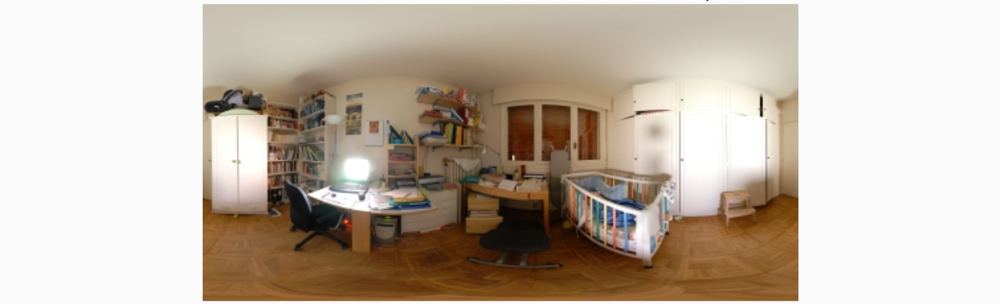

Se suelen obtener a partir de múltiples fotografías de un entorno. A su vez, pueden servir para crear mapas de entorno esféricos.

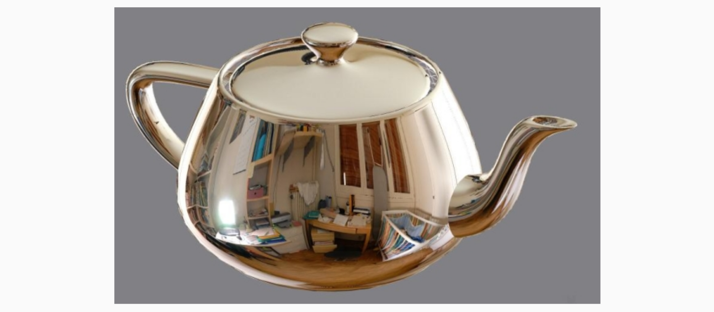

### Reflexión en espejos planos

En estos objetos, la escena reflejada es simétrica respecto de la original respecto del plano del espejo:

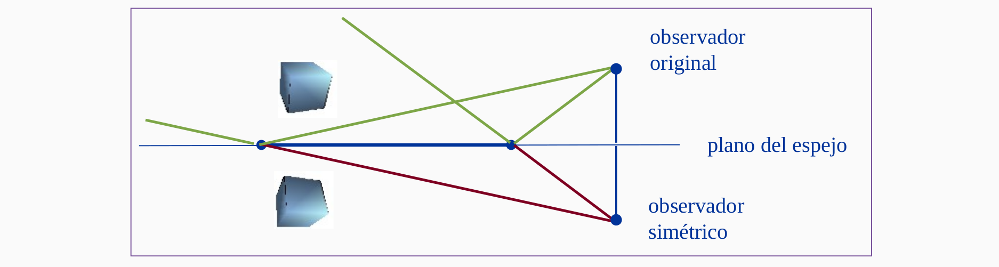

Se pueden reproducir las reflexiones sintetizando la imagen vista por una cámara simétrica respecto de la original.


## 2. Ray Tracing

## 2.1 El algoritmo de Ray-Tracing

Existe un algoritmo no muy eficiente en tiempo, pero bastante sencillo, que tiene en cuenta todos los efectos anteriores:
- Este algoritmo es el algoritmo de Ray-Tracing (seguimiento de rayos, usualmente traducido por trazado de rayos)
- Descrito completamente por primera vez por Turner Whitted en 1979-80.
- Está basado en la EPO por Ray-Casting, combinada con evaluación del MIL
- Es conceptualmente muy sencillo, y fácil de implementar.
- Obtiene un grado de realismo muy superior a Z-buffer, a costa de tiempos de cálculo usualmente más altos.

Frente a rasterización, Ray-Tracing puede visualizar objetos
- curvos (con superficie definida por ecuaciones implícitas).
- especulares perfectos (que reflejan el entorno).
- transparentes (con índices de refracción arbitrarios).
- con sombras arrojadas por otros.

Existen diversos algoritmos basados en Ray-Tracing con funcionalidad adicional:
- **Ray-Tracing distribuido**: Fuentes de luz extensas, profundidad de campo, desenfoque de movimiento (motion-blur).
- **Path-Tracing**: Iluminación indirecta o global.

> El algoritmo de Path-Tracing y derivados se usa en generación por ordenador de películas y efectos especiales.

### Modelo de Iluminación Local extendido para Ray-Tracing

Ray-Tracing calcula la radiancia $L_{in}(q, u)$ incidente sobre un punto $q$ proveniente de una dirección $u$.
$$L_{in}(q, u) = L(p, v) = M_E(p) + L_{ind}(p, v) + \sum_{i = 0}^{n_L - 1} v_i \cdot S_i \cdot L_{dir}(p, v, l_i)$$
donde
- El punto $p$ es el primero visible desde $q$ en la dirección de $u$.
- El vector $v$ es la dirección de salida de radiancia (es $−u$).
- $M_E(p)$ es la emivisivad en $p$.
- El valor $v_i$ es la visiblidad de la $i$-ésima fuente de luz (vale $0$ o $1$).
- Las funciones $L_{dir}$ y $L_{ind}$ representan la iluminación directa y la iluminación indirecta, respectivamente.

### Iluminación directa

La iluminación directa $L_{dir}(p, v, l)$ es la radiancia reflejada en $p$ hacia $v$ debida a iluminación directa proveniente de una fuente de luz que está en la dirección $l$. Se define así:

$$L_{dir}(p, v, l) = k_a(p) \cdot C(p) + k_d(p) \cdot C (p) \cdot \max\{0, n \cdot l\} + k_s(p) \cdot d_i \cdot [\max\{0, r \cdot v\}]^e$$

Esta fórmula incorpora las componentes ambiental, difusa y pseudo-especular o glossy, de forma similar a como vimos para rasterización. Aquí:

- $r$ es el vector reflejado en $p$ (depende de $v$ y $n$).
- $n$ es la normal en $p$ (depende de $p$ y $O$).
- $k_a$, $k_d$, $k_s$ son los parámetros del material en $p$.
- $C(p)$ es el color del objeto en $p$

### Iluminación indirecta

El término $L_{ind}(p, v)$ incluye la radiancia ambiente global, la reflejada perfectamente y la refractada. Se define recursivamente en términos de $L_{in}$:
$$
L_{ind}(p, v) = A_G(p) + k_{ps}(p) \cdot M_{PS}(p) \cdot L_{in}(p, r) + k_t(p) \cdot M_T(p) \cdot L_{in}(p, t)$$
donde:
- $A_G(p)$ es la radiancia ambiente global (suple ilum. indirecta).
- $k_t(p)$ es la fracción de luz refractada en $p$.
- $k_{ps}(p)$ es la fracción de luz reflejada de forma especular perfecta en $p$.
- $M_{PS}(p)$ y $M_T(p)$ son ternas RGB (con valores en $[0, 1]$) que permiten modular el color de la componente refejada perfectamente o refractada.
- $r$ es el vector reflejado en $p$ (depende de $v$ y $n$).
- $t$ es el vector refractado en $p$ (depende de $v$ y $n$).

### Generación de rayos-primarios

Los pixels se procesan secuencialmente, en cada uno se crea un rayo (llamado **rayo primario** o **rayo de cámara**) y se determina el primer objeto visible por Ray-Casting:

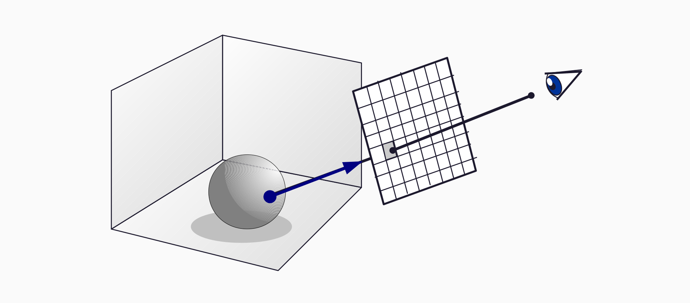

### Pseudocódigo del algoritmo de Ray-Tracing

El pseudocódigo del algoritmo, que recorre todos los pixels, puede quedar así:

```sh
o : = Posición del observador, en coords. del mundo
for cada pixel (i, j) de la imagen do
	q := Punto central (en WCC) del pixel (i, j)
	u := Vector desde 'o' hasta 'q' normalizado
	rad := RayTracing(o, u, 1)
	fijar el pixel (i, j) al valor rad
```

> La función `RayTracing` es recursiva, calcula la radiancia incidente sobre el punto $o$, proveniente de la dirección $u$ (como una terna RGB). El entero $n$ es el nivel de profundidad en las llamadas recursivas.

```sh
function RayTracing(punto o, vector u, entero n)
	if n > max then
		return (0,0,0) // si se ha superado máximo nivel de recursión devolver radiancia nula
	O := Primer objeto visible desde 'o' en la dirección 'u' // (por ray-casting)
	if no existe ningun objeto visible then
		return radiancia de fondo correspondiente a 'u'
	p := Punto de O intersecado
	return EvaluaMILRec(O, p, −u, n)
```

### Evaluación del MIL

Una vez se conoce el punto $p$, se obtienen la normal $n$, y los parámetros del MIL, que es evaluado:

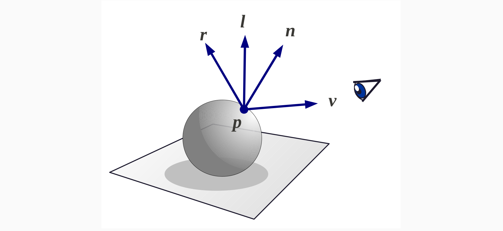

### Sombras arrojadas

Este método permite incorporar sombras arrojadas, usando Ray-Casting para visibilidad. Se comprueba si un segmento de recta desde $p$ hasta (o hacia) la fuente interseca algún objeto de la escena, es decir, se evalua $V( p, q_i)$

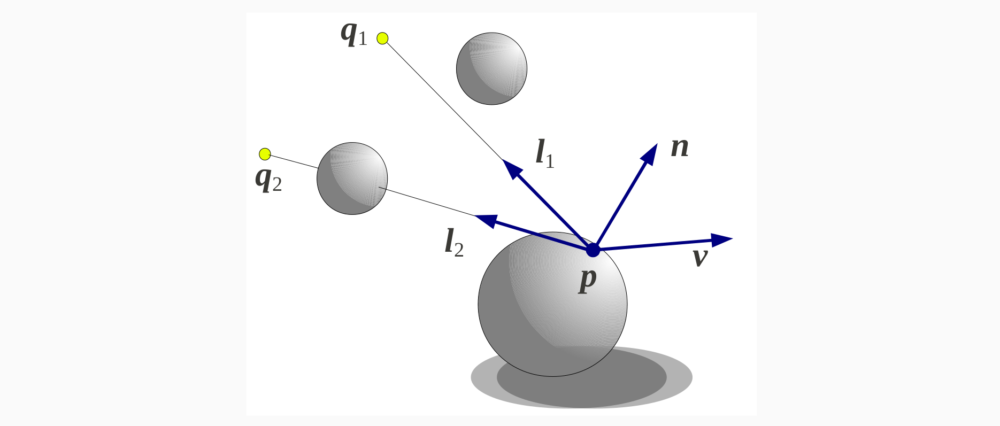

### Detalles de las superficies

El objeto en el que está $p$ puede tener asociadas texturas (o mapas de perturbación de la normal)
- A partir de $p$ se obtienen las coordenadas $(u, v)$ en el espacio de la textura
- A partir de $(u, v)$ se consulta la textura o texturas asociadas al objeto.

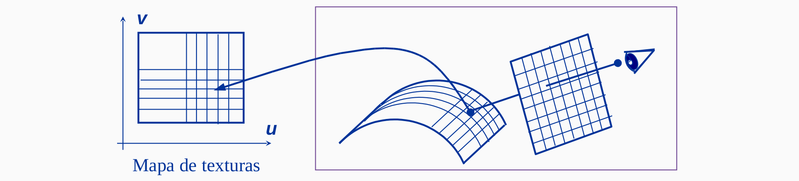

### Rayos secundarios y recursividad

También es posible tener en cuenta superficies perfectamente especulares y/o perfectamente transparentes. Esto se hace creando rayos secundarios, e invocando recursivamente al algoritmo.

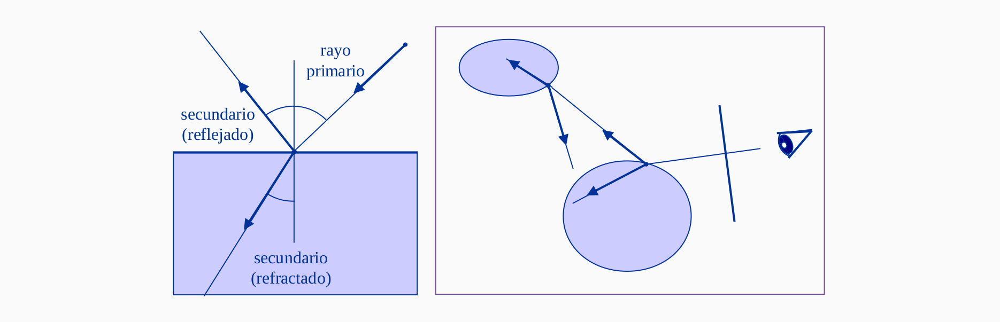

Da lugar a un árbol de rayos asociado al árbol de llamadas recursivas.

```sh
function EvaluaMILREC(O, p, v, n)
	Obtener parámetros del material de O en p (n, C, ka , kd , ks , kps , MPS , MT , kt)
	Obtener parámetros de fuentes de luz (nL, li, Si)
	rad := ME(p) + AG(p) // emisividad y componente ambiente global
	for i := 0 to nL − 1 do // para cada fuente de luz
		if la fuente i es visible desde 'p' then
			rad := rad + Si · Directa(p, v, li) // ilum. directa
	if kt > 0 and n < max then
		t := Vector refractado respecto de v
		rad := rad + k t · MT · RayTracing(p, t, n + 1) // componente refractada
	if k ps > 0 and n < max then
		r := Vector reflejado respecto de v
		rad := rad + k ps · MPS · RayTracing(p, r, n + 1) // componente reflejada
	return rad
```

La función `Directa` evalúa $L_{dir}$ (las componentes ambiental, difusa y especular correspondientes a una fuente de luz)

```sh
function Directa(p, v, l)
	rad := k a · C
	if k d > 0 then
		rad := rad + k d · C · máx(0, n · l)
	if k s > 0 then
		rad := rad + k s · di · [máx(0, r · v)]^e
	return rad
```

## 2.2 Intersecciones rayo-objeto y rayo-escena

El algoritmo de Ray-Tracing emplea la mayor parte de su tiempo en:
- Evaluación de MIL avanzados: a los subprogramas que los evaluan se les llama shaders.
- Cálculo de intersecciones. Dado un punto $o$ y un vector unitario $v$ (en coordenadas de mundo, codificando una semirrecta o rayo), se trata de calcular el menor valor real $t > 0$ tal que el punto $p(t) = o + tv$ está en la frontera o superficie de algún objeto de la escena.

Hay dos algoritmos fundamentales:
- **Intersección rayo-objeto**: Cada tipo de geometría posible tiene asociado un algoritmo.
- **Intersección rayo-escena**: Podemos recorrer exhaustivamente los objetos, pero es $O(n_o)$. Se reducen los tiempos con indexación espacial, que es $O(\log n_o)$.

### Intersecciones rayo-objeto: método general

Calcular la intersección de un rayo $(o, v)$ con un objeto cuya geometría es $O ⊆ R$ consiste en obtener el mínimo valor de $t > 0$ (si hay alguno) tal que $o + tv \in \partial O$. El objeto $O$ puede estar caracterizado por estas dos funciones:

- **Ecuación implícita**: Un campo escalar $F$ tal que si $p \in \partial O$ entonces $F(p) = 0$.
- **Condiciones adicionales**: Un predicado o función lógica $C$ tal que $p \in \partial O$ si y solo si $F (p) = 0$ y $C (p)$.

El algoritmo requiere:
1. Calcular el conjunto $S = \{ t_0, t_1, \dotsc, t_{n−1} \}$ con las raíces de la ecuación $F (o + tv) = 0$.
2. Eliminar de $S$ los $t_i$ que no cumplen $C (o + ti v)$.
3. Si $S \neq \emptyset$ la solución es $t = \min(S)$. Si $S = \emptyset$ no hay intersección.
### Intersecciones rayo-objeto: métodos de solución

Hay dos tipos de algoritmos para obtener la menor raíz $t$:
- **Directos**: $t$ se obtiene con una fórmula explícita. Por ejemplo, si $\partial O$ es un subconjunto de una superficie cuádrica, entonces
$$F(o + tv) = 0 \iff \exists a, b, c \in \mathbb{R} : a t^2 + bt + c = 0$$
- **Iterativos**: $t$ se obtiene por sucesivas aproximaciones. Por ejemplo, se puede usar si $F$ es la **signed distance function (SDF)** de $O$, es decir, si
$$F(p) = s \cdot \left( \min_{p \in \partial O} \|p − q\| \right)$$ donde 
$$s = \begin{cases} -1 & p \in O \\ +1 & p \notin O \end{cases}$$

>Si no se dispone de SDF existen alternativas (Bisección, Newton, cotas de distancia, etc...).

### Indexación espacial para métodos directos

Para calcular las intersecciones rayo-escena podemos usar los algoritmos directos de intersección rayo-objeto para las distintos tipos de objetos que forman la escena:
- Las escenas usualmente consisten en mallas de triángulos.
- Solución de **fuerza bruta**: Comprobar la intersección con cada triángulo de la escena (tiempo en $O(n_t)$).
- La indexación espacial se basa en descartar partes de la escena si el rayo no interseca un volumen englobante $V$ de todos los triángulos de esa parte de la escena.

> La intersección rayo-$V$ es muy rápida de calcular. Se hace jerárquicamente (recursivamente), y se obtiene un árbol de volúmenes englobantes, con conjuntos de triángulos en los nodos terminales. Se obtiene tiempo en $O(\log n_t)$.

### El algoritmo **Sphere Tracing**

Un método iterativo, llamado **Sphere Tracing**, usa las SDFs $F_i$ de los objetos $O_i$. El algoritmo se basa en avanzar un punto a lo largo del rayo. A cada paso se avanza la minima distancia del punto a los objetos de la escena, hasta que diverge o converge a un punto de intersección:

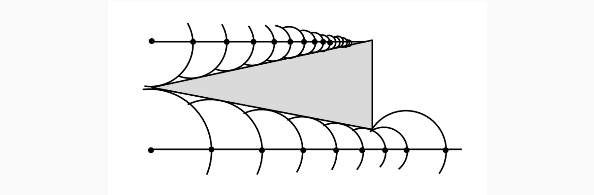

```sh
function InterseccionSDF(o, v, O0 , . . . , On−1)
	p = o // Mejor punto de intersección encontrado hasta ahora
	d = 0 // Máxima distancia que se puede avanzar desde 'p'
	repeat
		p = p + dv // avanzamos a lo largo del rayo
		d = mı́n {F0(p), . . . , Fn−1(p)} // actualizamos d en p
	until length(d) <= e (o hasta un número máximo de iteraciones)
	if length(d) <= e then // si p está ya muy cerca de la superficie
		Hay intersección con Oi en p (con i tal que d = Fi(p))
	else
		No hay intersección con ningún objeto
```